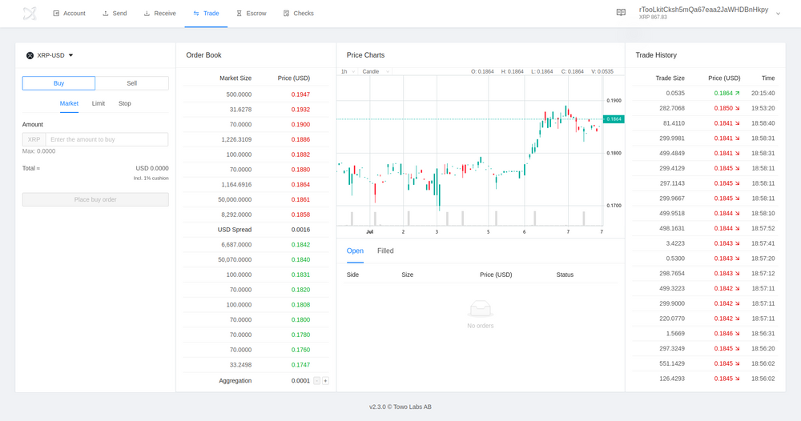
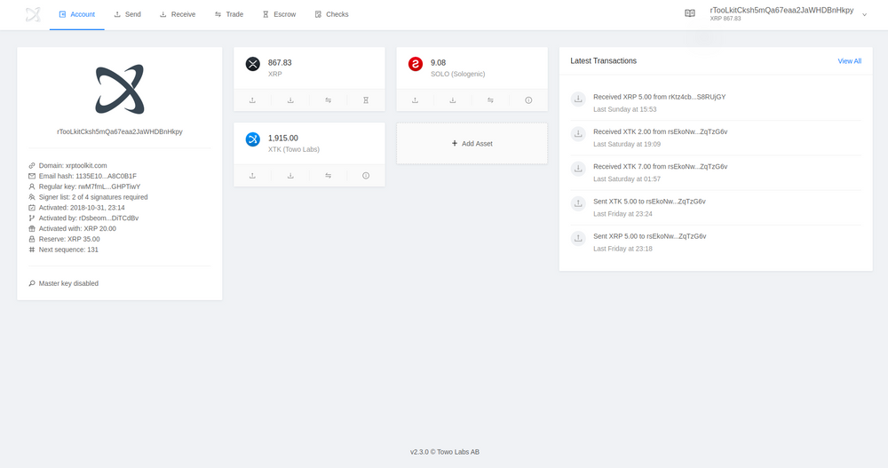
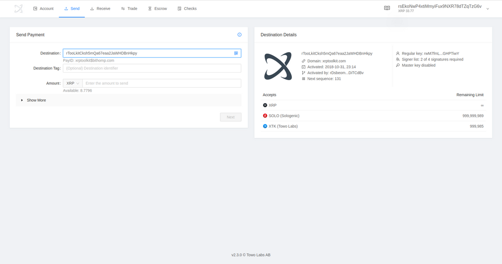
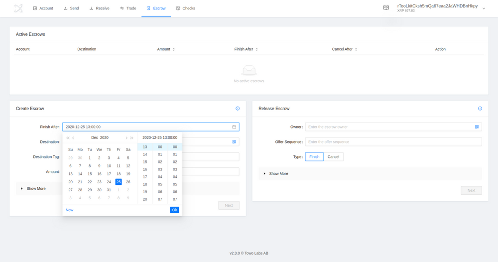

# Developer Reflections: XRP Toolkit

[XRP Toolkit](https://www.xrptoolkit.com/), developed by [Towo Labs](https://towo.io), is a platform for managing crypto assets on the XRP Ledger, including a full-featured graphical user-interface (GUI) for the XRP Ledger's built-in decentralized exchange (DEX).

> 

XRP Toolkit is used by thousands of Xaman App and Ledger hardware wallet users to access advanced XRP Ledger features, such as limit orders, cross-currency payments, escrows, checks, and account settings.

> 

When a user connects their wallet to XRP Toolkit, they get the security benefits of their favorite non-custodial wallet, and the usability of a full-featured web interface.

> 

XRP Toolkit has been designed from the ground up with strong security standards, and only handles public data and public keys. XRP Toolkit uses ripple-lib and the JSON-RPC Websocket to access the XRP Ledger.

> 

All transaction signing has been offloaded to the supported wallets, which reduces the need to copy/paste sensitive key material, and allows XRP Toolkit to focus on offering users advanced XRP Ledger features.

If you're a developer that uses the [XRP Ledger](https://xrpl.org/), [Interledger](https://interledger.org/), [Xpring SDK](https://github.com/xpring-eng/xpring-sdk), [XRP API](https://github.com/xpring-eng/xrp-api), [ripple-lib](https://github.com/ripple/ripple-lib), [XRP CLI](https://github.com/xpring-eng/xrp-cli) or related open-source technologies in your products and apps, then fill out this form [[link](https://docs.google.com/forms/d/e/1FAIpQLSeQAWZFBanNeuYyTFoA2FzHXJzzduoQGSGxgeInzCL_WKJpdQ/viewform?usp=sf_link)] with details about your product or app, and join the community.
