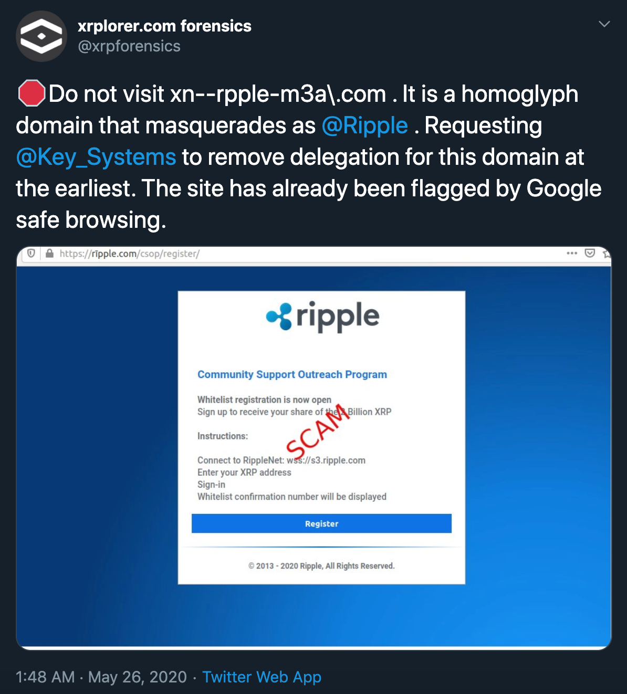
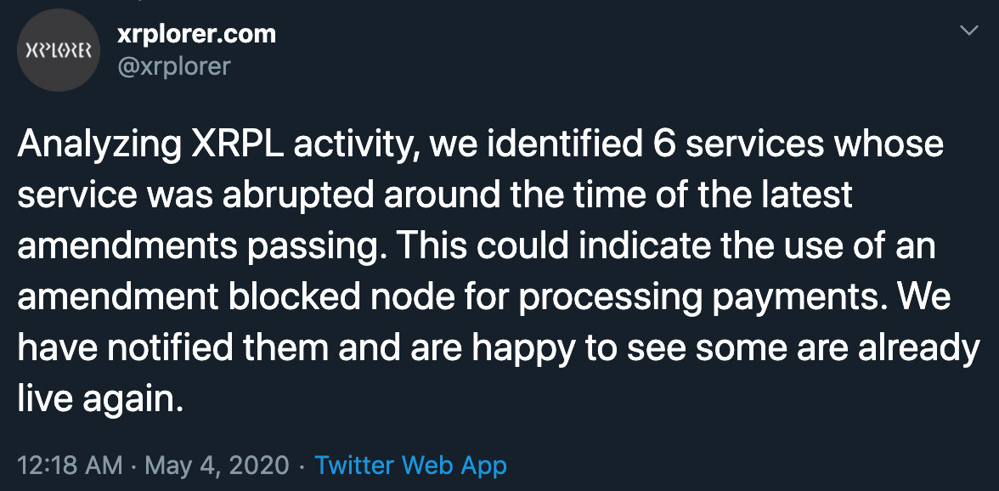

# Developer Reflections: Xrplorer

This week on Developer Reflections, we're proud to highlight [Xrplorer](https://xrplorer.com), a powerful open analytics platform built on top of a graph database representation of the XRP Ledger.

Xrplorer was built by [Thomas Silkjaer](https://twitter.com/Silkjaer), a Danish data scientist, designer, and popular [Forbes Contributor](https://www.forbes.com/sites/thomassilkjaer/#4562826a7348), as a side-project on [Neo4j](https://neo4j.com/), to prove out the benefits of using a graph database over a traditional relational database management system (RDBMS), which is typically used to store XRP Ledger historical data.

<!-- BREAK -->

**Note:** The Xrplorer project as described in this post has been deprecated, as forensics and other data are being combined with related efforts within the XRP Ledger Foundation. _(Updated October 2022)_

A primary benefit of the graph database is that the ledgers are not stored in their original binary form or JSON representations, which makes it easier to do more complex relational queries, apply graph algorithms, run fraud detection algorithms and integrate XRP Ledger data with machine learning.

To that extent, Xrplorer has been widely used by the XRP Community as a watchdog platform to prevent, report and combat fraudulent activity on the XRP Ledger.

A forensic team was formed on [Twitter](https://twitter.com/xrpforensics) using Xrplorer and social media data to serve as a safety beacon for the XRP Community by reporting scammers and fake giveaways.

> 

[Xrplorer](https://twitter.com/xrplorer) has also been effective at identifying "[amendment blocked](https://xrpl.org/amendments.html#amendment-blocked)" servers and notifying their operators, who hadn't yet upgraded to the latest stable version of the XRP Ledger.

> 

The graph database structure has also enabled Silkjaer to [visualize XRP Ledger data in stunning ways](https://www.forbes.com/sites/thomassilkjaer/2019/05/13/visualization-the-xrp-ledger-expanding-over-time/#6508d5a446ea) , which have uniquely expressed his combined passion and talent for data and design.

> 
> _XRP Ledger visualized by Thomas Silkjaer in [Forbes](https://www.forbes.com/sites/thomassilkjaer/2019/05/13/visualization-the-xrp-ledger-expanding-over-time/#52c7b3746ea7)._

If you're a developer that uses the [XRP Ledger](https://xrpl.org/), [Interledger](https://interledger.org/), [Xpring SDK](https://github.com/xpring-eng/xpring-sdk), [XRP API](https://github.com/xpring-eng/xrp-api), [ripple-lib](https://github.com/ripple/ripple-lib), [XRP CLI](https://github.com/xpring-eng/xrp-cli) or related open-source technologies in your products and apps, then fill out this form [[link](https://docs.google.com/forms/d/e/1FAIpQLSeQAWZFBanNeuYyTFoA2FzHXJzzduoQGSGxgeInzCL_WKJpdQ/viewform?usp=sf_link)] with details about your product or app, and join the community.
