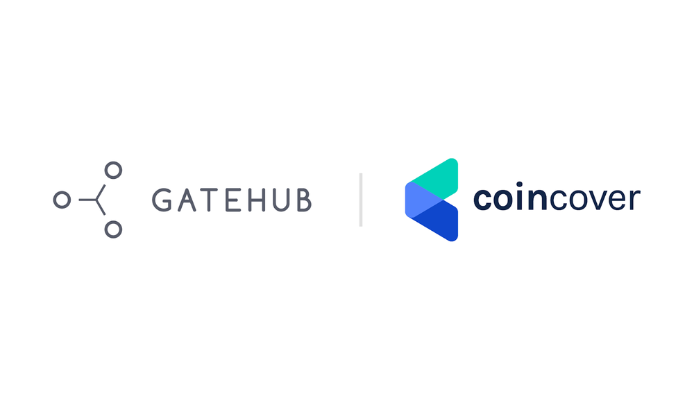

# Community Spotlight: Developing Wallet Protect

GateHub started in 2013 with an idea: _What if there was a wallet that could hold any type of asset, have an integrated exchange built-in and provide the ability to send and receive assets across any payment network instantly?_

<!-- BREAK -->

Bitcoin dominated the market at the time, and as an early pioneer, Bitstamp’s exchange was one of the first exchanges to list XRP and become an XRPL gateway. Enej Pungerčar, who at the time worked at Bitstamp as a web designer and developer, was able to see the benefits of a blockchain that would be able to support other types of assets, unlike Bitcoin. Inspired by the challenge, he began building a front-end wallet prototype to ease the burden of transferring funds and to better the user experience.

He decided to use the XRP Ledger because it was instant and allowed users to send multiple currencies across the network. But, while he could access and transfer funds on the XRP Ledger (XRPL), Pungerčar still needed a Bitstamp account to send money to the wallet itself. He needed more support in order to develop a more robust solution.

## Building on the XRP Ledger

In 2014, he presented his idea at Ripple in San Francisco. It was the first time anyone attempted to build something on the front-end of the XRP Ledger and he received overwhelming support from both Ripple’s leadership and developer teams. Shortly thereafter, Pungerčar along with Anžej Simičak and George Frost, formally started [GateHub](https://gatehub.net/?utm_source=ripplex&utm_medium=affiliate&utm_campaign=wallet_protect) and launched the first version of the wallet in 2015.

Since then, GateHub has been focused on improving its user experience. On the one side is the wallet. Built for the masses, it is a robust platform but user friendly enough to allow those who haven’t necessarily interacted with the XRP Ledger to jump right in with both feet. Then on the other side is growing GateHub into a gateway, building it out as a platform that would not only attract customers, but also increase the adoption of the XRP Ledger and provide a turn key solution for financial institutions and corporations to act as a gateway without worrying about all the complicated infrastructure requirements. GateHub is the largest wallet provider on the XRP Ledger. Ultimately, it aims to become one of the world’s leading overall wallet providers and the best ‘gateway as a service’ platform.

The primary reasons they chose to build GateHub on XRPL is the benefits of scalability, speed and low cost. Compared to other blockchains, settlements on XRPL take an average of 3-5 seconds, versus an hour or more. Plus, using the XRPL gives GateHub freedom to build out new tools to better serve their customers.

> 

## Wallet Protect: A New Service for XRPL Wallets

Security concerns are permeating the crypto market. Since 2011, over $7.6 billion of crypto funds have been stolen due to scams and user’s general unfamiliarity with the market. On top of that, when exchanges are forced to shut down, there is no way for users to recover their funds. This is a problem GateHub is looking to solve.

[Wallet Protect](https://gatehub.net/blog/wallet-protect-faq/?utm_source=ripplex&utm_medium=affiliate&utm_campaign=wallet_protect) is a world-first for the XRP Ledger. It provides users with the ability to secure their wallets with multi-signature and up to $100,000 of theft cover through a partnership with [Coincover](http://coincover.com/). Coincover offers a range of cryptocurrency protection products including fund recovery and deposit protection guarantee.

Additionally, the custody of funds always stays with the customer, meaning whether GateHub exists or not, users will always be able to get their funds back. Thanks to its use of [xrplorer](https://xrplorer.com/) and [Chainalisys](https://www.chainalysis.com/), GateHub flags suspicious account addresses to help mitigate unnecessary security problems in the first place.

Wallet Protect is built into GateHub and it’s easy for users to [sign-up](https://signin.gatehub.net/signup?utm_source=ripplex&utm_medium=affiliate&utm_campaign=wallet_protect). A special 25% discount has been extended for readers of this blog. For the month of March, $10,000 of theft cover can be purchased for $2.25 per month or upgraded to $100,000 of theft cover for $18 per month.

<figure class="kg-card kg-embed-card"><iframe src="https://player.vimeo.com/video/522005166?app_id=122963" width="640" height="360" frameborder="0" allow="autoplay; fullscreen; picture-in-picture" allowfullscreen></iframe></figure>

## What’s Next for GateHub

As GateHub continues to improve its platform and grow, Pungerčar and his team, that is more than 40 people strong, are committed to helping people navigate the world of cryptocurrency more efficiently. By building a network of regulated gateways using the XRP Ledger, it will soon be possible for customers to draw upon any assets or values.

GateHub, however, doesn’t want to do it alone. The team wants to encourage other developers and merchants to build their own solutions and wallet applications. The sooner more companies and developers adopt the technology, the sooner its value will be recognized on a global scale.

Are you a developer interested in building on the XRP Ledger? Learn more [here](https://xrpl.org/docs.html).
