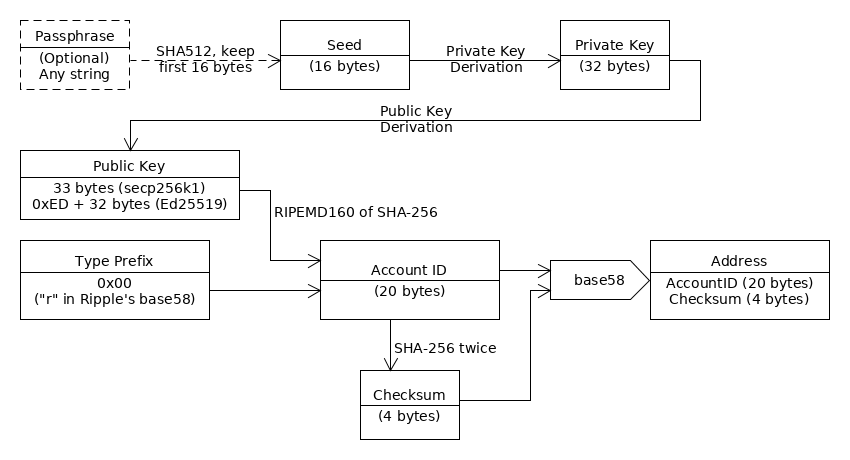

# RCL Accounts

An "Account" in the Ripple Consensus Ledger represents a holder of XRP and a sender of transactions. The core elements of an account are:

- An identifying **address**, such as `rf1BiGeXwwQoi8Z2ueFYTEXSwuJYfV2Jpn`
- An account can send [transactions](reference-transaction-format.html) to modify the Ripple Consensus Ledger, for a variety of purposes including:
    - Sending XRP to a recipient, immediately or through locking mechanisms like payment channels and escrow.
    - Issuing, redeeming, or sending non-XRP assets and currencies.
    - Trading in the decentralized exchange.
    - Changing settings such as authorization settings, balance limits, or the behavior of assets issued by the account.
- An **XRP balance**. Some of this XRP is set aside for the [Reserve](concept-reserves.html).
- A **sequence number**, starting at 1 and increasing with each transaction sent from this account. No transaction can be included in a ledger unless the transaction's sequence number matches its sender's next sequence number.
- A **history of transactions** that affected this account and its balances.

In the ledger's data tree, an account's core data is stored in the [AccountRoot](reference-ledger-format.html#accountroot) ledger node type. An account can also be the owner (or partial owner) of several other types of data.

**Tip:** An "Account" in the Ripple Consensus Ledger is somewhere between the financial usage (like "bank account") and the computing usage (like "UNIX account"). Non-XRP currencies and assets aren't stored in an RCL Account itself; each such asset is stored in an accounting relationship called a "Trust Line" that connects two parties.

## Addresses

The "address" of an account is derived from the account's master [public key](https://en.wikipedia.org/wiki/Public-key_cryptography), which is in turn derived from a secret key. Ripple account addresses always start with the letter `r` and can be 25 to 35 characters in length. The data of a Ripple address includes a 4-byte checksum so that the probability of generating a valid address from random characters is approximately 1 in 2^32.

The conversion from a public key to an address involves a one-way hash function, so it is possible to confirm that a public key matches an address but it is impossible to derive the public key from the address alone. (This is part of the reason why signed transactions include the public key _and_ the address of the sender.) For more technical details, see [Address Encoding](#address-encoding).

The process of "creating" an address is the purely mathematical task of generating a key pair and calculating the address from it, so an address can exist separately from its presence as an account object in the ledger. To actually make an account for an address, someone must send the address enough XRP to satisfy the reserve. This is called _funding_ the account. Whether or not the address is a funded account, you can use the address (and the key pair it's derived from) as a regular key or as part of a signer list.

### Special Addresses

Some addresses have special meaning, or historical uses, in the Ripple Consensus Ledger. In many cases, these are "black hole" addresses, meaning the address is not derived from a known secret key. Since it is effectively impossible to guess a secret key from only an address, any XRP possessed by black hole addresses is lost forever.

| Address                     | Name | Meaning | Black Hole? |
|-----------------------------|------|---------|-------------|
| rrrrrrrrrrrrrrrrrrrrrhoLvTp | ACCOUNT\_ZERO | An address that is the base-58 encoding of the value `0`. In peer-to-peer communications, `rippled` uses this address as the issuer for XRP. | Yes |
| rrrrrrrrrrrrrrrrrrrrBZbvji  | ACCOUNT\_ONE | An address that is the base-58 encoding of the value `1`. In the ledger, [RippleState entries](reference-ledger-format.html#ripplestate) use this address as a placeholder for the issuer of a trust line balance. | Yes |
| rHb9CJAWyB4rj91VRWn96DkukG4bwdtyTh | The genesis account | When `rippled` starts a new genesis ledger from scratch (for example, in stand-alone mode), this account holds all the XRP. This address is generated from the seed value "masterpassphrase" which is [hard-coded](https://github.com/ripple/rippled/blob/94ed5b3a53077d815ad0dd65d490c8d37a147361/src/ripple/app/ledger/Ledger.cpp#L184). | No |
| rrrrrrrrrrrrrrrrrNAMEtxvNvQ | Ripple Name reservation black-hole | In the past, Ripple asked users to send XRP to this account to reserve Ripple Names.| Yes |
| rrrrrrrrrrrrrrrrrrrn5RM1rHd | NaN Address | Previous versions of [ripple-lib](https://github.com/ripple/ripple-lib) generated this address when base-58 encoding the value [NaN](https://developer.mozilla.org/en-US/docs/Web/JavaScript/Reference/Global_Objects/NaN). | Yes |

## Permanence of Accounts

Once created, an account exists in the Ripple Consensus Ledger's data tree forever. This is because the current sequence number for a transaction must be tracked forever, so that old transactions cannot be processed a second time.

Unlike Bitcoin and many other crypto-currencies, each new version of the Ripple Consensus Ledger's public ledger chain contains the full state of the ledger, which increases in size with each new account. For that reason, Ripple discourages creating new accounts unless entirely necessary. Institutions who send and receive value on behalf of many users can use **Source Tags** and **Destination Tags** to distinguish payments from and to their customers while only using one (or a handful) of accounts in the Ripple Consensus Ledger.

## Transaction History

In the Ripple Consensus Ledger, transaction history is tracked by a "thread" of transactions linked by a transaction's identifying hash and the ledger index. The `AccountRoot` ledger node has hash and ledger of the transaction that most recently modified it; the metadata of that transaction includes the previous state of the `AccountRoot` node, so it is possible to iterate through the history of a single account this way. This transaction history includes any transactions that modify the `AccountRoot` node directly, including:

- Transactions sent by the account, because the modify the account's `Sequence` number. These transactions also modify the account's XRP balance because of the [transaction cost](concept-transaction-cost.html).
- Transactions that modified the account's XRP balance, including incoming [Payment transactions][] and other types of transactions such as [PaymentChannelClaim][] and [EscrowFinish][].

However, the _conceptual_ transaction history of an account also includes transactions that modified the account's owned objects and non-XRP balances. These objects are separate ledger nodes, each with their own thread of transactions that affected them. If you have an account's full ledger history, you can follow it forward to find the ledger node objects created or modified by it. A "complete" transaction history includes the history of objects owned by a transaction, such as:

- `RippleState` objects (Trust Lines) connected to the account.
- `DirectoryNode` objects, especially the owner directory tracking the account's owned objects.
- `Offer` objects, representing the account's outstanding currency-exchange orders in the decentralized exchange
- `PayChannel` objects, representing asynchronous payment channels to and from the account
- `Escrow` objects, representing held payments to or from the account that are locked by time or a crypto-condition.
- `SignerList` objects, representing lists of addresses that can authorize transactions for the account by [multi-signing](reference-transaction-format.html#multi-signing).

For more information on each of these objects, see the [Ledger Format Reference](reference-ledger-format.html).

## Address Encoding

**Tip:** These technical details are only relevant for people building low-level library software for RCL compatibility!

[[Source] ](https://github.com/ripple/rippled/blob/35fa20a110e3d43ffc1e9e664fc9017b6f2747ae/src/ripple/protocol/impl/AccountID.cpp#L109-L140 "Source")

Ripple addresses are encoded using [base-58](https://en.wikipedia.org/wiki/Base58) with the Ripple _dictionary_: `rpshnaf39wBUDNEGHJKLM4PQRST7VWXYZ2bcdeCg65jkm8oFqi1tuvAxyz`. Since Ripple encodes several types of keys with base-58, Ripple prefixes the encoded data with a one-byte "type prefix" (also called a "version prefix") to distinguish them. The type prefix causes addresses to usually start with different letters in base-58 format.

The following diagram shows the relationship between keys and addresses:

The formula for calculating a Ripple address is as follows. For the complete example code, see [`encode_address.js`](https://github.com/ripple/ripple-dev-portal/blob/master/content/code_samples/address_encoding/encode_address.js).

1. Import required algorithms: SHA-256, RIPEMD160, and base58. Set the dictionary for base58.

        'use strict';
        const assert = require('assert');
        const crypto = require('crypto');
        const R_B58_DICT = 'rpshnaf39wBUDNEGHJKLM4PQRST7VWXYZ2bcdeCg65jkm8oFqi1tuvAxyz';
        const base58 = require('base-x')(R_B58_DICT);

        assert(crypto.getHashes().includes('sha256'));
        assert(crypto.getHashes().includes('ripemd160'));

2. Start with the 33-byte ECDSA secp256k1 key, or a 32-byte Ed25119 public key. For Ed25519 keys, prefix the key with the byte `0xED`.

        const pubkey_hex =
          'ED9434799226374926EDA3B54B1B461B4ABF7237962EAE18528FEA67595397FA32';
        const pubkey = Buffer.from(pubkey_hex, 'hex');
        assert(pubkey.length == 33);

3. Calculate the RIPEMD160 hash of the SHA-256 hash of the public key. This value is the "Account ID".

        const pubkey_inner_hash = crypto.createHash('sha256').update(pubkey);
        const pubkey_outer_hash = crypto.createHash('ripemd160');
        pubkey_outer_hash.update(pubkey_inner_hash.digest());
        const account_id = pubkey_outer_hash.digest();

4. Calculate the SHA-256 hash of the SHA-256 hash of the Account ID; take the first 4 bytes. This value is the "checksum".

        const address_type_prefix = Buffer.from([0x00]);
        const payload = Buffer.concat([address_type_prefix, account_id]);
        const chksum_hash1 = crypto.createHash('sha256').update(payload).digest();
        const chksum_hash2 = crypto.createHash('sha256').update(chksum_hash1).digest();
        const checksum =  chksum_hash2.slice(0,4);

5. Concatenate the the payload, and the checksum, and calculate the base58 value of the concatenated buffer. The result is the address.

        const dataToEncode = Buffer.concat([payload, checksum]);
        const address = base58.encode(dataToEncode);
        console.log(address);
        // rDTXLQ7ZKZVKz33zJbHjgVShjsBnqMBhmN

<!--{# Reference link definitions #}-->


