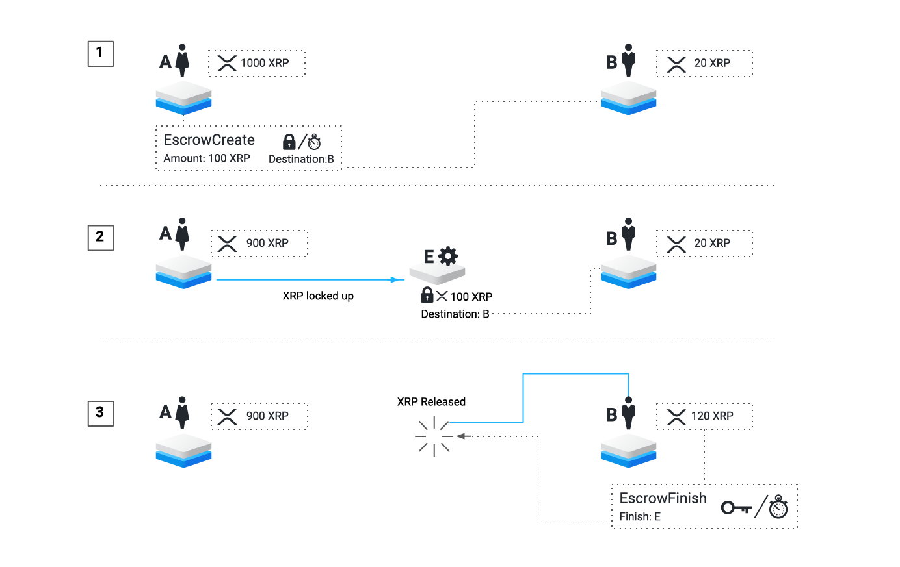
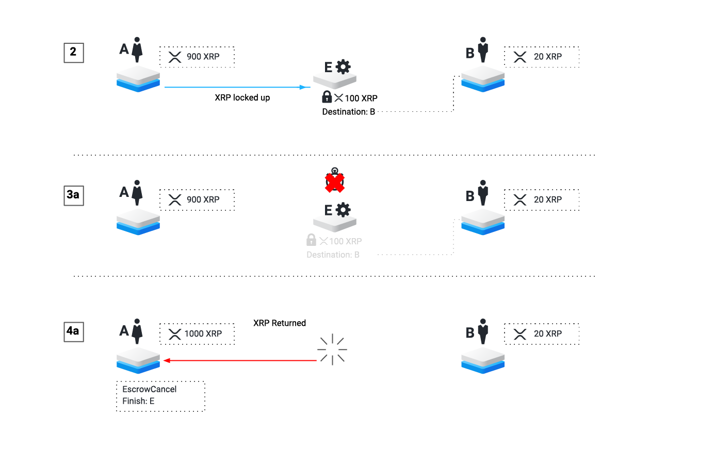

# Escrow

Escrow is a feature of the XRP Ledger that allows you to send conditional XRP payments. These conditional payments, called _escrows_, set aside XRP and deliver it later when certain conditions are met. Conditions to successfully finish an escrow include time-based unlocks and [crypto-conditions][]. Escrows can also be set to expire if not finished in time. Conditional held payments are a key feature for full [Interledger Protocol][] support, which enables chains of payments to cross any number of ledgers.

The XRP set aside in an escrow is locked up. No one can use or destroy the XRP until the escrow has been successfully finished or canceled. Before the expiration time, only the intended receiver can get the XRP. After the expiration time, the XRP can only be returned to the sender.

## Usage

<!--{# Diagram sources: https://docs.google.com/presentation/d/1C-_TLkkoQEH7KJ6Gjwa1gO6EX17SLiJ8lxvFcAl6Rxo/ #}-->

[](img/escrow-success-flow.png)

**Step 1:** To send an escrow, the sender uses an [EscrowCreate transaction][] to set aside some XRP. This transaction defines a finish time, an expiration time, or both. The transaction may also define a crypto-condition that must be fulfilled to finish the escrow. This transaction must define an intended recipient for the XRP; the recipient _may_ be the same as the sender.

**Step 2:** After this transaction has been processed, the XRP Ledger has an [Escrow object](reference-ledger-format.html#escrow) that holds the escrowed XRP. This object tracks the properties of the escrow as defined by the transaction that created it. If this escrow has a finish time, no one can access the XRP before then.

**Step 3:** The recipient, or any other XRP Ledger address, sends an [EscrowFinish transaction][] to deliver the XRP. If the correct conditions are met, this destroys the Escrow object in the ledger and credits the XRP to the intended recipient. If the escrow has a crypto-condition, this transaction must include a fulfillment for that condition. If the escrow has an expiration time, this cannot happen after that time.

### Expiration Case

[](img/escrow-cancel-flow.png)

All escrows start the same way, so **Steps 1 and 2** are the same as in the successful case.

**Step 3a:** If the escrow has an expiration time, and it has not been successfully finished before then, the escrow is considered expired. It continues to exist in the XRP Ledger, but can no longer successfully finish. (Expired objects remain in the ledger until a transaction modifies them. Time-based triggers cannot change the ledger contents.)

**Step 4a:** The sender, or any other XRP Ledger address, sends an [EscrowCancel transaction][] to cancel the expired escrow. This destroys the [Escrow object](reference-ledger-format.html#escrow) in the ledger and returns the XRP to the sender.

## Limitations

Escrow is designed as a feature to enable XRP Ledger to be used in the [Interledger Protocol][] and with other smart contracts. The current version has a modest scope to avoid complexity.

- Escrow only works with XRP, not issued currencies.
- Escrow requires sending at least two transactions: one to create the escrow, and one to finish or cancel it. Thus, it is not financially sensible to escrow payments for very small amounts, since you have to destroy the [transaction cost](concept-transaction-cost.html) of two transactions.
- All escrows must have a "finish-after" time, an expiration time, or both. Neither time can be in the past when the transaction to create the escrow executes.
- Timed releases and expirations are limited to the resolution of XRP Ledger closes. This means that, in practice, times may be rounded to approximately 5 second intervals, depending on exactly when the ledgers close.
- The only supported [crypto-condition][] type is PREIMAGE-SHA-256.

Escrow provides strong guarantees that are best suited for high-value, low-quantity payments. [Payment Channels](tutorial-paychan.html) are better suited for fast, low-value payments. Of course, unconditional [Payments](reference-transaction-format.html#payment) are also preferable for many use cases.

## Availability of Escrow

Conditional payments have been enabled by the ["Escrow" Amendment](concept-amendments.html#escrow) to the XRP Ledger Consensus Protocol since 2017-03-31. A previous version of the same functionality was available on the [Ripple Test Net](https://ripple.com/build/ripple-test-net/) by the name "Suspended Payments" (SusPay) in 2016.

When testing in [stand-alone mode](concept-stand-alone-mode.html), you can force the Escrow feature to be enabled locally regardless of the amendment status. Add the following stanza to your `rippled.cfg`:

    [features]
    Escrow

You can check the status of the Escrow amendment using the [`feature` command](reference-rippled.html#feature).

## EscrowFinish Transaction Cost

When using [crypto-conditions][], the EscrowFinish transaction must pay a [higher transaction cost](concept-transaction-cost.html#special-transaction-costs) because of the higher processing load involved in verifying the crypto-condition fulfillment.

If the escrow is purely time-locked with no crypto-condition, the EscrowFinish costs only the standard [transaction cost](concept-transaction-cost.html) for a reference transaction.

The additional transaction cost required is proportional to the size of the fulfillment. Currently, an EscrowFinish with a fulfillment requires a minimum transaction cost of **330 [drops of XRP](reference-rippled.html#specifying-currency-amounts) plus 10 drops per 16 bytes in the size of the fulfillment**. If the transaction is [multi-signed](reference-transaction-format.html#multi-signing), the cost of multi-signing is added to the cost of the fulfillment.

**Note:** The above formula is based on the assumption that the reference cost of a transaction is 10 drops of XRP.

If [Fee Voting](concept-fee-voting.html) changes the `reference_fee` value, the formula scales based on the new reference cost. The generalized formula for an EscrowFinish transaction with a fulfillment is as follows:

```
reference_fee * (signer_count + 33 + (fulfillment_bytes / 16))
```

## Further Reading

For more information about Escrow in the XRP Ledger, see the following:

- [Escrow Tutorials](tutorial-escrow.html)
    - [Send a Time-Held Escrow](tutorial-escrow.html#send-a-time-held-escrow)
    - [Send a conditionally-held escrow](tutorial-escrow.html#send-a-conditionally-held-escrow)
    - [Look up escrows by sender](tutorial-escrow.html#look-up-escrows-by-sender)
- [Transaction Reference](reference-transaction-format.html)
    - [EscrowCreate transaction][]
    - [EscrowFinish transaction][]
    - [EscrowCancel transaction][]
- [Ledger Reference](reference-ledger-format.html)
    - [Escrow object](reference-ledger-format.html#escrow)

For more information on Interledger and how conditional transfers enable secure payments across multiple ledgers, see [Interledger Architecture](https://interledger.org/rfcs/0001-interledger-architecture/).

<!--{# reference link definitions #}-->
[Interledger Protocol]: https://interledger.org/
[crypto-condition]: https://tools.ietf.org/html/draft-thomas-crypto-conditions-03
[crypto-conditions]: https://tools.ietf.org/html/draft-thomas-crypto-conditions-03

