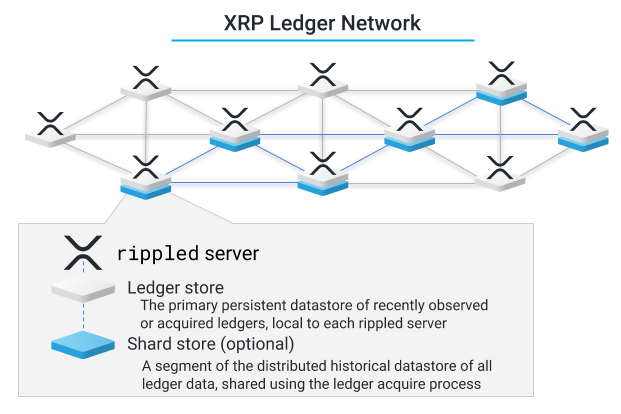

# History Sharding

[Introduced in: rippled 0.90.0][New in: rippled 0.90.0]

As servers operate, they naturally produce a database containing data about the ledgers they witnessed or acquired during network runtime. Each `rippled` server stores that ledger data in its ledger store, but the online delete logic rotates these databases when the number of stored ledgers exceeds configured space limitations.

Historical sharding distributes the transaction history of the XRP Ledger into segments, called shards, across servers in the XRP Ledger network. A shard is a range of ledgers, consisting of a header and two SHAMaps. A `rippled` server stores ledgers in both the ledger store and the shard store in the same way.

Using the history sharding feature, individual `rippled` servers can contribute to storing historical data without needing to store the entire (multiple terabyte) history. A shard store does not replace a ledger store, but implements a reliable path towards distributed ledger history across the XRP Ledger Network.

[](img/xrp-ledger-network-ledger-store-and-shard-store.png)

## Acquiring and Sharing History Shards

`rippled` servers acquire and store history shards only if configured to do so. For those servers, acquiring shards begins after synchronizing with the network and backfilling ledger history to the configured number of recent ledgers. During this time of lower network activity, a `rippled` server set to maintain a `shard_db` randomly chooses a shard to add to its shard store. To increase the probability for an even distribution of the network ledger history, shards are randomly selected for acquisition, and the current shard is given no special consideration.

Once a shard is selected, the ledger acquire process begins by fetching the sequence of the last ledger in the shard and working backwards toward the first. The retrieval process begins with the server checking for the data locally. For data that is not available, the server requests data from its peer `rippled` servers. Those servers that have the data available for the requested period respond with their history. The requesting server combines those responses to create the shard. The shard is complete when it contains all the ledgers in a specific range.

If a `rippled` server runs out of space before completely acquiring a shard, it stops its retrieval process until it has space available to continue. After that point, the most recently completed shard may replace an older shard. If there is sufficient disk space, the `rippled` server acquires additional randomly selected shards to add to the shard store until reaching the maximum allocated disk space for shards (`max_size_gb`).

## XRP Ledger Network Data Integrity

The history of all ledgers is shared by servers agreeing to keep particular ranges of historical ledgers. This makes it possible for servers to confirm that they have all the data they agreed to maintain, and produce proof trees or ledger deltas. Since `rippled` servers that are configured with history sharding randomly select the shards that they store, the entire history of all closed ledgers is stored in a normal distribution curve, increasing the probability that the XRP Ledger Network evenly maintains the history.

## Shard Store Configuration

To configure your `rippled` to store shards of ledger history, add a `shard_db` section to your `rippled.cfg` file.

### Shard Configuration Example
The following snippet from an example `rippled.cfg` file shows the configuration fields for adding sharding to a `rippled` server:

```
[shard_db]
type=NuDB
path=/var/lib/rippled/db/shards/nudb
max_size_gb=50
```

**Tip:** Ripple recommends using NuDB for the shard store (`type=NuDB`). NuDB uses fewer file handles per shard than RocksDB. RocksDB uses memory that scales with the size of data it stores, which may require excessive memory overhead.

**Tip:** While both validator and tracking (or stock) `rippled` servers can be configured to use history shard stores, Ripple recommends adding history sharding only for non-validator `rippled` servers to reduce overhead for validators. If you run a validator and want to manage ledger history using sharding, run a separate `rippled` server with sharding enabled.

For more information, reference the `[shard_db]` example in the [rippled.cfg configuration example](https://github.com/ripple/rippled/blob/master/doc/rippled-example.cfg).

### Sizing the Shard Store
Determining a suitable size for the shard store involves careful consideration. You should consider the following when deciding what size your shard store should be:

- Although redundant, it is possible to hold full ledger history in the ledger store and the history shard store.
- An effective configuration might limit the ledger store only to recent history.
- The ledger store history size should at minimum be twice the ledgers per shard, due to the fact that the current shard may be chosen to be stored and it would be wasteful to reacquire that data.
- The time to acquire, number of file handles, and memory cache usage is directly affected by sizing.
- Each shard contains 2^14 ledgers (16384).
-  A shard occupies approximately 200 MB to 4 GB based on the age of the shard. Older shards are smaller because there was less activity in the XRP Ledger at the time.
- A shard occupies approximately 200 MB to 4 GB based on the age of the shard. Older shards are smaller because there was less activity in the XRP Ledger at the time.

