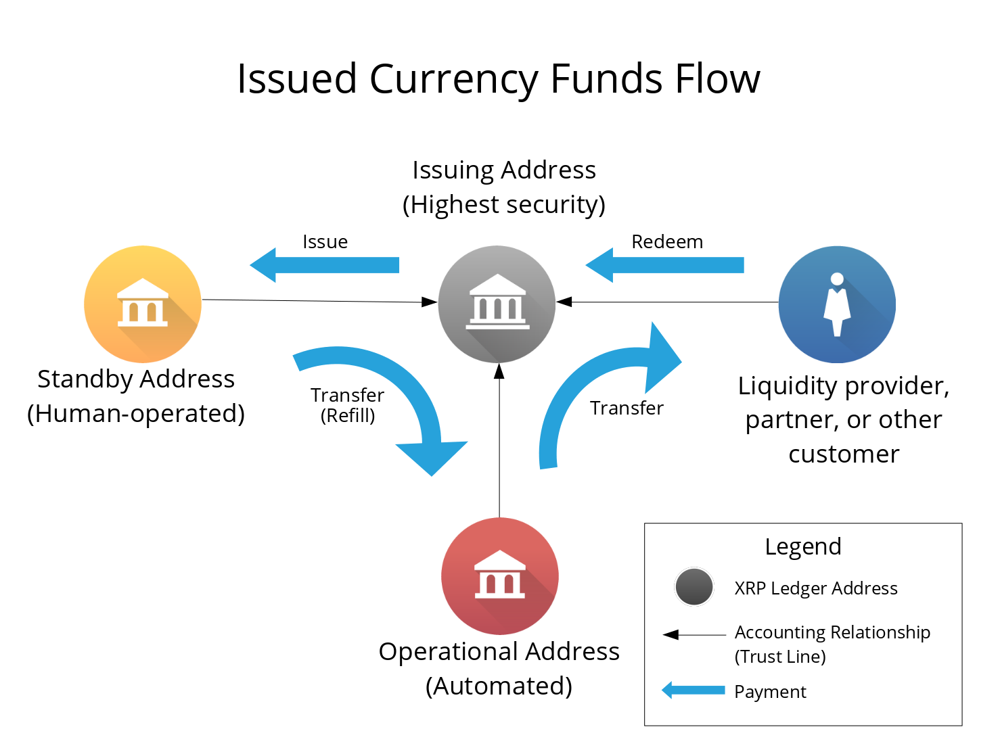

# Issuing and Operational Addresses #

All non-XRP currency balances (issuances) in the Ripple Consensus Ledger (RCL) are tied to accounting relationships between two Ripple addresses. To control an address in the RCL, you only need the secret key mathematically connected to that address. Since no party can unilaterally prevent transactions or correct the ledger, financial institutions typically use multiple Ripple ledger addresses to minimize the risk associated with a compromised secret key. Ripple strongly recommends the following separation of roles:

* One **issuing address**, also known as a "cold wallet." This address is the hub of the financial institution's accounting relationships in the ledger, but sends as few transactions as possible.
* One or more **operational addresses**, also known as "hot wallets." Automated, internet-connected systems use the secret keys to these addresses to conduct day-to-day business like transfers to customers and partners.
* Optional **standby addresses**, also known as "warm wallets." Trusted human operators use these addresses to transfer money to the operational addresses.

## Funds Lifecycle ##

Funds in the Ripple Consensus Ledger tend to flow in a cycle. When the issuing address sends payments, it creates balances in the accounting relationships in the Ripple Consensus Ledger. Within the RCL, users can exchange balances across different accounting relationships, so we use the term _issuances_ to describe any non-XRP balance. Issuances have positive value from the perspective of the customers, partners, operational addresses, and standby addresses. The same issuances are negative balances from the perspective of the issuing address, since they represent obligations. When the issuing address receives a payment, this reduces its obligations, effectively "destroying" the issuances that were sent.

The issuing address sends issuances to a standby address, or directly to an operational address. The standby addresses send those issuances to operational addresses. Operational addresses send payments to liquidity providers or other customers and partners. Because all issuances are tied to accounting relationships with the issuing address, payments and exchanges of issuances "ripple through" the issuing address. The payment debits the sender's balance in its accounting relationship with the issuing address and credits the recipient's balance in the recipient's accounting relationship with the issuing address. The Ripple Consensus Ledger also supports more complicated [paths](concept-paths.html) that connect multiple issuers through order books and [liquidity providers who allow their funds to ripple](concept-noripple.html).

## Issuing Address ##

The issuing address is like a vault. Partners, customers, and operational addresses create accounting relationships (trust lines) to the issuing address, but this address sends as few transactions as possible. Periodically, a human operator creates and signs a transaction from the issuing address in order to refill the balances of a standby or operational address. Ideally, the secret key used to sign these transactions should never be accessible from any internet-connected computer.

Unlike a vault, the issuing address can receive payments directly from customers and partners. Since all transactions in the Ripple Consensus Ledger are public, automated systems can monitor for payments to the issuing address without needing a secret key.

### Issuing Address Compromise ###

If a malicious actor learns the secret key behind a institution's issuing address, that actor can create new issuances without limit and trade them in the decentralized exchange. This would make it difficult for the financial institution to distinguish legitimately-obtained issuances and redeem them fairly. If a financial institution loses control of its issuing address, the institution must create a new issuing address, and all users who have accounting relationships with the old issuing address must create new accounting relationships with the new address.

### Multiple Issuing Addresses ###

A financial institution can issue more than one currency in the Ripple Consensus Ledger from a single issuing address. However, there are some settings that apply equally to all currencies issued from an address, including the percentage for [transfer fees](concept-transfer-fees.html) and the [global freeze](concept-freeze.html) status. If the financial institution wants the flexibility to manage settings differently for each currency, the institution must use a different issuing address for each currency.

## Operational Addresses ##

An operational address is like a cash register. It makes payments on behalf of the institution by transferring issuances to customers and partners. In order to sign transactions automatically, the secret key for an operational address must be stored on a server that is connected to the internet. (The secret key can be stored encrypted, but the server must decrypt it in order to sign transactions.) Customers and partners do not, and should not, create accounting relationships with an operational address.

Each operational address has a limited balance of issuances. When the balance of an operational address gets low, the financial institution refills it by sending a payment from the issuing address or a standby address.

### Operational Address Compromise ###

If a malicious actor learns the secret key behind an operational address, the financial institution can only lose as much currency as that operational address holds. The institution can switch to a new operational address with no action from customers and partners.

## Standby Addresses ##

Another optional step that an institution can take to balance risk and convenience is to use "standby addresses" as an intermediate step between the issuing address and operational addresses. The institution can fund additional Ripple addresses as standby addresses, whose keys are not stored online, but are entrusted to different trusted users.

When an operational address is running low on funds, a trusted user can use a standby address to refill the operational address's balance. When a standby addresses run low on funds, the institution can use the issuing address to send more currency to a standby address in a single transaction, and the standby addresses can distribute that currency among themselves if necessary. This improves security of the issuing address, allowing it to make fewer total transactions, without leaving too much money in the control of a single automated system.

As with operational addresses, a standby address must have an accounting relationship with the issuing address, and not with customers or partners. All precautions that apply to operational addresses also apply to standby addresses.

### Standby Address Compromise ###

If a standby address is compromised, the results are similar to an operational address being compromised. A malicious actor can steal any balances possessed by the standby address, and the financial institution can change to a new standby address with no action from customers and partners.
