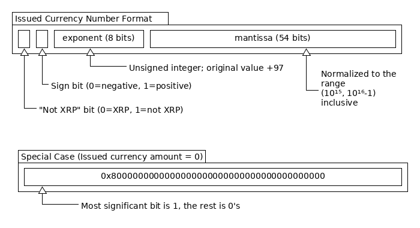
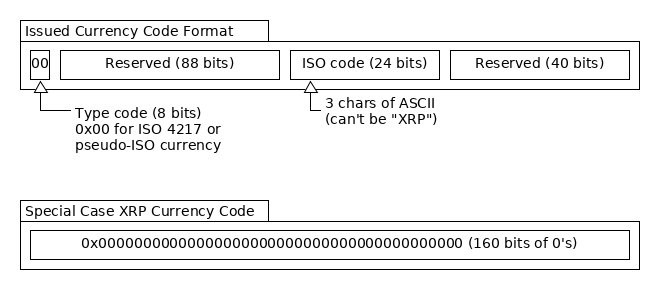

# Money in the XRP Ledger

The XRP Ledger is an advanced blockchain-like system that was designed to let people transact in multiple currencies, seamlessly tracking, trading, and settling multiple currencies in an exchange that's as decentralized as the network itself. Users have the power to create their own currency-like digital assets in the XRP Ledger, which may or may not represent obligations owed outside the XRP Ledger. Tying it all together is XRP, the XRP Ledger's native cryptocurrency, which serves anti-spam purposes and acts as a medium of exchange.

## XRP

**XRP** is the native cryptocurrency of the XRP Ledger. All [accounts](concept-accounts.html) in the XRP Ledger can send XRP among one another and . Unlike other currencies in the XRP Ledger, XRP is not tied to a "trust line" (accounting relationship) between addresses. XRP can be sent directly from any XRP Ledger address to any other, without needing a gateway or liquidity provider. This helps make XRP a convenient bridge currency.

Some advanced features of the XRP Ledger, such as [Escrow](concept-escrow.html) and [Payment Channels](tutorial-paychan.html), only work with XRP. Order book [autobridging](https://ripple.com/dev-blog/introducing-offer-autobridging/) uses XRP to deepen liquidity in the decentralized exchange by merging order books of two issued currencies (such as USD:EUR) with XRP order books (USD:XRP + XRP:EUR results in more trades for the USD:EUR book).

XRP also serves as a protective measure against spamming the network. All XRP Ledger addresses need a small amount of XRP to pay the costs of maintaining the XRP Ledger. The [transaction cost](concept-transaction-cost.html) and [reserve](concept-reserves.html) are neutral fees denoted in XRP and not paid to any party.

For more information on XRP's use cases, benefits, and news, see the [XRP Portal](https://ripple.com/xrp-portal/).

### XRP Properties

XRP is the only native currency in the XRP Ledger. The very first ledger contained 100 billion XRP, and no new XRP can be created. XRP can be destroyed by [transaction costs](concept-transaction-cost.html) or lost by sending it to addresses for which no one holds a key, so XRP is slightly [deflationary](https://en.wikipedia.org/wiki/Deflation) by nature. No need to worry about running out, though: at the current rate of destruction, it would take at least 70,000 years to destroy all XRP, and XRP prices and fees can be adjusted as the total supply of XRP changes.

Technically, XRP Ledger software uses unsigned 64-bit integers to store and calculate XRP amounts down to 6 decimal places. The smallest indivisible amount of XRP is 0.000001, called a "drop" of XRP. Thus, 1 XRP is represented as `1000000` in the internal representation, and 1 drop of XRP is `1` in the internal representation.

## Issued Currencies

All currencies other than XRP are represented as "issued currencies". These digital assets, sometimes called "issuances" or "IOUs", are tracked in accounting relationships, called "trust lines," between addresses. Issued currencies are typically considered as liabilities from one perspective and assets from the other, so the balance of a trust line is negative or positive depending on which side you view it from. An address freely issue (non-XRP) currency, limited only by how much other addresses are willing to hold.

Issued currencies can "ripple" through multiple issuers and holders if they use the same currency code. This is useful in some cases, but can cause unexpected and undesirable behavior in others. You can use the [NoRipple flag](concept-noripple.html) on trust lines to prevent those trust lines from rippling.

In the typical model, an issued currency is tied to holdings of currency or other assets outside the XRP Ledger. The issuer of the currency, called a _gateway_, handles deposits and withdrawals to exchange currency outside the XRP Ledger for equivalent balances of issued currency in the XRP Ledger. For more information on how to run a gateway, see the [Gateway Guide](tutorial-gateway-guide.html).

There are other use cases for issued currencies in the XRP Ledger. For example, you can create an "Initial Coin Offering" (ICO) by issuing a fixed amount of currency to a secondary address, then throwing away the key to the issuer. (Be aware: ICOs may be [regulated as securities](https://www.sec.gov/oiea/investor-alerts-and-bulletins/ib_coinofferings) in the USA.) Ripple recommends researching the relevant regulations before engaging in any financial service business.

Addresses can also [freeze](concept-freeze.html) issued currencies, which may be useful for businesses to comply with financial regulations in their jurisdiction. If you do not need this feature and do not want to freeze currencies, you can give up your address's ability to freeze individual trust lines and to undo a global freeze. XRP can never be frozen.

### Issued Currency Properties

Issued currencies in the XRP Ledger are represented with a custom format with the following precision:

* Minimum nonzero absolute value: `1000000000000000e-96`
* Maximum value: `9999999999999999e80`
* Minimum value: `-9999999999999999e80`
* 15 decimal digits of precision

### Issued Currency Math
[[Source] ](https://github.com/ripple/rippled/blob/35fa20a110e3d43ffc1e9e664fc9017b6f2747ae/src/ripple/protocol/impl/STAmount.cpp "Source")

Internally, `rippled` represents numbers for issued currencies in a custom number format. This format can store a wide variety of assets, including those typically measured in very small or very large denominations. Unlike typical floating-point representations of non-whole numbers, this format uses integer math for all calculations, so it always maintains 15 decimal digits of precision. Unlike "arbitrary precision" number formats, the custom format can always be stored in a fixed size of 64 bits.

The internal format consists of three parts: a sign bit, a mantissa, and an exponent. The mantissa contains up to 15 significant digits (in base-10), and the exponent contains a scale (from -96 to +80). The sign bit indicates whether the amount is positive or negative. Before recording any amount, `rippled` "canonicalizes" the value so that the mantissa is within the range `1000000000000000` to `9999999999999999` (inclusive) and the exponent is in the range -96 to 80 (inclusive). (Exception: the value `0` is represented with a mantissa of `0`.) For example, the canonical representation of 1 unit of currency is `1000000000000000e-15`. The internal calculations generally use integer math so that numbers are always precise within 15 digits.

When transmitting non-XRP amounts across the network or recording them in ledgers, the amounts are joined into a 64-bit format. The most significant bit indicates whether the amount is XRP or issued currency. (The value `1` indicates a non-XRP amount.) The next bit is the sign bit, 1 for positive or 0 for negative. (Caution: This is the opposite of how sign bits work in most other numeric representations!) The next 8 bits are the exponent, and the mantissa occupies the remaining 54 bits.

### Currency Codes

All non-XRP currencies in the XRP Ledger have a 160-bit currency code. The [`rippled` APIs](reference-rippled.html) map 3-character ASCII strings (case-sensitive) to 160-bit currency codes using a standard mapping. The currency code `XRP` is disallowed for issued currencies. Currencies with the same code can [ripple](concept-noripple.html) across connected trustlines. The currency code has no other behavior built into the XRP Ledger.

#### Standard Mapping

The standard currency mapping allocates the bits as follows:

1. The first 8 bits must be `0x00`.
2. The next 96 bits are reserved, and should be all `0`s.
3. The next 24 bits represent 3 characters of ASCII.
    Ripple recommends using [ISO 4217](http://www.xe.com/iso4217.php) codes, or popular pseudo-ISO 4217 codes such as "BTC". However, any combination of the following characters is permitted: all uppercase and lowercase letters, digits, as well as the symbols `?`, `!`, `@`, `#`, `$`, `%`, `^`, `&`, `*`, `<`, `>`, `(`, `)`, `{`, `}`, `[`, `]`, and <code>&#124;</code>. The currency code `XRP` (all-uppercase) is reserved for XRP and cannot be used by issued currencies.
4. The next 8 bits indicate the currency version. If the same currency is reissued with a different value, you can increment this value to keep the currencies separate.
5. The next 24 bits are reserved and should be all `0`s.

#### Nonstandard Mappings

You can also issue currency of other types by using a 160-bit (40-character) hexadecimal string such as `015841551A748AD2C1F76FF6ECB0CCCD00000000` as the currency code. To prevent this from being treated as a different currency code type, the first 8 bits MUST NOT be `0x00`.

**Deprecated:** Some previous versions of [ripple-lib](https://github.com/ripple/ripple-lib) supported an "interest-bearing" or "demurraging" currency code type. Currencies of this type were valued at a different amount than their face value based on the current time and the interest rate incorporated in the currency code. Demurraging / interest-bearing currencies are no longer supported, but you may encounter them in ledger data. These currencies have the following format:

1. The first 8 bits must be `0x01`.
2. The next 24 bits represent 3 characters of ASCII.
    This is expected to be an ISO 4217 code. It supports the same characters as the standard format's ASCII characters.
3. The next 24 bits MUST be all `0`s.
4. The next 64 bits are the interest rate of the currency, represented as "e-folding time" in an IEEE 754 double format.
5. The next 24 bits are reserved and should be all `0`s.

For more information, see [Gateway demurrage on the Ripple Wiki](https://wiki.ripple.com/Gateway_demurrage).
