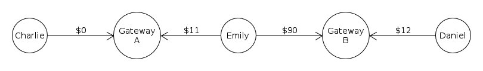

# Understanding the NoRipple Flag #

In the Ripple Consensus Ledger (RCL), the "NoRipple" flag is a setting on a trust line. When an address enables the NoRipple flag on two trust lines, payments from third parties cannot "ripple" through that address on those trust lines. This protects liquidity providers from having balances shift unexpectedly between different issuers of the same currency.

## Background ##

"Rippling" occurs when more than one trust line is adjusted to make a payment. For example, if Alice owes Charlie money, and Alice also owes Bob money, then you could represent that in Ripple with trust lines like so:

If Bob wants to pay $3 to Charlie, then he could say, "Alice, take $3 of the money you owe me, and pay it to Charlie." Alice transfers some of the debt from Bob to Charlie. In the end, the Ripple trust lines work out like so:

We call this process, where two addresses pay each other by adjusting the balances of trust lines in between them, "rippling". This is a useful and important feature of the Ripple Consensus Ledger. Rippling occurs when are linked by trust lines that use the same [currency code](reference-rippled.html#currency-codes). The issuer does not need to be the same: in fact, larger chains always involve changing issuers.

## Justification ##

Sometimes you do not want your balances to ripple. For example, imagine Emily has money issued by two different financial institutions, like so

Now Charlie can pay Daniel by rippling through Emily's address. For example, if Charlie pays Daniel $10:

This may surprise Emily, who does not know Charlie or Daniel. Even worse, if Institution A charges her higher fees to withdraw her money than Institution B, this could cost Emily money. The NoRipple flag exists to avoid this scenario. If Emily sets it on both trust lines, then payments cannot ripple through her address using those two trust lines.

For example:

Now the above scenario, where Charlie pays Daniel while rippling through Emily's address, is no longer possible.

## Specifics ##

The NoRipple flag makes certain paths invalid, so that they cannot be used to make payments. A path is considered invalid if and only if it enters **and** exits an address node through trust lines where NoRipple has been enabled for that address.

## Technical Details ##

### Enabling / Disabling NoRipple ###

The NoRipple flag can only be enabled on a trust line if the address has a positive or zero balance on that trust line. This is so that the feature cannot be abused to default on the obligation the trust line balance represents. (Of course, you can still default by abandoning the address.)

In the [`rippled` APIs](reference-rippled.html), you can enable the NoRipple flag by sending a [TrustSet Transaction](reference-transaction-format.html#trustset) with the `tfSetNoRipple` flag. You can disable NoRipple (enable rippling) with the `tfClearNoRipple` flag.

In [RippleAPI](reference-rippleapi.html), you can enable the NoRipple flag by sending a [Trustline transaction](reference-rippleapi.html#preparetrustline) transaction with the `ripplingDisabled` field of the trust line set to `true`.

### Looking Up NoRipple Status ###

In the case of two accounts that mutually trust each other, the NoRipple flag is tracked separately for each account.

In the [`rippled` APIs](reference-rippled.html), you can use the [account_lines method](https://ripple.com/build/rippled-apis/#account-lines) to look up the trust lines associated with an address. For each trust line, the `no_ripple` field shows whether the current address has enabled the NoRipple flag on that trust line, and the `no_ripple_peer` field shows whether the counterparty has enabled the NoRipple flag.

In [RippleAPI](reference-rippleapi.html), you can use the [getTrustlines](reference-rippleapi.html#gettrustlines) method to look up the trust lines associated with an address. For each trust line, the `ripplingDisabled` field shows whether the current address has enabled the NoRipple flag on that trust line, and the `counterparty.ripplingDisabled` field shows whether the counterparty has enabled the NoRipple flag.
