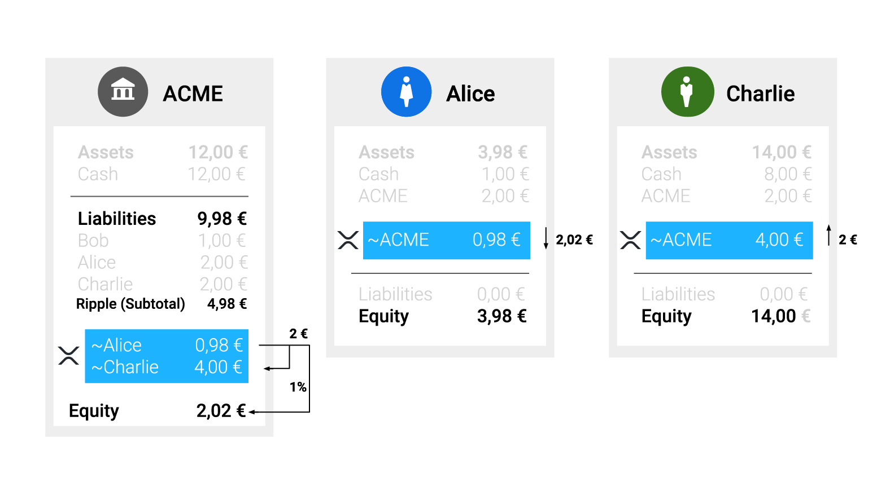

# Transfer Fees #

The `TransferRate` setting in the Ripple Consensus Ledger (RCL) allows [financial institutions that issue currency in the RCL](https://ripple.com/knowledge_center/gateways/) to charge users a _transfer fee_ for sending the currencies issued by that financial institution. The sender of the transfer is debited an extra percentage based on the transfer fee, while the recipient of the transfer is credited the intended amount. The difference is the transfer fee, which becomes the property of the issuing address, and is no longer tracked in the Ripple Consensus Ledger. The transfer fee does not apply when sending or receiving _directly_ to and from the issuing account, but it does apply when transferring from an [operational address][] to another user.

[operational address]: concept-issuing-and-operational-addresses.html
[issuing address]: concept-issuing-and-operational-addresses.html

XRP never has a transfer fee, because it never has an issuer.

For example, ACME Bank might set the transfer fee to 0.5% for ACME issuances. For the recipient of a payment to get 2 EUR.ACME, the sender must send 2.01 EUR.ACME. After the transaction, ACME's outstanding obligations in Ripple have decreased by 0.01€, which means that ACME no longer needs to hold that amount in the account backing its Ripple issuances.

The following diagram shows a Ripple payment of 2 EUR.ACME from Alice to Charlie with a transfer fee of 1%:

## Transfer Fees in Payment Paths ##

A transfer fee applies whenever an individual transfer would shift issuances from one party to another through the issuing account. In more complex transactions, this can occur multiple times. Transfer fees apply starting from the end and working backwards, so that ultimately the sender of a payment must send enough to account for all fees. For example:

In this scenario, Salazar (the sender) holds EUR issued by ACME, and wants to deliver 100 USD issued by WayGate to Rosa (the recipient). FXMaker is a currency trader with the best offer in the order book, at a rate of 1 USD.WayGate for every 0.9 EUR.ACME. If there were no transfer fees, Salazar could deliver 100 USD to Rosa by sending 90 EUR. However, ACME has a transfer fee of 1% and WayGate has a transfer fee of 0.2%. This means:

* FXMaker must send 100.20 USD.WayGate for Rosa to receive 100 USD.WayGate.
* FXMaker's current ask is 90.18 EUR.ACME to send 100.20 USD.WayGate.
* For FXMaker to receive 90.18 EUR.ACME, Salazar must send 91.0818 EUR.ACME.

# Technical Details #

The transfer fee is represented by a setting on the [issuing address][]. The transfer fee has a maximum precision of 9 digits, and cannot be less than 0% or greater than 100%. The TransferRate setting applies to all currencies issued by the same account. If you want to have different transfer fee percentages for different currencies, use different [issuing addresses][issuing address] for each currency.

## RippleAPI ##

In RippleAPI, the transfer fee is specified in the `transferRate` field, as an integer which represents the amount you must send for the recipient to get 1 billion units of the same currency. A `transferRate` of `1005000000` is equivalent to a transfer fee of 0.5%. By default, the `transferRate` is set to no fee. The value of `transferRate` cannot be less than `1000000000` or more than `2000000000`. The value `null` is a special case for no fee, equivalent to `1000000000`.

A financial institution can send a [Settings transaction](reference-rippleapi.html#settings) from its [issuing address][] to change the `transferRate` for its issuances.

You can check an account's `transferRate` with the [getSettings method](reference-rippleapi.html#getsettings).

## rippled ##

In `rippled`'s JSON-RPC and WebSocket APIs, the transfer fee is specified in the `TransferRate` field, as an integer which represents the amount you must send for the recipient to get 1 billion units of the same currency. A `TransferRate` of `1005000000` is equivalent to a transfer fee of 0.5%. By default, the `TransferRate` is set at `1000000000`, indicating no fee. The value of `TransferRate` cannot be less than `1000000000` or more than `2000000000`. However, value `0` is special case for no fee, equivalent to `1000000000`.

A financial institution can submit an [AccountSet transaction](reference-transaction-format.html#accountset) from its [issuing address][] to change the `TransferRate` for its issuances.

You can check an account's `TransferRate` with the [`account_info` command](reference-rippled.html#account-info). If the `TransferRate` is omitted, then that indicates no fee.
