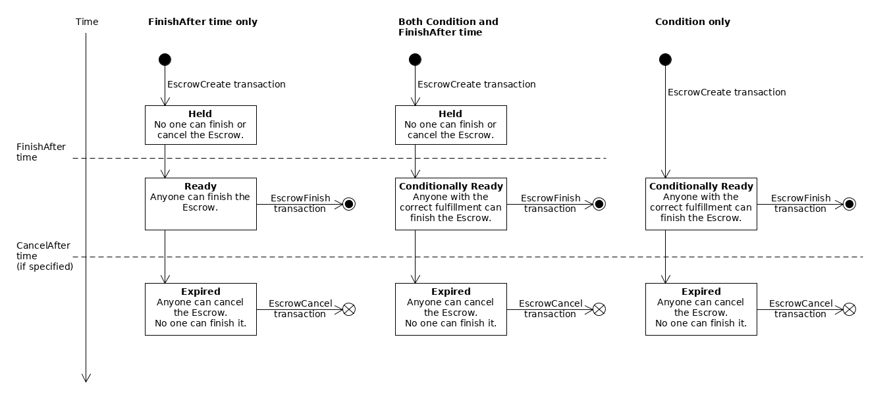

# Escrow

A traditional escrow is a contract between two parties to facilitate financial transactions. A sender delivers funds to an impartial third party to hold, guaranteeing its availability to a recipient. The third party only releases the funds to the recipient when conditions specified by the contract are met. This method ensures both parties meet their obligations.

The XRP Ledger takes escrow a step further, removing the need for a third party to hold the funds. Instead, an escrow locks up XRP on the ledger itself, which can't be used or destroyed until conditions are met.

## Types of Escrow

The XRP Ledger supports three types of escrow:

- **Time-based Escrow:** Escrow funds only become available after a certain amount of time passes.
- **Conditional Escrow:** This escrow is created with a corresponding condition and fulfillment. The condition serves as a lock on the funds and won't release until the correct fulfillment key is provided.
- **Combination Escrow:** This escrow combines the features of time-based and conditional escrow. The escrow is completely inaccessible until the specified time passes, after which the funds can be release by providing the correct fulfillment.

## Escrow Lifecycle

1. The sender creates an escrow using the `EscrowCreate` transaction to define:

    - An amount of XRP to lock up.
    - The conditions to release the XRP.
    - The recipient of the XRP.

2. After the transaction is processed, the XRP Ledger creates an `Escrow` object that holds the escrowed XRP.

3. When the escrow conditions are met, the funds become available.

4. The recipient sends an `EscrowFinish` transaction to actually deliver the XRP. The `Escrow` object is destroyed and the XRP credited to the recipient.
    
    **Note:** If the escrow has an expiration time and isn't successfully finished before then, the escrow becomes expired. Expired escrows remain in the ledger until an `EscrowCancel` transaction cancels it, destroying the `Escrow` object and returning the XRP to the sender.

***TODO: Are these official escrow statuses you can look up in the XRPL?***
## Escrow States

The following diagram shows the states an Escrow can progress through:

The diagram shows three different cases for three possible combinations of the escrow's "finish-after" time (`FinishAfter` field), crypto-condition (`Condition` field), and expiration time (`CancelAfter` field):

- **Time-based Escrow (left):** With only a finish-after time, the escrow is created in the **Held** state. After the specified time has passed, it becomes **Ready** and anyone can finish it. If the escrow has an expiration time and no one finishes it before that time passes, then the escrow becomes **Expired**. In the expired state, an escrow cannot be finished, and anyone can cancel it. If the escrow does not have a `CancelAfter` field, it never expires and cannot be canceled.

- **Combination Escrow (center):** If the escrow specifies both a crypto-condition (`Condition` field) _and_ a "finish-after" time (`FinishAfter` field), the escrow is **Held** until its finish-after time has passed. Then it becomes **Conditionally Ready**, and can finish it if they supply the correct fulfillment to the crypto-condition. If the escrow has an expiration time (`CancelAfter` field), and no one finishes it before that time passes, then the escrow becomes **Expired**. In the expired state, an escrow cannot be finished, and anyone can cancel it. If the escrow does not have a `CancelAfter` field, it never expires and cannot be canceled.

- **Conditional Escrow (right):** If the escrow specifies a crypto-condition (`Condition` field) and not a finish-after time, the escrow becomes **Conditionally Ready** immediately when it is created. During this time, anyone can finish the escrow, but only if they supply the correct fulfillment to the crypto-condition. If no one finishes the escrow before its expiration time (`CancelAfter` field), the escrow becomes **Expired**. (An escrow without a finish-after time _must_ have an expiration time.) In the expired state, the escrow can no longer be finished, and anyone can cancel it.

## Limitations

- Escrow only works with XRP, not tokens.
- The transaction costs can make it infeasible for small amounts.
    - Escrow requires at least two transactions: one to create the escrow and one to finish or cancel it. Both parties must pay the cost of each transaction.
    - Crypto-Conditions incur a higher transaction cost than usual.
- You can't create an escrow with past time values.
- Timed releases and expirations resolve according to XRP Ledger close times. In practice, actual release and expiration times can vary by about five seconds as ledgers close.
- The only supported crypto condition type is PREIMAGE-SHA-256.

## Use Cases

### Time-based Lock-Up

**Background:** Ripple holds a large amount of the total XRP, which it sells methodically as a way to fund and incentivize the healthy development of the XRP Ledger and related technologies. At the same time, owning such a large chunk of XRP causes problems for the company, such as:

- Individuals and businesses who use the XRP Ledger worry that their investments in XRP could be diluted or devalued if Ripple floods the market. Flooding the market would be a long-term loss for Ripple, but the possibility the company could do so exerts downward pressure on the price of XRP and decreases the value of the company's assets.
- Ripple must carefully manage ownership of its accounts to protect against digital theft and other forms of malicious behavior--even by insiders.

**Solution:** By placing 55 billion XRP into time-based escrows, Ripple ensures that the supply of XRP in circulation is predictable and increases at a slow and steady rate. Anyone who holds XRP knows that Ripple can't flood the market, even if the company's priorities or strategy changes.

Placing the money into escrow sharply limits the amount of XRP that can be stolen or redirected if a malicious actors gains temporary control over Ripple's XRP account. This reduces the risk of catastrophic losses of XRP and increases the time for Ripple to detect, prevent, and track down unintended uses of Ripple's XRP assets.

***TODO: Escrows aren't recommended for interledger payments. However, we can use them for smart contracts. Replace this section with a real-life smart contract use case.***
### Interledger Payments

**Background:** In the quickly-developing world of financial technology, one of the core challenges is coordinating activities that cross multiple digital money systems, or ledgers. Many proposed solutions to this problem can be reduced to creating "one ledger to rule them all." Ripple doesn't believe a single system can meet everyone's needs; instead, an interconnected network of ledgers—an _interledger_—is the true future of financial technology. The `Interledger Protocol` defines standards for making as many systems as possible connect securely and smoothly.

The most fundamental principle of inter-ledger payments is _conditional transfers_. Multi-hop payments have a risk problem: the more hops in the middle, the more places the payment can fail. Interledger solves this with the financial equivalent of a "[two-phase commit](https://en.wikipedia.org/wiki/Two-phase_commit_protocol)", where the two steps are (1) prepare conditional transfers, then (2) fulfill the conditions to execute the transfers. The Interledger project defined a `crypto-conditions` specification to standardize automated ways to define and verify conditions, and settled on SHA-256 hashes as a "common denominator" of such conditions.

**Solution:** The Escrow feature makes the XRP Ledger ideal for bridging multi-hop payments using the Interledger Protocol, because it natively supports transfers that deliver XRP based on PREIMAGE-SHA-256 crypto-conditions, and it executes those transfers within seconds of being presented with the matching fulfillment.

***TODO: Think of a smart contract that would see real-world use. The draw of smart contracts is it removes human interaction (I think?), but the example in use-an-escrow-as-a-smart-contract.md still has a person ultimately deciding if someone gets paid.***
### Smart Contracts

**Background:** 

**Solution:**  

## See Also

- [Transactions](../transactions.html)
    - [Transaction Cost](../transaction-cost.html)
- [Escrow Tutorials](use-escrows.html)
- [Transaction Reference](transaction-formats.html)
    - [EscrowCreate transaction][]
    - [EscrowFinish transaction][]
    - [EscrowCancel transaction][]
- [Ledger Reference](ledger-data-formats.html)
    - [Escrow object](escrow-object.html)

***TODO: Out of date, I believe. Confirm before deleting.***
For more information on Interledger and how conditional transfers enable secure payments across multiple ledgers, see [Interledger Architecture](https://interledger.org/rfcs/0001-interledger-architecture/).

For more information on Ripple's 55-billion XRP lock-up, see [Ripple's Insights Blog](https://ripple.com/insights/ripple-to-place-55-billion-xrp-in-escrow-to-ensure-certainty-into-total-xrp-supply/).