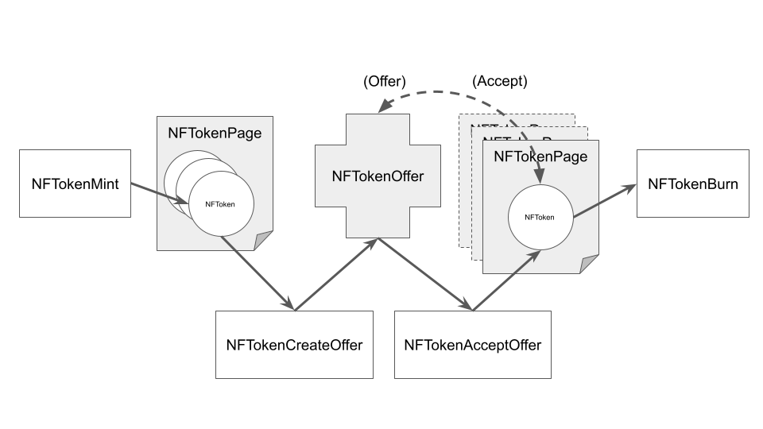

# Non-fungible Tokens


The XRP Ledger tokens are, primarily, fungible.

> Fun·gi·ble /ˈfənjəbəl/ (adj)
>
> 1. able to replace or be replaced by another identical item; mutually interchangeable.

Fungible tokens can be easily traded between users for XRP or other issued assets on the XRP Ledger's decentralized exchange. This makes them ideal for payments.

A good example of a fungible item might be a postage stamp. If you are standing around in 1919 and need to send a letter by airmail, you would purchase a 24-cent stamp and affix it to your envelope. If you lost that stamp, you could use a different 24-cent stamp or use 2 10-cent stamps and 2 2-cent stamps. Very fungible.

But since you are standing around in 1919, you might be offered 24-cent airmail stamps where the aeroplane on the stamp is accidentally printed upside down. These are the world famous “Inverted Jenny” stamps. Only 100 were circulated on a single sheet of stamps, making them extremely rare and sought after. The current value of each mint condition stamp is appraised at over $1.5 million dollars.

Those stamps cannot be replaced by just another other 24-cent stamp. They have become _non-fungible_.

The XRPL Labs team has created a framework that supports non-fungible tokens (NFTs, or “nifties” in the vernacular).  Non-fungible tokens serve to encode ownership of unique physical, non-physical, or purely digital goods, such as works of art or in-game items.

## NFT Extensions

Extensions to the XRP Ledger support two new objects and a new ledger structure.

The `NFToken` is a native NFT type. It has operations to enumerate, purchase, sell, and hold such tokens. An `NFToken` is a unique, indivisible unit that is not used for payments.

The `NFTokenPage object` contains a set of `NFToken` objects owned by the same account.

You create a new `NFToken` using the `NFTokenMint` transaction.

`NFTokenOffer` object is a new object that describes an offer to buy or sell a single `NFToken`.

You destroy an `NFToken` using the `NFTokenBurn` transaction.

## `NFToken` Lifecycle

You create a NFT using the `NFTokenMint` transaction. The `NFToken` lives on the `NFTokenPage` of the issuing account. You can create an `NFTokenOffer` to sell the `NFToken`, creating an entry to the XRP Ledger. Another account can accept the `NFTokenOffer`, transferring the `NFToken` to the accepting account’s `NFTokenPage`. If the `lsfTransferable `flag is set to _true_ (0x000008) when the `NFToken` is minted, the `NFToken` can be traded multiple times between accounts. The `NFToken` can be permanently destroyed by its owner using the `NFTokenBurn` transaction.

<!--
## Reference

- [NFToken][] data type
- Ledger Objects
    - [NFTokenOffer object][]
    - [NFTokenPage object][]
- Transactions
    - [NFTokenMint transaction][]
    - [NFTokenCreateOffer transaction][]
    - [NFTokenCancelOffer transaction][]
    - [NFTokenAcceptOffer transaction][]
    - [NFTokenBurn transaction][]

### API Methods

* `account_nfts`
* `nft_sell_offers`
* `nft_buy_offers`
-->