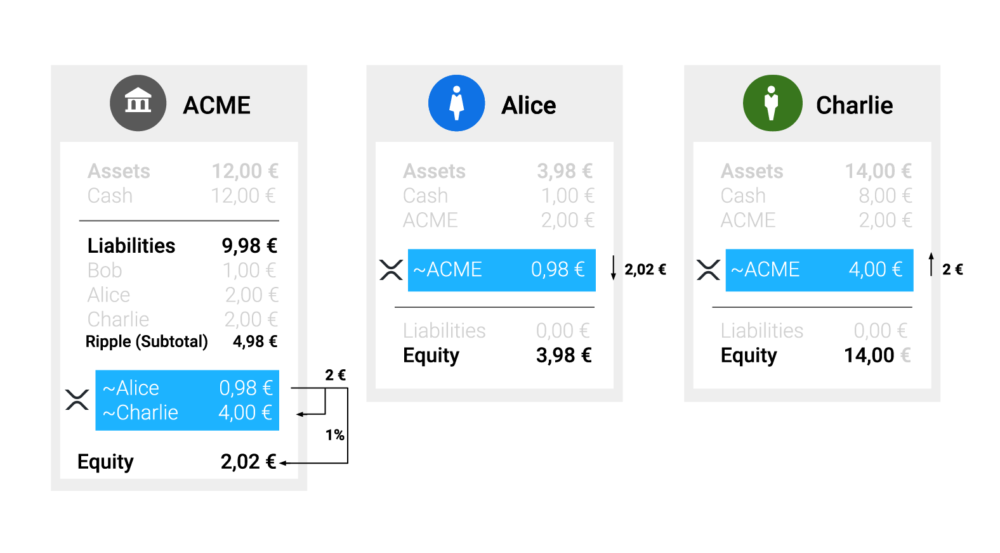
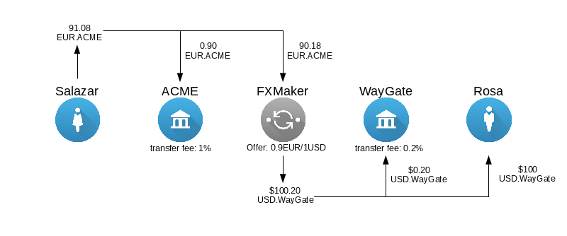

# Transfer Fees #

The *TransferRate* setting in the shared Ripple ledger allows issuing gateways to charge users a "transfer fee" for sending that gateway's issuances to other users. When a gateway sets the transfer fee, it costs extra to send a transfer of that gateway's issuances. The sender of the transfer is debited an extra percentage based on the transfer fee, while the recipient of the transfer is credited the intended amount. The difference is the transfer fee, which becomes the property of the issuing gateway, and is no longer tracked in the Ripple network. The transfer fee does not apply when sending or receiving *directly* to and from the issuing account, but it does apply when transferring from a hot wallet to another user. 

XRP never has a transfer fee, because it never has an issuer.

For example, ACME Gateway might set the transfer fee to 0.5% for ACME issuances. In order for the recipient of a payment to get 2 EUR.ACME, the sender must send 2.01 EUR.ACME. After the transaction, ACME's outstanding obligations in Ripple have decreased by 0.01€, which means that it is no longer obliged to hold that amount in the account backing its Ripple issuances.

The following diagram shows a Ripple payment of 2 EUR.ACME from Alice to Charlie with a transfer fee of 1%:

## Transfer Fees in Longer Paths ##

A transfer fee applies whenever an individual transfer would shift issuances from one party to another through the issuing account. In more complex transactions, this can occur multiple times. Transfer fees apply starting from the end and working backwards, so that ultimately the initial sender of a payment must send enough to account for all fees. For example:

In this scenario, Salazar (the sender) holds EUR issued by ACME, and wants to deliver 100 USD issued by WayGate to Rosa (the recipient). FXMaker is a market maker with the best offer in the order book, at a rate of 1 USD.WayGate for every 0.9 EUR.ACME. If there were no transfer fees, Salazar could deliver 100 USD to Rosa by sending 90 EUR. However, ACME has a transfer fee of 1% and WayGate has a transfer fee of 0.2%. This means:

* FXMaker must send 100.20 USD.WayGate in order for Rosa to receive 100 USD.WayGate.
* FXMaker's current ask is 90.18 EUR.ACME in order to send 100.20 USD.WayGate.
* In order for FXMaker to receive 90.18 EUR.ACME, Salazar must send 91.0818 EUR.ACME.

# Technical Details #

The transfer fee is represented by a setting on the issuing (**cold wallet**) account. The transfer fee has a maximum precision of 9 digits, and cannot be less than 0% or greater than 100%. The TransferRate setting applies to all currencies issued by the same account. If you want to have different transfer fee percentages for different currencies, use different cold wallets to issue each currency.

## Ripple-REST ##

In Ripple-REST, the transfer fee is specified in the `transfer_rate` field, as a decimal which represents the amount you must send in order for the recipient to get 1 unit of the same currency. A `transfer_rate` of `1.005` is equivalent to a transfer fee of 0.5%. By default, the `transfer_rate` is set at `1.0`, indicating no fee. The value of `transfer_rate` cannot be less than `1.0` or more than `2.0`. However, the value `0` is special: it is equivalent to `1.0`, meaning no fee.

A gateway can use the [Update Account Settings method](https://ripple.com/build/ripple-rest/#update-account-settings) with its cold wallet to change the `transfer_rate` for its issuances.

You can check an account's `transfer_rate` with the [Get Account Settings method](https://ripple.com/build/ripple-rest/#get-account-settings).

## rippled ##

In `rippled`'s JSON-RPC and WebSocket APIs, the transfer fee is specified in the `TransferRate` field, as an integer which represents the amount you must send in order for the recipient to get 1 billion units of the same currency. A `TransferRate` of `1005000000` is equivalent to a transfer fee of 0.5%. By default, the `transfer_rate` is set at `1000000000`, indicating no fee. The value of `TransferRate` cannot be less than `1000000000` or more than `2000000000`. However, value `0` is special: it is equivalent to `1000000000`, meaning no fee.

A gateway can submit an [AccountSet transaction](https://ripple.com/build/transactions/#accountset) from its cold wallet to change the `TransferRate` for its issuances. 

You can check an account's `TransferRate` with the [account_info command](https://ripple.com/build/rippled-apis/#account-info). If the `TransferRate` is omitted, then that indicates no fee.

