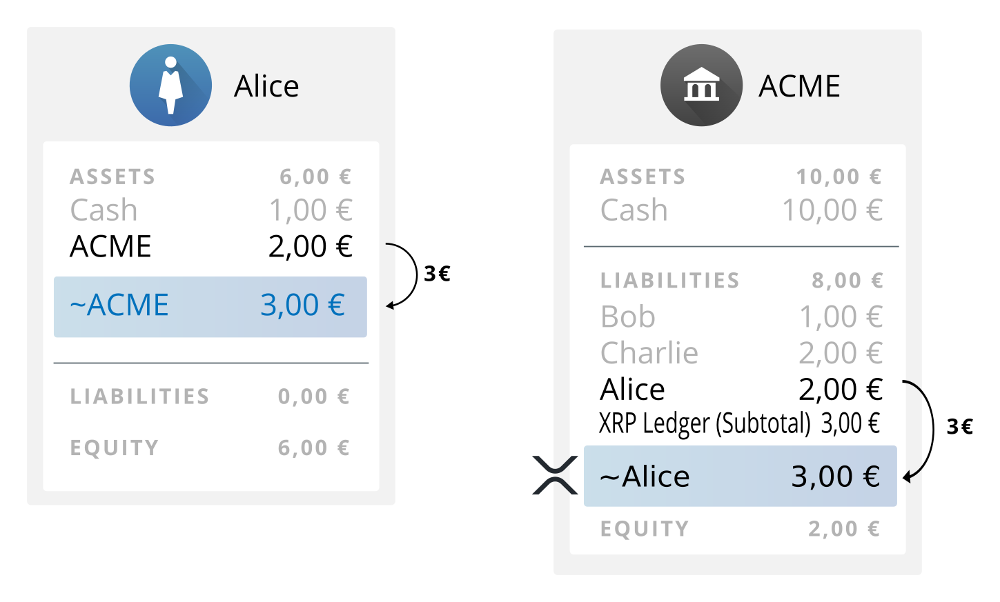
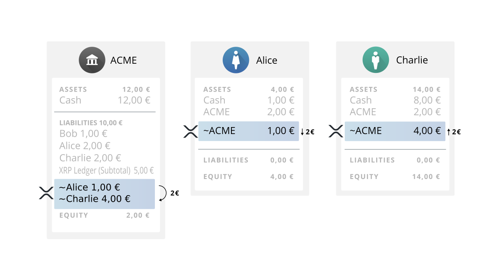

# Becoming a Ripple Gateway #

If you have an existing online financial system, you can expand it to act as a gateway in the the Ripple Consensus Ledger (RCL). [Gateways](https://ripple.com/knowledge_center/gateways/) are the businesses that link the Ripple Consensus Ledger to the rest of the world. By becoming a Ripple gateway, existing online financial services, such as payment systems and digital currency exchange, can gain several advantages:

* By enabling its customers to send and receive value in the Ripple Consensus Ledger, the business increases its value proposition to customers.
* By accepting payments from the Ripple Consensus Ledger, the business increases the number of ways that customers can fund accounts at its business, even internationally.
* The business can use Ripple-related services as a new source of revenue.

This document explains the concepts and steps necessary to become a Ripple gateway. In this document, we use a fictional online currency exchange named "ACME" and its customers as examples, to show how ACME can expand its business to include being a Ripple gateway.


## Contact Information ##

You are not on your own. Ripple depends on the success of individual gateways, so we are here to help. Please contact us if you need help building and growing your gateway.

* Contact [partners@ripple.com](mailto:partners@ripple.com) for enterprise-class integrations, infrastructure advice, and other business development needs.
* Contact [developers@ripple.com](mailto:developers@ripple.com) for technical questions, clarifications, bug reports, and feature requests.


## Ripple Gateways Explained ##



This guide focuses on running an **issuing gateway**.

### Ripple Trust Lines and Issuances ###

All assets in the Ripple Consensus Ledger, except for the native cryptocurrency XRP, are represented as _issuances_, which are digital balances that represent currency or assets of value held by an issuer. Within the RCL, counterparties can send and trade issuances without requiring intervention from the issuer. Typically, a gateway sends issuances to customers when it receives money in systems and ledgers outside the RCL, and promises to send money to customers in outside systems in exchange for being repaid in issuances in the RCL. Issuances get their value from a gateway's agreement to honor the obligation that the issuances represent. No computer system can force a Ripple gateway to honor that obligation.

The Ripple Consensus Ledger has a system of directional accounting relationships, called _trust lines_, to make sure that users only hold issuances from counterparties they trust.

A "trust line" is link between two addresses in Ripple. A trust line represents an explicit statement of willingness to hold gateway debt obligations. When a customer sends money into the RCL, a gateway takes custody of those assets outside of Ripple, and sends issuances in the RCL to the customer's address. When a customer sends money out of the RCL, she makes a Ripple payment to the gateway, and the gateway credits the customer in its own system of record, or in some other account.


### XRP ###

XRP is the native [cryptocurrency](https://ripple.com/knowledge_center/math-based-currency/) of the Ripple Consensus Ledger. Like issuances, XRP can be freely sent and exchanged among Ripple addresses. Unlike issuances, XRP is not tied to an accounting relationship. XRP can be sent directly from any Ripple address to any other, without going through a gateway or liquidity provider. This helps make XRP a convenient [bridge currency](https://ripple.com/knowledge_center/bridge-currency-2/).

XRP also serves other purposes in the RCL, in particular as [a protective measure against spamming the network](https://ripple.com/knowledge_center/abuse-protection/). All Ripple addresses need a small amount of XRP to pay the costs of maintaining the Ripple Consensus Ledger. The [transaction cost](concept-transaction-cost.html) and [reserve](concept-reserves.html) are neutral fees not paid to any party.

Issuing gateways do not need to accumulate or exchange XRP. They must only hold a small balance of XRP to send transactions through the network. The XRP equivalent of $10 USD should be enough for at least one year of transaction costs for a busy gateway.

Private exchanges and liquidity providers may choose to hold additional XRP for trading. Ripple (the company) **does not** promote XRP as a speculative investment.

### Liquidity and Currency Exchange ###

The Ripple Consensus Ledger contains a currency exchange, where any user can place and fulfill bids to exchange XRP and _issuances_ in any combination. Cross-currency payments automatically use the currency exchange to convert currency atomically when the transaction is executed. In this way, users who choose make offers in the distributed exchange provide the liquidity that makes the RCL useful.

Currency traders who hold a gateway's issuances can provide liquidity to other popular currencies, without the gateway needing to float a large reserve in various destination currencies. The gateway also does not need to take on the risk of financial exchange. However, a gateway may still want to provide liquidity to XRP or other popular currencies at a baseline rate, especially when the gateway is new to the exchange. If you do provide liquidity, use a different address for trading than your issuing address.

Third-party liquidity providers can use [RippleAPI](reference-rippleapi.html), [Ripple Stream](https://ripple.com/technology/), or a [third-party client application](https://ripple.com/knowledge_center/wallet-providers/) to access the distributed exchange. Some client applications look up the addresses associated with a gateway using [ripple.txt](#rippletxt), so it can be helpful to publish a good ripple.txt.

Contact [partners@ripple.com](mailto:partners@ripple.com) for help establishing liquidity between your gateway and others.


## Suggested Business Practices ##

The value of a gateway's issuances in the Ripple Consensus Ledger comes directly from the trust that customers can redeem them with the gateway when needed. We recommend the following precautions to reduce the risk of business interruptions:

* Use separate [Issuing and Operational Addresses](concept-issuing-and-operational-addresses.html) to limit your risk profile on the network.
* Comply with anti-money-laundering regulations for your jurisdiction, such as the [Bank Secrecy Act](http://en.wikipedia.org/wiki/Bank_Secrecy_Act). This usually includes requirements to collect ["Know-Your-Customer" (KYC) information](http://en.wikipedia.org/wiki/Know_your_customer).
* Read and stay up-to-date with [Gateway Bulletins](https://ripple.com/knowledge_center/gateway-bulletins/), which provide news and suggestions for Ripple gateways.
* Publicize all your policies and fees.


### Hot and Cold Wallets ###



For more information, see [Issuing and Operational Addresses](concept-issuing-and-operational-addresses.html)


## Fees and Revenue Sources ##

There are several ways in which a gateway can seek to profit from Ripple integration. These can include:

* Withdrawal and Deposit fees. Gateways typically charge a small fee (such as 1%) for the service of adding or removing money from Ripple. You have the power to determine the rate you credit people when they move money onto and off of Ripple through your gateway.
* Transfer fees. You can set a percentage fee to charge automatically when customers send each other issuances created by your issuing address. This amount is debited from the Ripple Consensus Ledger, decreasing your obligation each time your issuances change hands. See [TransferRate](#transferrate) for details.
* Indirect revenue from value added. Ripple integration can provide valuable functionality for your customers that distinguishes your business from your competitors.
* Interest on Ripple-backed funds. You can keep the collateral for the funds you issue in RCL in a bank account that earns interest. Make sure you can always access enough funds to service customer withdrawals.
* [Financial Exchange](#liquidity-and-currency-exchange). A gateway can also make offers to buy and sell its issuances for other issuances in the RCL, providing liquidity to cross-currency payments and possibly making a profit. (As with all financial exchange, profits are not guaranteed.)


### Choosing Fee Rates ###

Fees imposed by gateways are optional. Higher fees earn more revenue when a gateway's services are used. On the other hand, high fees discourage customers from using your services. Consider the fees that are charged by other gateways, especially ones issuing similar currencies, as well as traditional payment systems outside of Ripple, such as wire fees. Choosing the right fee structure is a matter of balancing your pricing with what the market is willing to pay.


# Ripple Integration #

## Before Ripple Integration ##

Our example exchange, ACME, already accepts withdrawals and deposits from customers using some existing system, and uses its own system of record to track how much balance each user has with the exchange. Such a system can be modeled with a balance sheet and tracking how much currency each user has with ACME.

In the following diagram, ACME Exchange starts with €5 on hand, including €1 that belongs to Bob, €2 that belongs to Charlie, and an additional €2 of equity that belongs to ACME itself. Alice deposits €5, so ACME adds her to its balance sheet and ends up with €10.


**Assumptions:** To integrate with Ripple, we assume that an exchange such as ACME meets the following assumptions:

* ACME already has a system to accept deposits and withdrawals from some outside payment source.
* ACME waits for deposits to clear before crediting them in ACME's system of record.
* ACME always keeps enough funds on-hand to pay withdrawals on demand, subject to their terms and conditions.
    * ACME can set fees, minimum withdrawals, and delay times for deposits and withdrawals as their business model demands.

## Sending from Gateway to Ripple ##

Ripple payments can automatically bridge between currencies, but an issuing gateway normally only sends single-currency payments that go directly to customers. This means debiting a customer's current balance in your system, and then sending the equivalent amount of issuances in the RCL to the customer's Ripple address.

An example flow for a payment into the RCL:

1. Alice asks to send €3 of her ACME balance into the RCL.
2. In its system of record, ACME debits Alice's balance €3.
3. ACME submits a Ripple transaction, sending €3 to Alice's Ripple address. The €3 is marked in the Ripple Consensus Ledger as being "issued" by ACME (3 EUR.ACME).

**Assumptions:**

* Alice already has an address in the Ripple Consensus Ledger separate from her ACME account. Alice manages her Ripple address using a third-party client application.




### Requirements for Sending to RCL ###

There are several prerequisites that ACME must meet for this to happen:

- ACME sets aside money that is issued in the Ripple Consensus Ledger. ACME can query the RCL to see who holds its issuances at any time. There are several ways ACME may do this:
    - ACME may create a Ripple Consensus Ledger collateral account in ACME's system of record.
    - ACME can store the funds allocated to Ripple in a separate bank account.
    - If ACME is a cryptocurrency exchange, ACME can create a separate wallet to hold the funds allocated to Ripple, as publicly-verifiable proof to customers that the gateway is solvent.
- ACME must control an address in the Ripple Consensus Ledger. Ripple's best practices recommend using a separate issuing address and operational address. See [Issuing and Operational Addresses](concept-issuing-and-operational-addresses.html) for details.
    - ACME must enable the [DefaultRipple Flag](#defaultripple) on its issuing address for customers to send and receive its issuances.
- Alice must create an accounting relationship (trust line) from her Ripple address to ACME's issuing address. She can do this from any Ripple client application as long as she knows ACME's issuing address.
    - ACME should publicize its issuing address on its website where customers can find it. It can also use [ripple.txt](#rippletxt) to publish the issuing address to automated systems.
- ACME must create a user interface for Alice to send funds from ACME into Ripple.
    - ACME needs to know Alice's Ripple address. ACME can have Alice input her Ripple addresss as part of the interface, or ACME can require Alice to input and verify her Ripple address in advance.

See [Sending Payments to Customers](#sending-payments-to-customers) for an example of how to send payments into Ripple.


## Sending from RCL to Gateway ##

A payment out of the Ripple Consensus Ledger means the Gateway receives a payment in the RCL, and credits a user in the gateway's system of record.

An example flow of a payment out of Ripple:

1. Bob sends Ripple transaction of €1 to ACME's issuing address.
2. In ACME's system of record, ACME credits Bob's balance €1.

Payments going from the Ripple Consensus Ledger to a gateway can be single-currency or cross-currency payments. The gateway's issuing address can only receive issuances it created (or XRP).

### Requirements for Receiving from RCL ###

In addition to the [requirements for sending into Ripple](#requirements-for-sending-to-rcl), there are several prerequisites that ACME must meet to process payments coming from Ripple:

- ACME must monitor its Ripple addresses for incoming payments.
- ACME must know which user to credit in its system of record for the incoming payments.
    - We recommend that ACME should [bounce any unrecognized incoming payments](#bouncing-payments) back to their sender.
    - Typically, the preferred method of recognizing incoming payments is through [destination tags](#source-and-destination-tags).


## Precautions ##

Processing payments to and from Ripple naturally comes with some risks, so a gateway should be sure to take care in implementing these processes. We recommend the following precautions:

- Protect yourself against reversible deposits. Ripple payments are irreversible, but many electronic money systems like credit cards or PayPal are not. Scammers can abuse this to take their fiat money back by canceling a deposit after receiving Ripple issuances.
- When sending into Ripple, specify the issuing address as the issuer of the currency. Otherwise, you might accidentally use paths that deliver the same currency issued by other addresses.
- Before sending a payment into Ripple, double check the cost of the payment. A payment from your operational address to a customer should not cost more than the destination amount plus any [transfer fee](#transferrate) you have set.
- Before processing a payment out of Ripple, make sure you know the customer's identity. This makes it harder for anonymous attackers to scam you. Most anti-money-laundering regulations require this anyway. This is especially important because the users sending money from the RCL could be different than the ones that initially received the money in the RCL.
- Follow the guidelines for [reliable transaction submission](#reliable-transaction-submission) when sending Ripple transactions.
- [Robustly monitor for incoming payments](#robustly-monitoring-for-payments), and read the correct amount. Don't mistakenly credit someone the full amount if they only sent a [partial payment](reference-transaction-format.html#partial-payments).
- Track your obligations and balances within the Ripple Consensus Ledger, and compare with the assets in your collateral account. If they do not match up, stop processing withdrawals and deposits until you resolve the discrepancy.
- Avoid ambiguous situations. We recommend the following:
    - Enable the [`DisallowXRP` flag](#disallowxrp) for the issuing address and all operational addresses, so customers do not accidentally send you XRP. (Private exchanges should *not* set this flag, since they trade XRP normally.)
    - Enable the [`RequireDest` flag](#requiredest) for the issuing address and all operational addresses, so customers do not accidentally send a payment without the destination tag to indicate who should be credited.
    - Enable the [`RequireAuth` flag](#requireauth) on all operational addresses so they cannot issue currency by accident.
- Monitor for suspicious or abusive behavior. For example, a user could repeatedly send funds into and out of the RCL, as a denial of service attack that effectively empties an operational address's balance. Suspend customers whose addresses are involved in suspicious behavior by not processing their Ripple payments.


## Trading on Ripple ##

After the issuances have been created in the Ripple Consensus Ledger, they can be freely transferred and traded by RCL users. There are several consequences of this situation:

- Anyone can buy/sell EUR.ACME on Ripple. If ACME issues multiple currencies on Ripple, a separate trust line is necessary for each.
    - This includes RCL users who do not have an account in ACME Exchange's systems. To withdraw the funds successfully from ACME, users still have to register with ACME.
    - Optionally, ACME uses the [Authorized Accounts](#authorized-accounts) feature to limit who can hold EUR.ACME in the RCL.
    - If ACME determines that a customer has acted in bad faith, ACME can [Freeze](#freeze) that user's accounting relationships to ACME in the RCL, so that the user can no longer trade in the gateway's issuances.
- RCL users trading and sending EUR.ACME to one another requires no intervention by ACME.
- All exchanges and balances in the RCL are publicly viewable.

The following diagram depicts a Ripple payment sending 2EUR.ACME from Alice to Charlie. ACME can query the RCL to see updates to its balances any time after the transaction has occurred:




## Freeze ##

A gateway can freeze accounting relationships in the Ripple Consensus Ledger to meet regulatory requirements:

* Gateways can freeze individual accounting relationships, in case a customer address shows suspicious activity or violates a gateway's terms of use.
* Gateways can freeze all accounting relationships to their issuing address, in case of a major security compromise or for migrating to a new issuing address.
* Furthermore, gateways can permanently opt out of their ability to freeze accounting relationships. This allows a gateway to assure its customers that it will continue to provide "physical-money-like" services. <!-- STYLE_OVERRIDE: will -->

For more information, see the [Freeze article](concept-freeze.html).


## Authorized Accounts ##

The Ripple Consensus Ledger's Authorized Accounts feature enables a gateway to limit who can hold that gateway's issuances, so that unknown Ripple addresses cannot hold the currency the gateway issues. Ripple feels this is *not necessary* in most cases, since gateways have full control over the process of redeeming Ripple balances for value in the outside world. (You can collect customer information and impose limits on withdrawals at that stage without worrying about what happens within the Ripple Consensus Ledger.)

To use the Authorized Accounts feature, a gateway enables the `RequireAuth` flag for its issuing address, and then individually approves each accounting relationship. An address can only hold funds issued by a gateway after its accounting relationship with that gateway is approved.

The transaction to authorize an accounting relationship must be signed by the issuing address, which unfortunately means an increased risk exposure for that address. The process for sending funds into the Ripple Consensus Ledger with RequireAuth enabled looks like the following:

1. ACME publishes its issuing address to customers.
2. Alice creates an accounting relationship from her Ripple address to ACME's issuing address, indicating that she is willing to hold ACME's issuances.
3. ACME's issuing address sends a transaction authorizing Alice's accounting relationship.

See [RequireAuth](#requireauth) for technical details on how to use Authorized Accounts.


## Source and Destination Tags ##

*Destination Tags* are a feature of Ripple payments can be used to indicate the beneficiary or destination for a payment. For example, a Ripple payment to a gateway may include a destination tag to indicate which customer should be credited for the payment. A gateway should keep a mapping of destination tags to accounts in the gateway's system of record.

Similarly, *Source Tags* indicate the originator or source of a payment. Most commonly, a Source Tag is included so that the recipient of the payment knows where to bounce the payment. When you bounce an incoming payment, use the Source Tag from the incoming payment as the Destination Tag of the outgoing (bounce) payment.

We recommend providing several kinds of Destination Tags for different purposes:

* Direct mappings to customer accounts
* Matching the Source Tags on outgoing payments (in case your payments get bounced)
* Tags for quotes, which expire
* Other disposable destination tags that customers can generate.

See [Generating Source and Destination Tags](#generating-source-and-destination-tags) for recommendations on the tehnical details of making and using Source Tags and Destination Tags.


# Technical Details #

## Infrastructure ##

For the gateway's own security as well as the stability of the network, we recommend that each gateway run its own `rippled` servers. Ripple (the company) provides detailed and individualized recommendations to businesses interested in running a significant Ripple-based business.

Contact [partners@ripple.com](mailto:partners@ripple.com) to see how Ripple can help.

### APIs and Middleware ###

There are several interfaces you can use to connect to the Ripple Consensus Ledger, depending on your needs and your existing software:

* [`rippled`](reference-rippled.html) provides JSON-RPC and WebSocket APIs that can be used as a low-level interface to all core Ripple functionality.
* [RippleAPI](reference-rippleapi.html) provides a simplified API for JavaScript applications.


## Tool Security ##

Any time you submit a Ripple transaction, it must be signed using your secret key. The secret key gives full control over your Ripple address. **Never** send your secret key to a server operated by someone else. Either use your own `rippled` server, or sign the transactions locally before sending them to a `rippled` server.

The examples in this document show API methods that include a secret key. This is only safe if you control `rippled` server yourself, *and* you connect to it over a connection that is secure from outside listeners. (For example, you could connect over a loopback (localhost) network, a private subnet, or an encrypted VPN.) Alternatively, you could use [RippleAPI](reference-rippleapi.html) to sign transactions locally before submitting them to a third-party server.


## DefaultRipple ##

The DefaultRipple flag controls whether the balances in an accounting relationship [allowed to ripple](concept-noripple.html) by default. Rippling is what allows customers to trade issuances, so a gateway must allow rippling on all the accounting relationships to its issuing address.

Before asking customers to create accounting relationships to its issuing address, a gateway should enable the DefaultRipple flag on that address. Otherwise, the gateway must individually disable the NoRipple flag for each accounting relationship that other addresses have created.

The following is an example of using a locally-hosted `rippled`'s [`submit` command](reference-rippled.html#submit) to send an AccountSet transaction to enable the DefaultRipple flag:

Request:

```
POST http://localhost:8088/
{
    "method": "submit",
    "params": [
        {
            "secret": "sn3nxiW7v8KXzPzAqzyHXbSSKNuN9",
            "tx_json": {
                "Account": "rf1BiGeXwwQoi8Z2ueFYTEXSwuJYfV2Jpn",
                "Fee": "15000",
                "Flags": 0,
                "SetFlag": 8,
                "TransactionType": "AccountSet"
            }
        }
    ]
}
```



Response:

```
{
    "result": {
        "engine_result": "tesSUCCESS",
        "engine_result_code": 0,
        "engine_result_message": "The transaction was applied. Only final in a validated ledger.",
        "status": "success",
        "tx_blob": "1200032200000000240000003E202100000008684000000000003A98732103AB40A0490F9B7ED8DF29D246BF2D6269820A0EE7742ACDD457BEA7C7D0931EDB74473045022100D8F2DEF27DE313E3F0D1E189BF5AC8879F591045950E2A33787C3051169038C80220728A548F188F882EA40A416CCAF2AC52F3ED679563BBE1BAC014BB9E773A333581144B4E9C06F24296074F7BC48F92A97916C6DC5EA9",
        "tx_json": {
            "Account": "rf1BiGeXwwQoi8Z2ueFYTEXSwuJYfV2Jpn",
            "Fee": "15000",
            "Flags": 0,
            "Sequence": 62,
            "SetFlag": 8,
            "SigningPubKey": "03AB40A0490F9B7ED8DF29D246BF2D6269820A0EE7742ACDD457BEA7C7D0931EDB",
            "TransactionType": "AccountSet",
            "TxnSignature": "3045022100D8F2DEF27DE313E3F0D1E189BF5AC8879F591045950E2A33787C3051169038C80220728A548F188F882EA40A416CCAF2AC52F3ED679563BBE1BAC014BB9E773A3335",
            "hash": "665B27B64CE658704FFD326A4FE2F5F5B5E67EACA61DE08258A59D35B883E1D5"
        }
    }
}
```

To confirm that an address has DefaultRipple enabled, look up the address using the [account_info command](reference-rippled.html#account-info), specifying a validated ledger version. Use [a bitwise-AND operator](https://en.wikipedia.org/wiki/Bitwise_operation#AND) to compare the `Flags` field with 0x00800000 (the [ledger flag lsfDefaultRipple](reference-ledger-format.html#accountroot-flags)). If the result of the bitwise-AND operation is nonzero, then the address has DefaultRipple enabled.


## Generating Source and Destination Tags ##

You need a scheme to create Source and Destination tags for your customers and payments. (See [Source and Destination Tags](#source-and-destination-tags) for an explanation of what Source and Destination Tags are.)

For greater privacy and security, we recommend *not* using monotonically-incrementing numbers as destination tags that correlate 1:1 with customers. Instead, we recommend using convenient internal IDs, but mapping those to destination tags using a quick hash or cipher function such as [Hasty Pudding](http://en.wikipedia.org/wiki/Hasty_Pudding_cipher). You should set aside ranges of internal numbers for different uses of destination tags.

After passing the internal numbers through your hash function, you can use the result as a destination tag. To be safe, you should check for collisions. Do not reuse destination tags unless they have explicit expiration dates (like quotes and customer-generated tags).

We recommend making a user interface to generate a destination tag on-demand when a customer intends to send money to the gateway. Then, consider that destination tag valid only for a payment with the expected amount. Later, bounce any other transactions that reuse the same destination tag.

Enable the [RequireDest](#requiredest) flag on your issuing and operational addresses so that customers must use a destination tag to indicate where funds should go when they send Ripple payments to your gateway.


## DisallowXRP ##

The DisallowXRP setting (`disallowIncomingXRP` in RippleAPI) is designed to discourage RCL users from sending XRP to an address by accident. This reduces the costs and effort of bouncing undesired payments, if your gateway does not trade XRP. The DisallowXRP flag is not strictly enforced, because doing so could allow addresses to become permanently unusable if they run out of XRP. Client applications should honor the DisallowXRP flag by default.

An issuing gateway that does not trade XRP should enable the DisallowXRP flag on the gateway's issuing and operational addresses. A private exchange that trades in XRP should only enable the DisallowXRP flag on addresses that are not expected to receive XRP.

The following is an example of using a locally-hosted `rippled`'s [`submit` command](reference-rippled.html#submit) to send an AccountSet transaction to enable the DisallowXRP flag:

Request:

```
POST http://localhost:8088/
{
    "method": "submit",
    "params": [
        {
            "secret": "sn3nxiW7v8KXzPzAqzyHXbSSKNuN9",
            "tx_json": {
                "Account": "rf1BiGeXwwQoi8Z2ueFYTEXSwuJYfV2Jpn",
                "Fee": "10000",
                "Flags": 0,
                "SetFlag": 3,
                "TransactionType": "AccountSet"
            }
        }
    ]
}
```



Response:

```
{
	"result": {
		"engine_result": "tesSUCCESS",
		"engine_result_code": 0,
		"engine_result_message": "The transaction was applied. Only final in a validated ledger.",
		"status": "success",
		"tx_blob": "12000322000000002400000164202100000003684000000000002710732103AB40A0490F9B7ED8DF29D246BF2D6269820A0EE7742ACDD457BEA7C7D0931EDB74473045022100C2E38177E92C3998EB2C22978595784BC4CABCF7D57DE71FCF6CF162FB683A1D02205942D42C440D860B4CF7BB0DF77E4F2C529695854835B2F76DC2D09644FCBB2D81144B4E9C06F24296074F7BC48F92A97916C6DC5EA9",
		"tx_json": {
			"Account": "rf1BiGeXwwQoi8Z2ueFYTEXSwuJYfV2Jpn",
			"Fee": "10000",
			"Flags": 0,
			"Sequence": 356,
			"SetFlag": 3,
			"SigningPubKey": "03AB40A0490F9B7ED8DF29D246BF2D6269820A0EE7742ACDD457BEA7C7D0931EDB",
			"TransactionType": "AccountSet",
			"TxnSignature": "3045022100C2E38177E92C3998EB2C22978595784BC4CABCF7D57DE71FCF6CF162FB683A1D02205942D42C440D860B4CF7BB0DF77E4F2C529695854835B2F76DC2D09644FCBB2D",
			"hash": "096A89DA55A6A1C8C9EE1BCD15A8CADCC52E6D2591393F680243ECEB93161B33"
		}
	}
}
```


## RequireDest ##

The `RequireDest` setting (`requireDestinationTag` in RippleAPI) is designed to prevent customers from sending payments to your address while accidentally forgetting the [destination tag](#source-and-destination-tags) that identifies who should be credited for the payment. When enabled, the Ripple Consensus Ledger rejects any payment to your address that does not specify a destination tag.

We recommend enabling the `RequireDest` flag on all gateway issuing and operational addresses.

The following is an example of using a locally-hosted `rippled`'s [`submit` command](reference-rippled.html#submit) to send an AccountSet transaction to enable the `RequireDest` flag:

Request:

```
POST http://localhost:5005/
Content-Type: application/json
{
    "method": "submit",
    "params": [
        {
            "secret": "sn3nxiW7v8KXzPzAqzyHXbSSKNuN9",
            "tx_json": {
                "Account": "rf1BiGeXwwQoi8Z2ueFYTEXSwuJYfV2Jpn",
                "Fee": "15000",
                "Flags": 0,
                "SetFlag": 1,
                "TransactionType": "AccountSet"
            }
        }
    ]
}
```



Response:

```
200 OK
{
	"result": {
		"engine_result": "tesSUCCESS",
		"engine_result_code": 0,
		"engine_result_message": "The transaction was applied. Only final in a validated ledger.",
		"status": "success",
		"tx_blob": "12000322000000002400000161202100000003684000000000003A98732103AB40A0490F9B7ED8DF29D246BF2D6269820A0EE7742ACDD457BEA7C7D0931EDB74473045022100CD9A87890ADFAC49B8F69EDEC4A0DB99C86667883D7579289B06DAA4B81BF87E02207AC3FEEA518060AB2B538D330614D2594F432901F7C011D7EB92F74383E5340F81144B4E9C06F24296074F7BC48F92A97916C6DC5EA9",
		"tx_json": {
			"Account": "rf1BiGeXwwQoi8Z2ueFYTEXSwuJYfV2Jpn",
			"Fee": "15000",
			"Flags": 0,
			"Sequence": 353,
			"SetFlag": 3,
			"SigningPubKey": "03AB40A0490F9B7ED8DF29D246BF2D6269820A0EE7742ACDD457BEA7C7D0931EDB",
			"TransactionType": "AccountSet",
			"TxnSignature": "3045022100CD9A87890ADFAC49B8F69EDEC4A0DB99C86667883D7579289B06DAA4B81BF87E02207AC3FEEA518060AB2B538D330614D2594F432901F7C011D7EB92F74383E5340F",
			"hash": "59025DD6C9848679BA433448A1DD95833F2F4B64B03E214D074C7A5B6E3E3E70"
		}
	}
}
```

## RequireAuth ##

The `RequireAuth` setting (`requireAuthorization` in RippleAPI) prevents all counterparties from holding balances issued by an address unless the address has specifically approved an accounting relationship with that counterparty.

We recommend always [enabling `RequireAuth`](#enabling-requireauth) for operational addresses and standby addresses, and then never approving any accounting relationships. This prevents operational addresses from creating issuances even by accident. This is a purely precautionary measure, and does not stop those addresses from transferring issuances created by the issuing address, as they are intended to do.

If you want to use the [Authorized Accounts](#authorized-accounts) feature, you must also enable `RequireAuth` on your issuing address. When using Authorized Accounts, your issuing address must [submit a `TrustSet` transaction to approve each accounting relationship](#authorizing-trust-lines) that customers create with your issuing address.

You can only enable `RequireAuth` if the address owns no accounting relationships (trust lines) and no offers in the Ripple Consensus Ledger, so you must decide whether or not to use it before you start doing business in the RCL.

### Enabling RequireAuth ###

The following is an example of using a locally-hosted `rippled`'s [`submit` command](reference-rippled.html#submit) to send an AccountSet transaction to enable the RequireAuth flag: (This method works the same way regardless of whether the address is an issuing address, operational address, or standby address.)

Request:

```
POST http://localhost:5005/
{
    "method": "submit",
    "params": [
        {
            "secret": "sn3nxiW7v8KXzPzAqzyHXbSSKNuN9",
            "tx_json": {
                "Account": "rUpy3eEg8rqjqfUoLeBnZkscbKbFsKXC3v",
                "Fee": "15000",
                "Flags": 0,
                "SetFlag": 2,
                "TransactionType": "AccountSet"
            }
        }
    ]
}
```



### Authorizing Trust Lines ###

If you are using the [Authorized Accounts](#authorized-accounts) feature, customers cannot hold balances you issue unless you first authorize their accounting relationships to you in the RCL.

To authorize an accounting relationship, submit a TrustSet transaction from your issuing address, with the user to trust as the `issuer` of the `LimitAmount`. Leave the `value` (the amount to trust them for) as **0**, and enable the [tfSetfAuth](reference-transaction-format.html#trustset-flags) flag for the transaction.

The following is an example of using a locally-hosted `rippled`'s [`submit` command](reference-rippled.html#submit) to send a TrustSet transaction authorizing the customer address rf1BiGeXwwQoi8Z2ueFYTEXSwuJYfV2Jpn to hold issuances of USD from the issuing address rsA2LpzuawewSBQXkiju3YQTMzW13pAAdW:

Request:

```
POST http://localhost:8088/
{
    "method": "submit",
    "params": [
        {
            "secret": "sn3nxiW7v8KXzPzAqzyHXbSSKNuN9",
            "tx_json": {
                "Account": "rsA2LpzuawewSBQXkiju3YQTMzW13pAAdW",
                "Fee": "15000",
                "TransactionType": "TrustSet",
                "LimitAmount": {
                    "currency": "USD",
                    "issuer": "rf1BiGeXwwQoi8Z2ueFYTEXSwuJYfV2Jpn",
                    "value": 0
                },
                "Flags": 65536
            }
        }
    ]
}
```




## Robustly Monitoring for Payments ##

To robustly check for incoming payments, gateways should do the following:

* Keep a record of the most-recently-processed transaction and ledger. That way, if you temporarily lose connectivity, you know how far to go back.
* Check the result code of every incoming payment. Some payments go into the ledger to charge an anti-spam fee, even though they failed. Only transactions with the result code `tesSUCCESS` can change non-XRP balances. Only transactions from a validated ledger are final.
* [Look out for Partial Payments](https://ripple.com/knowledge_center/partial-payment-flag/ "Partial Payment Flag Gateway Bulletin"). Payments with the partial-payment flag enabled can be considered "successful" if any non-zero amount is delivered, even miniscule amounts.
    * In `rippled`, check the transaction for a `meta.delivered_amount` field. If present, that field indicates how much money *actually* got delivered to the `Destination` address.
    * In RippleAPI, you can search the `outcome.BalanceChanges` field to see how much the destination address received. In some cases, this can be divided into multiple parts on different trust lines.
* Some transactions change your balances without being payments directly to or from one of your addresses. For example, if ACME sets a nonzero [TransferRate](#transferrate), then ACME's issuing address's outstanding obligations decrease each time Bob and Charlie exchange ACME issuances. See [TransferRate](#transferrate) for more information.

To make things simpler for your customers, we recommend accepting payments to either operational addresses and issuing addresses.

As an added precaution, we recommend comparing the balances of your issuing address with the Ripple-backing funds in your internal accounting system as of each new Ripple ledger version. The issuing address's negative balances should match the assets you have allocated to RCL outside the network. If the two do not match up, then you should suspend processing payments into and out of the RCL until you have resolved the discrepancy.

* Use [`rippled`'s `gateway_balances` command](reference-rippled.html#gateway-balances) or [RippleAPI's `getTrustlines` method](reference-rippleapi.html#gettrustlines) to check your balances.
* If you have a [TransferRate](#transferrate) set, then your obligations within the RCL decrease slightly whenever other Ripple addresses transfer your issuances among themselves.


## TransferRate ##

The *TransferRate* setting (`transferRate` in RippleAPI) defines a fee to charge for transferring issuances from one Ripple address to another. See [Transfer Fees](https://ripple.com/knowledge_center/transfer-fees/) in the Knowledge Center for more information.

The following is an example of using a locally-hosted `rippled`'s [`submit` command](reference-rippled.html#submit) to send an AccountSet transaction for the issuing address rsA2LpzuawewSBQXkiju3YQTMzW13pAAdW, setting the TransferRate to charge a fee of 0.5%.

Request:

```

{
    "method": "submit",
    "params": [
        {
            "secret": "sn3nxiW7v8KXzPzAqzyHXbSSKNuN9",
            "tx_json": {
                "Account": "rsA2LpzuawewSBQXkiju3YQTMzW13pAAdW",
                "Fee": "10000",
                "Flags": 0,
                "TransferRate": 1005000000,
                "TransactionType": "AccountSet"
            }
        }
    ]
}
```

Response:

```
{
	"result": {
		"engine_result": "tesSUCCESS",
		"engine_result_code": 0,
		"engine_result_message": "The transaction was applied. Only final in a validated ledger.",
		"status": "success",
		"tx_blob": "1200032200000000240000000F2B3BE71540684000000000002710732102B3EC4E5DD96029A647CFA20DA07FE1F85296505552CCAC114087E66B46BD77DF74473045022100AAFC3360BE151299523A93F445D5F6EB58AF5A4F8586C8B7818D6C6069660B40022022F46BCDA8FEE256AEB0BA2E92947EF4571F92354AB703E3E6D77FEF7ECBF64E8114204288D2E47F8EF6C99BCC457966320D12409711",
		"tx_json": {
			"Account": "rsA2LpzuawewSBQXkiju3YQTMzW13pAAdW",
			"Fee": "10000",
			"Flags": 0,
			"Sequence": 15,
			"SigningPubKey": "02B3EC4E5DD96029A647CFA20DA07FE1F85296505552CCAC114087E66B46BD77DF",
			"TransactionType": "AccountSet",
			"TransferRate": 1005000000,
			"TxnSignature": "3045022100AAFC3360BE151299523A93F445D5F6EB58AF5A4F8586C8B7818D6C6069660B40022022F46BCDA8FEE256AEB0BA2E92947EF4571F92354AB703E3E6D77FEF7ECBF64E",
			"hash": "24360352FBF5597F313E5985C1766BB4A0D277CE63219AC0C0D81014C1E663BB"
		}
	}
}
```

### TransferRate with Operational and Standby Addresses ###

All Ripple addresses, including operational and standby addresses, are subject to the transfer fee. If you set a nonzero transfer fee, then you must send extra (to pay the TransferRate) when making payments from your operational address or standby address. In other words, your addresses must pay back a little of the balance your issuing address created, each time you make a payment.

* In `rippled`'s APIs, you should set the [`SendMax` transaction parameter](reference-transaction-format.html#payment) higher than the destination `Amount` parameter.
* In RippleAPI, you should set the `source.maxAmount` parameter higher than the `destination.amount` parameter; or, set the `source.amount` parameter higher than the `destination.minAmount` parameter.

**Note:** The TransferRate does not apply when sending issuances directly to the issuing address. The issuing address must always accept its issuances at face value in the RCL. This means that customers don't have to pay the TransferRate if they send payments to the issuing address directly, but they do when sending to an operational address. If you accept payments at both addresses, you may want to adjust the amount you credit customers in your system of record when customers send payments to the operational address, to compensate for the TransferRate the customer pays.

For example: If ACME sets a transfer fee of 1%, a Ripple payment to deliver 5 EUR.ACME from a customer address to ACME's issuing address would cost exactly 5 EUR.ACME. However, the customer would need to send 5.05 EUR.ACME to deliver 5 EUR.ACME to ACME's operational address. (The issuing address's total obligations in the RCL decrease by 0.05 EUR.ACME.) When ACME credits customers for payments to ACME's operational address, ACME credits the customer for the amount delivered to the operational address _and_ the transfer fee, giving the customer €5,05 in ACME's systems.


## Sending Payments to Customers ##

When you build an automated system to send payments into Ripple for your customers, you must make sure that it constructs payments carefully. Malicious actors are constantly trying to find ways to trick a system into paying them more money than it should.

One common pitfall is performing pathfinding before sending sending a payment to customers in Ripple. If you specify the issuers correctly, the [default paths](concept-paths.html#default-paths) can deliver the currency as intended.

The following is an example of using a locally-hosted `rippled`'s [`submit` command](reference-rippled.html#submit) to send a payment from the operational address rf1BiGeXwwQoi8Z2ueFYTEXSwuJYfV2Jpn to the customer address raKEEVSGnKSD9Zyvxu4z6Pqpm4ABH8FS6n, sending and delivering funds issued by the issuing address rsA2LpzuawewSBQXkiju3YQTMzW13pAAdW.

Request:

```
{
	"method": "submit",
	"params": [{
		"secret": "sn3nxiW7v8KXzPzAqzyHXbSSKNuN9",
		"tx_json": {
			"TransactionType": "Payment",
			"Account": "rf1BiGeXwwQoi8Z2ueFYTEXSwuJYfV2Jpn",
			"Destination": "raKEEVSGnKSD9Zyvxu4z6Pqpm4ABH8FS6n",
			"Amount": {
				"currency": "USD",
				"value": "0.13",
				"issuer": "rsA2LpzuawewSBQXkiju3YQTMzW13pAAdW"
			},
			"SendMax": {
				"currency": "USD",
				"value": "0.13065",
				"issuer": "rsA2LpzuawewSBQXkiju3YQTMzW13pAAdW"
			},
			"Fee": "10000"
		}
	}]
}
```

*Reminder: Don't send your secret to a server you do not control.*

Response:

```
{
	"result": {
		"engine_result": "tesSUCCESS",
		"engine_result_code": 0,
		"engine_result_message": "The transaction was applied. Only final in a validated ledger.",
		"status": "success",
		"tx_blob": "1200002280000000240000016561D4449E57D63540000000000000000000000000005553440000000000204288D2E47F8EF6C99BCC457966320D1240971168400000000000271069D444A4413C6628000000000000000000000000005553440000000000204288D2E47F8EF6C99BCC457966320D12409711732103AB40A0490F9B7ED8DF29D246BF2D6269820A0EE7742ACDD457BEA7C7D0931EDB7446304402207B75D91DC0EEE613A94E05FD5D031568D8A763E99697FF6328745BD226DA7D4E022005C75D7215FD62CB8E46C55B29FCA8E3FC62FDC55DF300597089DD29863BD3CD81144B4E9C06F24296074F7BC48F92A97916C6DC5EA983143A4C02EA95AD6AC3BED92FA036E0BBFB712C030C",
		"tx_json": {
			"Account": "rf1BiGeXwwQoi8Z2ueFYTEXSwuJYfV2Jpn",
			"Amount": {
				"currency": "USD",
				"issuer": "rsA2LpzuawewSBQXkiju3YQTMzW13pAAdW",
				"value": "0.13"
			},
			"Destination": "raKEEVSGnKSD9Zyvxu4z6Pqpm4ABH8FS6n",
			"Fee": "10000",
			"Flags": 2147483648,
			"SendMax": {
				"currency": "USD",
				"issuer": "rsA2LpzuawewSBQXkiju3YQTMzW13pAAdW",
				"value": "0.13065"
			},
			"Sequence": 357,
			"SigningPubKey": "03AB40A0490F9B7ED8DF29D246BF2D6269820A0EE7742ACDD457BEA7C7D0931EDB",
			"TransactionType": "Payment",
			"TxnSignature": "304402207B75D91DC0EEE613A94E05FD5D031568D8A763E99697FF6328745BD226DA7D4E022005C75D7215FD62CB8E46C55B29FCA8E3FC62FDC55DF300597089DD29863BD3CD",
			"hash": "37B4AA5C77A8EB889164CA012E6F064A46B6B7B51677003FC3617F614608C60B"
		}
	}
}
```

In particular, note the following features of the [Payment Transaction](reference-transaction-format.html#payment):

- No `Paths` field. The payment only succeeds if it can use a [default path](concept-paths.html#default-paths), which is preferable. Using less direct paths can become much more expensive.
- The `issuer` of both the `SendMax` and the `Amount` is the issuing address. This ensures that the transaction sends and delivers issuances from the issuing address, and not from some other gateway.
- The `value` of the `SendMax` amount is slightly higher than the destination `Amount`, to compensate for the [transfer fee](#transferrate). In this case, the transfer fee is 0.5%, so the `SendMax` amount is exactly 1.005 times the destination `Amount`.


## Bouncing Payments ##

When one of your addresses receives a payment whose purpose is unclear, we recommend that you try to return the money to its sender. While this is more work than pocketing the money, it demonstrates good faith towards customers. You can have an operator bounce payments manually, or create a system to do so automatically.

The first requirement to bouncing payments is [robustly monitoring for incoming payments](#robustly-monitoring-for-payments). You do not want to accidentally refund a customer for more than they sent you! (This is particularly important if your bounce process is automated.) The [Partial Payment Flag Gateway Bulletin](https://ripple.com/knowledge_center/partial-payment-flag/) explains how to avoid a common problem.

Second, you should send bounced payments as Partial Payments. Since third parties can manipulate the cost of pathways between addresses, Partial Payments allow you to divest yourself of the full amount without being concerned about exchange rates within the Ripple Consensus Ledger. You should publicize your bounced payments policy as part of your terms of use. Send the bounced payment from either an operational address or a standby address.

* To send a Partial Payment using `rippled`, enable the [tfPartialPayment flag](reference-transaction-format.html#payment-flags) on the transaction. Set the `Amount` field to the amount you received and omit the `SendMax` field.
* To send a Partial Payment using RippleAPI, set the `allowPartialPayment` field of the [Payment object](reference-rippleapi.html#payment) to `true`. Set the `source.maxAmount` and `destination.amount` both equal to the amount you received.

You should use the `SourceTag` value (`source.tag` in RippleAPI) from the incoming payment as the `DestinationTag` value (`destination.tag` in RippleAPI) for the return payment.

To prevent two systems from bouncing payments back and forth indefinitely, you can set a new Source Tag for the outgoing return payment. If you receive an unexpected payment whose Destination Tag matches the Source Tag of a return you sent, then do not bounce it back again.


## Reliable Transaction Submission ##

The goal of reliably submitting transactions is to achieve the following two properties in a finite amount of time:

* Idempotency - Transactions should be processed once and only once, or not at all.
* Verifiability - Applications can determine the final result of a transaction.

To submit transactions reliably, follow these guidelines:

* Persist details of the transaction before submitting it.
* Use the `LastLedgerSequence` parameter. (RippleAPI does this by default.)
* Resubmit a transaction if it has not appeared in a validated ledger whose sequence number is less than or equal to the transaction's `LastLedgerSequence` parameter.

For more information, see [Reliable Transaction Submission](tutorial-reliable-transaction-submission.html).


## ripple.txt ##

The [ripple.txt](https://wiki.ripple.com/Ripple.txt) standard provides a way to publish information about your gateway so that automated tools and applications can read and understand it.

For example, if you run a validating `rippled` server, you can use ripple.txt to publish the public key of your validating server. You can also publish information about what currencies your gateway issues, and which Ripple addresses you control, to protect against impostors or confusion.

<!-- STYLE_OVERRIDE: gateway, gateways -->
