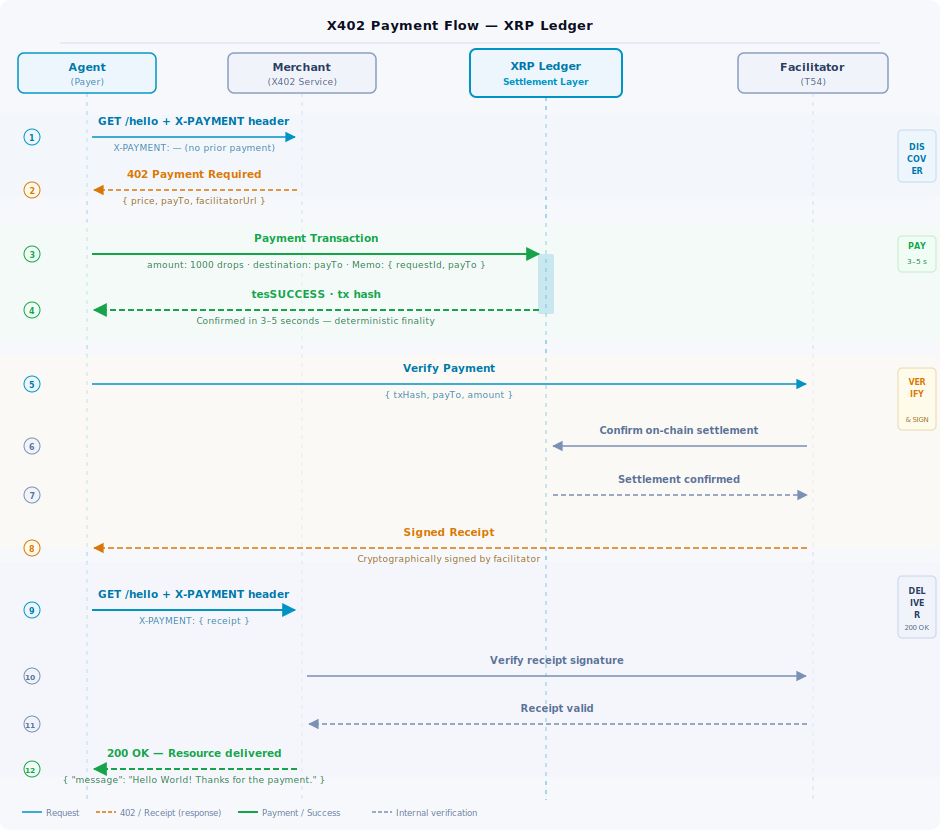

---
seo:
    title: Agentic Payments with X402 on the XRP Ledger
    description: >
        Enable AI agents to pay for and monetize HTTP-based services using the X402
        protocol on the XRP Ledger. Step-by-step quickstart for merchants and payer
        agents, with Python code samples using the x402-xrpl package.
labels:
    - AI
    - Agents
    - Payments
    - X402
---

# Agentic Payments with X402 on the XRP Ledger

X402 is an open protocol for HTTP-native machine-to-machine payments. It extends the existing HTTP 402 Payment Required status code into a complete payment flow: a service responds with its payment requirements, a client fulfills them with an on-chain transaction, and the service delivers the resource.

For AI agents, X402 means that paying for an API call or AI model inference is just another HTTP request — no human in the loop, no billing dashboard, no API key rotation. An agent can discover a paywall, pay for access, and retry, all in a single workflow step.

The XRP Ledger is a supported settlement chain in the X402 ecosystem via an implementation contributed by T54. This means agents using the XRP Ledger can pay for X402-gated services using XRP or RLUSD on day one.

**About the `x402-xrpl` package**

The `x402-xrpl` package is maintained by [T54](https://xrpl-x402.t54.ai) and is the reference implementation of X402 for the XRP Ledger. It is available on [PyPI](https://pypi.org/project/x402-xrpl/). The package is early-stage; review the [T54 changelog](https://xrpl-x402.t54.ai/docs) and pin a specific version in production rather than installing latest. The testnet facilitator at `xrpl-facilitator-testnet.t54.ai` is operated by T54 on a best-effort basis with no committed SLA; do not build production systems against it.

---

## How X402 works on the XRP Ledger

The X402 flow on the XRP Ledger involves three parties: a **merchant** (a service that
requires payment), a **payer agent** (a client that pays for access), and a
**facilitator** (a service that verifies the on-chain payment and issues a signed
receipt the merchant trusts).

The complete flow:

1. **Agent requests a resource** — the agent calls a protected HTTP endpoint.
2. **Merchant returns 402** — the response includes the price, the payment address, and the facilitator URL in a structured header.
3. **Agent sends a presigned on-chain transaction** — the agent submits a presigned XRP Ledger Payment transaction from the client to the merchant's wallet address for the required amount.
4. **Agent obtains a receipt** — the agent submits the transaction hash to the facilitator, which verifies the on-chain payment and issues a signed receipt.
5. **Agent retries with receipt** — the agent re-sends the original request with the receipt in the `X-PAYMENT` header.
6. **Merchant delivers** — the merchant verifies the receipt and returns the resource.

The XRP Ledger's deterministic finality means step 3 is reliable: the agent knows
within 3–5 seconds whether the payment confirmed, and a clean expiry means no ambiguous
state to handle.



<!-- For dark mode, swap to x402-sequence-dark.svg via a <picture> element once the
dark variant is available. Pattern: same as agentic-payment-loop diagram. -->

---

## Prerequisites

- Python 3.11+
- An XRPL wallet with a testnet balance. If you do not have one, use the
  [XRPL Testnet Faucet](https://xrpl.org/resources/dev-tools/xrp-faucets) to create
  and fund one in seconds.
- Basic familiarity with HTTP APIs.

---

## Merchant quickstart: accept X402 payments

This section shows how to protect an HTTP endpoint so that clients must pay before
receiving a response.

### Step 1: Install dependencies

```sh
pip install fastapi uvicorn x402-xrpl python-dotenv
```

### Step 2: Configure environment

Create a `.env` file with your merchant configuration:

```dotenv
XRPL_FACILITATOR_URL=https://xrpl-facilitator-testnet.t54.ai
XRPL_PAY_TO=rYourWalletAddress   # Your wallet address to receive payments.
XRPL_PRICE_DROPS=1000            # Price in drops (1 XRP = 1,000,000 drops).
XRPL_SOURCE_TAG=20260601         # Stamped on every on-chain payment for this endpoint.
```

The `XRPL_FACILITATOR_URL` above is T54's public testnet facilitator. For Mainnet,
T54 operates a separate facilitator endpoint — see
[T54's X402 documentation](https://xrpl-x402.t54.ai/docs) for the current URLs.


### Step 3: Create your server

Create a file called `server.py`:

```python
import os
from dotenv import load_dotenv
from fastapi import FastAPI
from x402_xrpl.server import require_payment

load_dotenv()

app = FastAPI()

# Protect the /hello endpoint with the x402 payment middleware.
# Requests that do not include a valid payment receipt receive a 402 response
# containing the payment requirements.
#
# extra={"sourceTag": ...} stamps every on-chain Payment that pays this
# endpoint with the given SourceTag, so you can filter and measure usage via
# any XRPL data API or block explorer.
# See /docs/agents/track-agent-behavior/ for more.
app.middleware("http")(
    require_payment(
        path="/hello",
        price=os.getenv("XRPL_PRICE_DROPS", "1000"),
        pay_to_address=os.getenv("XRPL_PAY_TO"),
        facilitator_url=os.getenv("XRPL_FACILITATOR_URL"),
        network="xrpl:1",   # xrpl:1 = Testnet, xrpl:0 = Mainnet
        asset="XRP",
        description="A paid hello world endpoint",
        extra={"sourceTag": int(os.getenv("XRPL_SOURCE_TAG", "20260601"))},
    )
)


@app.get("/hello")
async def hello():
    """Protected endpoint — requires payment."""
    return {"message": "Hello World! Thanks for the payment."}


@app.get("/health")
async def health():
    """Free endpoint — no payment required."""
    return {"status": "ok"}


if __name__ == "__main__":
    import uvicorn
    uvicorn.run(app, host="0.0.0.0", port=8000)
```

### Step 4: Run the server

```sh
python server.py
```

Visit `http://localhost:8000/hello`. Without a valid payment receipt in the request,
you will receive a `402 Payment Required` response with the payment requirements encoded
in the response headers. The `/health` endpoint remains free and accessible without
payment.

---

## Payer agent quickstart: pay for access

This section shows how to build a Python agent that detects a 402 response, signs and
submits an XRP payment automatically, and retries the original request with proof of
payment — all without any manual intervention.

### Step 1: Install dependencies

```sh
pip install requests xrpl-py x402-xrpl python-dotenv
```

### Step 2: Configure environment

Create a `.env` file with your wallet and target endpoint:

```dotenv
XRPL_BUYER_SEED=sYourWalletSeed                        # Your wallet seed — keep secret.
XRPL_TESTNET_RPC_URL=https://s.altnet.rippletest.net:51234/
RESOURCE_URL=http://localhost:8000/hello               # The paid endpoint to call.
```

> **Never commit your wallet seed to version control.** Use environment variables or a
> secrets manager. See [Step 2: Generate and secure your wallet](/docs/agents/getting-started-with-agentic-transactions/#step-2-generate-and-secure-your-wallet)
> for guidance.

### Step 3: Create your client

Create a file called `client.py`:

```python
import os
import json
from dotenv import load_dotenv
from xrpl.wallet import Wallet
from x402_xrpl.clients import x402_requests, decode_payment_response

load_dotenv()

# Load your wallet from the environment — never hardcode the seed.
buyer = Wallet.from_seed(os.getenv("XRPL_BUYER_SEED"))
print(f"Buyer address: {buyer.classic_address}")

# x402_requests wraps the standard requests library.
# It automatically handles any 402 response: signs the required payment,
# includes it in the retry, and returns the final response to your code.
# The SourceTag stamped on the on-chain Payment is the one the merchant
# declares in its payment requirements (see Merchant Step 3 above).
session = x402_requests(
    buyer,
    rpc_url=os.getenv("XRPL_TESTNET_RPC_URL"),
    network_filter=None,      # Accept any network declared by the server.
    scheme_filter="exact",    # Use the exact payment scheme.
)

# Make the request. If the server returns 402, the session handles it transparently.
resource_url = os.getenv("RESOURCE_URL")
print(f"Requesting: {resource_url}")

response = session.get(resource_url, timeout=180)
print(f"Status  : {response.status_code}")
print(f"Response: {response.text}")

# The server includes payment settlement details in the PAYMENT-RESPONSE header.
payment_response = response.headers.get("PAYMENT-RESPONSE")
if payment_response:
    decoded = decode_payment_response(payment_response)
    print("\nPayment settled!")
    print(json.dumps(decoded, indent=2))
```

### Step 4: Run the client

```sh
python client.py
```

The client automatically:

1. Requests the protected endpoint
2. Receives a 402 with payment requirements
3. Signs and submits the XRP payment on-chain
4. Retries the original request with the payment receipt
5. Returns the response once the server verifies settlement

<!-- ⚠️ FOLLOW-UP: Add JavaScript client quickstart once T54 publishes the
x402-xrpl JavaScript client documentation. -->


---

## Protecting an agentic workflow end-to-end

Because `x402_requests` returns a standard `requests`-compatible session, you can drop
it in anywhere your agent makes HTTP calls. The agent's main logic issues ordinary
`session.get()` and `session.post()` calls; any 402 response is handled transparently
without the agent needing to know about the payment flow.

A prompt that uses the XRPL skills to wire this up:

```
I'm building an agent that calls three external APIs. Two of them are X402-protected
and accept XRP on testnet. Use x402_requests from x402_xrpl.clients to create a
session that handles 402 responses automatically. Load the wallet seed from
XRPL_BUYER_SEED and the RPC URL from XRPL_TESTNET_RPC_URL. My agent code should
just call session.get() and session.post() without any payment logic in the
main workflow.
```

---

## Pricing guidance

X402 prices on the XRP Ledger are expressed in **drops** (the smallest unit of XRP;
1 XRP = 1,000,000 drops).

| Use case | Suggested price | Notes |
| :---- | :---- | :---- |
| Free tier / trial | 0 drops | Use for health checks and public endpoints |
| Lightweight API call | 100–1,000 drops | ~$0.00003–$0.0003 at $0.30/XRP |
| Standard data query | 1,000–10,000 drops | ~$0.0003–$0.003 |
| Compute-intensive / AI inference | 10,000–100,000 drops | ~$0.003–$0.03 |

For dollar-denominated pricing with price stability, RLUSD support in `x402-xrpl` is
on the roadmap. Use XRP for all testnet development today.

<!-- ⚠️ FOLLOW-UP: Confirm RLUSD support status in x402-xrpl and update this section
when available. -->

---

## Moving to Mainnet

Switching from testnet to Mainnet requires three changes:

1. **Network parameter** — change `network="xrpl:1"` to `network="xrpl:0"` in both
   merchant and client configuration.
2. **Facilitator URL** — replace the testnet facilitator URL with the Mainnet endpoint.
3. **Wallet** — fund a Mainnet wallet with real XRP and update `XRPL_PAY_TO`
   (merchant) and `XRPL_BUYER_SEED` (payer) accordingly.

No other code changes are required. The `x402-xrpl` package handles the network
difference transparently.

---

## Where to go next

- [Getting Started with Agentic Transactions](/docs/agents/getting-started-with-agentic-transactions/) —
  The full tutorial for setting up the XRPL skills and sending your first payment.
<!-- - [Track and Measure Agent Behavior](/docs/use-cases/agentic-transactions/#track-and-measure-agent-behavior) —
  Using `SourceTag` and `Memos` to attribute and audit agent payments.
- [For Institutional Developers](/docs/use-cases/agentic-transactions/#for-institutional-developers) —
  Spending controls, key management, and compliance logging for production deployments. -->
- [T54 X402 Documentation](https://xrpl-x402.t54.ai/docs) — The full X402 reference for
  the XRPL implementation, including the exact payment scheme and facilitator API.
- [X402 Protocol Repository](https://github.com/x402-foundation/x402) — The official X402 repository.

