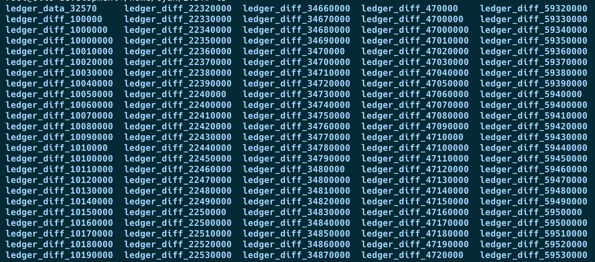

---
seo:
    description: Configure how far back your Clio server should store transaction history.
labels:
  - Clio Server
  - Data Retention
---
# Get Full History Data with Clio

This page describes how to access full XRP Ledger history data with the [Clio](../../../concepts/networks-and-servers/the-clio-server.md) server.

Clio stores the full XRP Ledger history in a publicly accessible [AWS S3](https://aws.amazon.com/s3/) bucket. This data enables Clio to serve requests that require complete historical context. Ledger data is uploaded automatically to the S3 bucket on a daily basis to ensure you always have access to the latest full history up to the current day.

## Prerequisites

- Ensure you have the Clio server installed. To learn more about how to build and compile Clio, see [Install Clio on Ubuntu Linux](../../installation/install-clio-on-ubuntu.md).
  
  You need to add `-o snapshot=True` at the `conan install` build step to build the Clio server with the full history feature.
  

- If you haven't already, install the [AWS CLI](https://docs.aws.amazon.com/cli/latest/userguide/getting-started-install.html) on your machine.

## Download Full History Data from S3

Before you can run the Clio server, you need to download the full XRP Ledger history data on your machine or environment. From your terminal, run the following command in a suitable directory:

```sh
aws s3 sync s3://full-history-ledger-data/Full-History . --no-sign-request
```

The command uses the `--no-sign-request` flag since the bucket is **public**, so you don't need AWS credentials to access it. The data is stored in the [EU-West (eu-west-2)](https://docs.aws.amazon.com/global-infrastructure/latest/regions/aws-regions.html) region, and due to its large size, the sync process can be slow.

To speed up the transfer, you can increase the number of concurrent AWS requests by setting the [`AWS_MAX_CONCURRENT_REQUESTS`](https://awscli.amazonaws.com/v2/documentation/api/latest/topic/s3-config.html#max-concurrent-requests) environment variable to an appropriate value for you system. For example:

```sh
export AWS_MAX_CONCURRENT_REQUESTS=64
```

Once the sync completes, your directory should contain a structure similar to the example shown below:



Take note of the directory where you downloaded the ledger data, as you will need it for the next steps.

## Start Clio with Full History

To start the Clio server with full history:

1. Navigate to the `clio/build` directory and run the snapshot server using the following command:

    ```sh
    ./clio_snapshot --server --grpc_server="127.0.0.1:50052" \
      --ws_server="0.0.0.0:6007" \
      --path=<path_to_full_history_folder>
    ```

    Replace `<path_to_full_history_folder>` with the path to the folder where you downloaded the ledger history data.
    This command starts a lightweight [Go server](https://github.com/XRPLF/clio/tree/develop/tools/snapshot) that provides the snapshot data over gRPC and WebSocket, and acts as a data source for Clio when running in full history mode.
2. Edit your Clio configuration file to connect to the snapshot server. Start with the `etl_sources` configuration: 

    ```json
    "etl_sources": [
      {
        "ip": "127.0.0.1",
        "ws_port": "6007",
        "grpc_port": "50052"
      }
    ]
    ```

    Ensure the `grpc_port` and `ws_port` values match the ones used in the `clio_snapshot` command from **step 1**.

3. Set the `start_sequeunce` and `end_sequence` to define the ledger range that you want. For example:

   ```json
   {
     ...
     "start_sequence": 32570,
     "finish_sequence": 10000000,
   }
   ```

   For the **full** ledger history, set:

     - `start_sequence`: `32570` (the oldest ledger version available in the production XRP Ledger history).
     - `end_sequence`: the latest ledger available in the downloaded history.

    
    You can find the actual start and end sequence in the `manifest.txt` file located in the root of your synced full history directory. It is formatted as `start_sequence | end_sequence`.
    
4. Start the Clio server along with your chosen database backend (e.g., ScyllaDB or Cassandra). Once Clio is up and running, it automatically extracts data from the `clio_snapshot` server. To confirm that ledger data is being populated, you can monitor your database.

This process may take some time, as Clio is ingesting and indexing the full history dataset into the database. You can tell the extraction is complete when the `clio_snapshot` server stops printing output to the terminal, which means all requested ledgers have been served.

## See Also

- **Concepts:**
    - [Ledger History](../../../concepts/networks-and-servers/ledger-history.md)
    - [The Clio Server](../../../concepts/networks-and-servers/the-clio-server.md)
- **References:**
    - [Clio Github Repository](https://github.com/XRPLF/clio)


