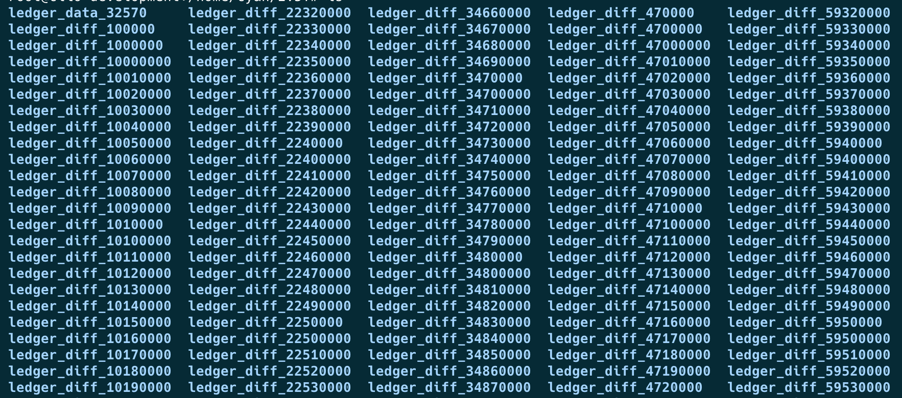

# Getting Full History Data with Clio

This page describes how to access full ledger history data with the Clio server.

Clio stores the full XRP Ledger history in a public [AWS S3](https://aws.amazon.com/s3/) bucket. This data enables Clio to serve requests that require complete historical context. Ledger data is uploaded automatically on a daily basis to the S3 bucket. This is to ensure you always have access to the latest full history up to the current day.

To download the full history data to your local environment, run the following command in your terminal:

`aws s3 sync s3://full-history-ledger-data/Full-History . --no-sign-request`

The command uses the `--no-sign-request` flag since the bucket is public, so you don't need AWS credentials to access it. The data is stored in the [EU-West (eu-west-2)](https://docs.aws.amazon.com/global-infrastructure/latest/regions/aws-regions.html) region, and due to its large size, the sync process can be slow.

To speed up the transfer, consider increasing the number of concurrent requests by setting `export AWS_MAX_CONCURRENT_REQUESTS=64`, or a request value that is appropriate for you.

Once the sync completes, your local directory should contain a structure similar to the example shown below:



## Prerequisites

Before proceeding, you must ensure that you have Clio installed. To learn more about how to build and compile Clio, see [Install Clio on Ubuntu Linux](../../installation/install-clio-on-ubuntu.md).


To build the Clio server with the full history feature, you need to add `-o snapshot=True` at the `conan install` build step.


## Starting Clio with Full History

To start the Clio server with full history:

1. Navigate to the `clio/build` directory and run the snapshot server using the following command:

    ```sh
    ./clio_snapshot --server --grpc_server="127.0.0.1:50052" \
      --ws_server="0.0.0.0:6007" \
      --path=<path_to_full_history_folder>
    ```

    This command starts a lightweight server that exposes the snapshot data over gRPC and WebSocket, and acts as a data source for Clio when it's running in full history mode.
2. Start the Clio server, along with the database backend (e.g., ScyllaDB or Cassandra).
3. Make sure to adjust your Clio configuration file to properly connect to the snapshot server, starting with the `etl_sources` field, which should match `grpc_server` address that you used in **step 1**:

    ```json
    "etl_sources": {
      "ip": "127.0.0.1",
      "ws_port": "6007",
      "grpc_port": "50052"
    }
    ```
4. Set the `start_sequeunce` and `end_sequence` to define the ledger range that you want. For example:

   ```json
   {
     ...
     "start_sequence": 32570,
     "finish_sequence": 10000000,
   }
   ```

   For the **full** history, set the `start_sequence` to `32570` and the `end_sequence` to the latest ledger available in S3.
   
   You can find the actual start and end sequence in the `manifest.txt` file located in the root of your synced `Full-History` directory. It is formatted as `start_sequence | end_sequence`.
   
