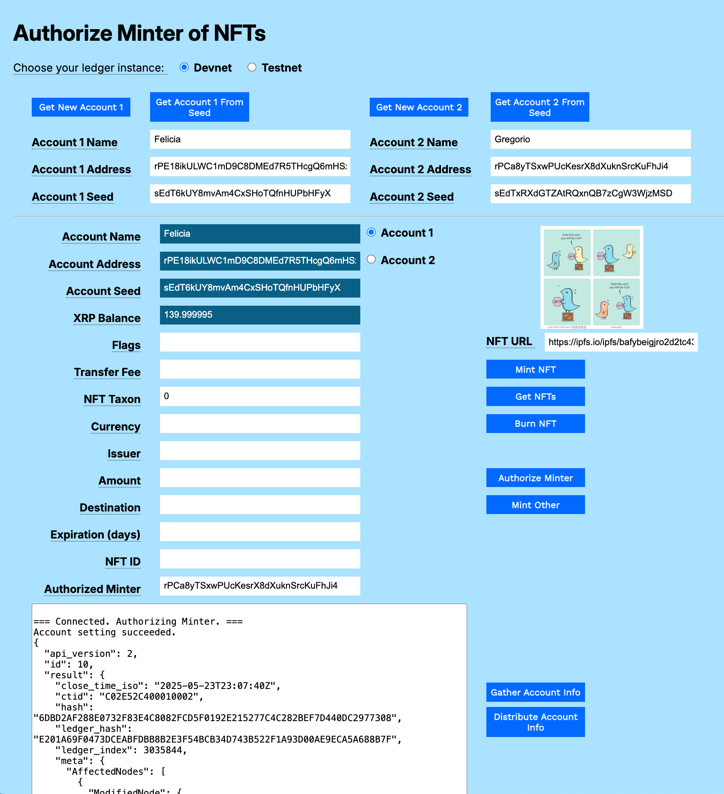
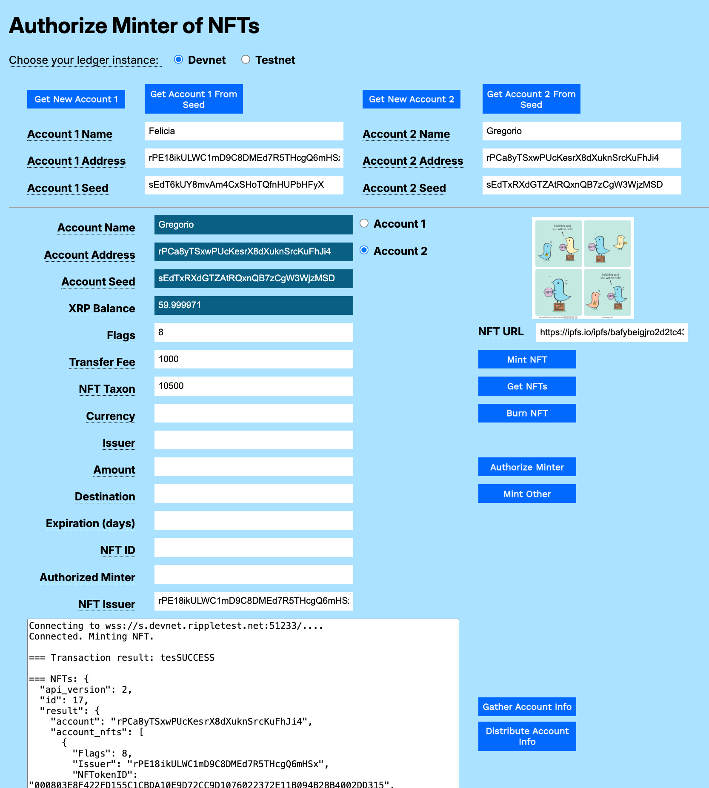

# Assign an Authorized Minter Using JavaScript

You can assign another account permission to mint NFTs for you.

This example shows how to:

1. Authorize an account to create NFTs for your account.
2. Mint an NFT for another account, when authorized.

[](../../../img/mt-auth-minter-1-empty-form.png)

# Usage

You can download the [NFT Modular Sam;ples](../../../../_code-samples/nft-modular-tutorials/nft-modular-tutorials.zip) archive to try the sample in your own browser.

## Get Accounts

1. Open `authorized-minter.html` in a browser.
2. Choose your preferred test network (**Devnet** or **Testnet**).
3. Get test accounts.
    1. If you copied the gathered information from another tutorial:
        1. Paste the gathered information to the **Result** field.
        2. Click **Distribute Account Info**.
    2. If you have an existing account seed:
        1. Paste the account seed to the **Account 1 Seed** or **Account 2 Seed** field.
        2. Click **Get Account 1 from Seed** or **Get Account 2 from Seed**.
    2. If you do not have existing accounts:
        1. Click **Get New Account 1**.
        2. Click **Get New Account 2**.
        
## Authorize an Account to Create NFTs

To authorize another account to create NFTs for your account:

1. Enter the account you want to authorize in the **Authorized Minter** field.
3. Click **Authorize Minter**.

[](../../../img/mt-auth-minter-2-authorize-minter.png)

## Mint an NFT for Another Account

To mint a non-fungible token for another account:

1. Set the **Flags** field. For testing purposes, we recommend setting the value to _8_. 
2. Enter the **NFT URL**. This is a URI that points to the data or metadata associated with the NFT object. You can use the sample URI provided if you do not have one of your own.
3. Enter the **Transfer Fee**, a percentage of the proceeds that the original creator receives from future sales of the NFT. This is a value of 0-50000 inclusive, allowing transfer rates between 0.000% and 50.000% in increments of 0.001%. If you do not set the **Flags** field to allow the NFT to be transferrable, set this field to 0.
5. Enter the account number on whose behalf you are minting the NFT in the **NFT Issuer** field.
6. Optionally, you can set an expected prices for the NFT. To set a price in XRP, enter the amount in drops in the **Amount** field. To use an issued currency, enter the **Currency**, **Issuer**, and **Amount**.
7. Optionally, you can enter a **Destination** address that will be the only account authorized to purchase the NFT.
8. Optionally, you can enter an **Expiration** value in days, after which the offer will no longer be available.
9. Click **Mint Other**.

[](../../../img/mt-auth-minter-3-mint-other.png)

Once the item is minted, the authorized minter can sell the NFT normally. The proceeds go to the authorized minter, less the transfer fee. The minter and the issuer can settle up on a division of the price separately.

# Code Walkthrough

You can download the [NFT Modular Tutorials](../../../../_code-samples/nft-modular-tutorials/nft-modular-tutorials.zip) archive to try each of the samples in your own browser.

## Authorize Minter

This function sets the authorized minter for an account. Each account can have 0 or 1 authorized minter that can mint NFTs in its stead.

```javascript
// *******************************************************
// ****************  Authorize Minter  *******************
// *******************************************************

async function authorizeMinter() {    
```

Get the account wallet and connect to the XRP Ledger.

```javascript
  const wallet = xrpl.Wallet.fromSeed(accountSeedField.value);
  const net = getNet();
  const client = new xrpl.Client(net);
  let results = `\n=== Connected. Authorizing Minter. ===`;
  resultField.value = results;

  try {
    await client.connect();
```

Create the transaction JSON.

```javascript
    tx_json = {
      "TransactionType": "AccountSet",
      "Account": wallet.address,
      "NFTokenMinter": authorizedMinterField.value,
      "SetFlag": xrpl.AccountSetAsfFlags.asfAuthorizedNFTokenMinter
    }
```

Sign and send the prepared transaction, then wait for the results.

```javascript
    const prepared = await client.autofill(tx_json)
    const signed = wallet.sign(prepared)
    const result = await client.submitAndWait(signed.tx_blob)
```

Report the results.

```javascript
    results += '\nAccount setting succeeded.\n'
    results += JSON.stringify(result, null, 2)
    resultField.value = results
```

Catch and report any errors.

```javascript
  } catch (error) {
    console.error("Error setting minter:", error);
    results = `\n\n=== Error setting minter: ${error.message}`;
    resultField.value += results;
```

Disconnect from the XRP Ledger.

```javascript
  } finally {
    if (client && client.isConnected()) {
      await client.disconnect();
    }
  }
```

## Mint Other

This revised mint function allows one account to mint for another issuer.

```javascript

// *******************************************************
// ****************  Mint Other  *************************
// *******************************************************

async function mintOther() {
```

Get the account wallet and connect to the XRP Ledger.

```javascript
async function mintOther() {
  let results = 'Connecting to ' + getNet() + '....'
  resultField.value = results
  const net = getNet()
  const wallet = xrpl.Wallet.fromSeed(accountSeedField.value)
  const client = new xrpl.Client(net)

  try {
    await client.connect()
    results += '\nConnected. Minting NFT.'
    resultField.value = results
```

Create the JSON transaction object.

```javascript
    // ------------------------------------------------------------------------
    const tx_json = {
      "TransactionType": "NFTokenMint",
      "Account": wallet.classicAddress,
      "URI": xrpl.convertStringToHex(nftURLfield.value),
      "Flags": parseInt(flagsField.value),
      "TransferFee": parseInt(transferFeeField.value),
      "Issuer": nftIssuerField.value,
      "NFTokenTaxon": nftTaxonField.value //Required, but if you have no use for it, set to zero.
    }
```

If the **Amount** field is populated, configure and add the expected amount the NFT will sell for.

```javascript
    if (amountField.value) {
         tx_json.Amount = configureAmount(amountField.value);
    }
```

If the **Expiration (days)** field is populated, configure and add the expiration date.

```javascript
    if (expirationField.value) {
       tx_json.Expiration = configureExpiration(expirationField.value);
    }
```

If the **Destination** field is populated, add it to the transaction JSON object.

```javascript
    if (destinationField.value) {
      tx_json.Destination = destinationField.value;
    }
```

Submit the transaction and wait for the result.

```javascript
    const tx = await client.submitAndWait(tx_json, { wallet: wallet })
```

Request the list of NFTs for the current account.

```javascript
    const nfts = await client.request({
      method: "account_nfts",
      account: wallet.classicAddress
    })
```

Report the results.

```javascript
    results += '\n\n=== Transaction result: ' + tx.result.meta.TransactionResult
    results += '\n\n=== NFTs: ' + JSON.stringify(nfts, null, 2)
    resultField.value = results + (await client.getXrpBalance(wallet.address))
```

Catch and report any errors.

```javascript
  } catch (error) {
    results += '\n\nAn error occurred: ' + error.message
    console.error(error) // Log the error for debugging
    resultField.value = results
```

Disconnect from the XRP Ledger.

```javascript
  } finally {
    if (client.isConnected()) { // Check if the client is connected before attempting to disconnect
      client.disconnect()
      results += '\nDisconnected from XRPL.'
      resultField.value = results
    }
  }
} //End of mintOther()
```


## authorized-minter.html

```html
<html>
<head>
    <title>Authorize Minter of NFTs</title>
    <link href='https://fonts.googleapis.com/css?family=Work Sans' rel='stylesheet'>
    <link href="modular-tutorials.css" rel="stylesheet">
    <script src='https://unpkg.com/xrpl@4.1.0/build/xrpl-latest.js'></script>
    <script src="account-support.js"></script>
    <script src='transaction-support.js'></script>
    <script src='mint-nfts.js'></script>
    <script src='authorized-minter.js'></script>
</head>
<body>
    <h1>Authorize Minter of NFTs</h1>
    <form id="theForm">
        <span class="tooltip" tooltip-data="Choose the XRPL host server for your account.">
            Choose your ledger instance:
        </span>
        &nbsp;&nbsp;
        <input type="radio" id="dn" name="server" value="wss://s.devnet.rippletest.net:51233" checked>
        <label for="dn">Devnet</label>
        &nbsp;&nbsp;
        <input type="radio" id="tn" name="server" value="wss://s.altnet.rippletest.net:51233">
        <label for="tn">Testnet</label>
        <br /><br />
        <table>
            <tr>
                <td>
                    <button type="button" onClick="getNewAccount1()">Get New Account 1</button>
                </td>
                <td>
                    <button type="button" onClick="getAccountFromSeed1()">Get Account 1 From Seed</button>
                </td>
                <td>
                    <button type="button" onClick="getNewAccount2()">Get New Account 2</button>
                </td>
                <td>
                    <button type="button" onClick="getAccountFromSeed2()">Get Account 2 From Seed</button>
                </td>
            </tr>
            <tr>
                <td>
                    <span class="tooltip" tooltip-data="Arbitrary human-readable name for the account."><label
                            for="account1name">Account 1 Name</label>
                    </span>
                </td>
                <td>
                    <input type="text" id="account1name" size="40"></input>
                </td>
                <td>
                    <span class="tooltip" tooltip-data="Arbitrary human-readable name for the account.">
                        <label for="account2name">Account 2 Name</label>
                    </span>
                </td>
                <td>
                    <input type="text" id="account2name" size="40"></input>
                </td>
            </tr>
            <tr>
                <td>
                    <span class="tooltip" tooltip-data="Identifying address for the account.">
                        <label for="account1address">Account 1 Address</label>
                    </span>
                </td>
                <td>
                    <input type="text" id="account1address" size="40"></input>
                </td>
                <td>
                    <span class="tooltip" tooltip-data="Identifying address for the account.">
                        <label for="account2address">Account 2 Address</label>
                    </span>
                </td>
                <td>
                    <input type="text" id="account2address" size="40"></input>
                </td>
            </tr>
            <tr>
                <td>
                    <span class="tooltip" tooltip-data="Seed for deriving public and private keys for the account.">
                        <label for="account1seed">Account 1 Seed</label>
                    </span>
                </td>
                <td>
                    <input type="text" id="account1seed" size="40"></input>
                </td>
                <td>
                    <span class="tooltip" tooltip-data="Seed for deriving public and private keys for the account.">
                        <label for="account2seed">Account 2 Seed</label>
                    </span>
                </td>
                <td>
                    <input type="text" id="account2seed" size="40"></input>
                </td>
            </tr>
        </table>
        <hr />
        <table>
            <tr valign="top">
                <td align="right">
                    <span class="tooltip" tooltip-data="Name of the currently selected account.">
                        <label for="accountNameField">Account Name</label>
                    </span>
                </td>
                <td>
                    <input type="text" id="accountNameField" size="40" readonly></input>
                    <input type="radio" id="account1" name="accounts" value="account1">
                    <label for="account1">Account 1</label>
                </td>
                <td rowspan="4" align="center">
                    <p>
                        
                </td>
            <tr valign="top">
                <td align="right">
                    <span class="tooltip" tooltip-data="Address of the currently selected account.">
                        <label for="accountAddressField">Account Address</label>
                    </span>
                </td>
                <td>
                    <input type="text" id="accountAddressField" size="40" readonly></input>
                    <input type="radio" id="account2" name="accounts" value="account2">
                    <label for="account2">Account 2</label>
                </td>
            </tr>
            <tr valign="top">
                <td align="right">
                    <span class="tooltip" tooltip-data="Seed of the currently selected account.">
                        <label for="accountSeedField">Account Seed</label>
                    </span>
                </td>
                <td>
                    <input type="text" id="accountSeedField" size="40" readonly></input>
                    <br>
                </td>
            </tr>
            <tr>
                <td align="right">
                    <span class="tooltip" tooltip-data="XRP balance for the currently selected account.">
                        <label for="xrpBalanceField">XRP Balance</label>
                    </span>
                </td>
                <td>
                    <input type="text" id="xrpBalanceField" size="40" readonly></input>
                </td>
            </tr>
            <tr>
                <td align="right">
                    <span class="tooltip" tooltip-data="NFT configuration flags.">
                        <label for="flagsField">Flags</label>
                    </span>
                </td>
                <td>
                    <input type="text" id="flagsField" size="40"></input>
                </td>
                <td align="right">
                    <span class="tooltip" tooltip-data="URL to the stored NFT.">
                        <label for="nftURLfield">NFT URL</label>
                    </span>&nbsp;&nbsp;
                    <input type="text" id="nftURLfield" size="30"
                        value="https://ipfs.io/ipfs/bafybeigjro2d2tc43bgv7e4sxqg7f5jga7kjizbk7nnmmyhmq35dtz6deq"></input>
                </td>
            </tr>
            <tr>
                <td align="right">
                    <span class="tooltip" tooltip-data="Percentage of sale price collected by the issuer when the NFT is sold. Enter a value from 0 to 50000, where 1000=1%.">
                        <label for="transferFeeField">Transfer Fee</label>
                    </span>
                    <p id="error-message"></p>
                </td>
                <td>
                    <input type="text" id="transferFeeField" size="40"></input>
                </td>
                <td>
                    <button type="button" onClick="mintNFT()">Mint NFT</button>
                </td>
            </tr>
            <tr>
                <td align="right">
                    <span class="tooltip" tooltip-data="NFT Taxon. Integer value used to identify NFTs minted in a series or collection. This value is required. Set it to 0 if you have no use for it.">
                        <label for="nftTaxonField">NFT Taxon</label>
                    </span>
                </td>
                <td>
                    <input type="text" id="nftTaxonField" size="40" value="0"></input>
                </td>
                <td>
                    <button type="button" onClick="getNFTs()">Get NFTs</button>
                </td>
            </tr>
            <tr>
                <td align="right">
                    <span class="tooltip" tooltip-data="Currency for the offer.">
                        <label for="currencyField">Currency</label>
                    </span>
                </td>
                <td>
                    <input type="text" id="currencyField" size="40"></input>
                    <br>
                </td>
                <td>
                    <button type="button" onClick="burnNFT()">Burn NFT</button>
                </td>
            </tr>
            <tr>
                <td align="right">
                    <span class="tooltip" tooltip-data="Issuer of the currency used.">
                        <label for="issuerField">Issuer</label>
                    </span>
                </td>
                <td>
                    <input type="text" id="issuerField" size="40"></input>
                    <br>
                </td>
            </tr>
            <tr>
                <td align="right">
                    <span class="tooltip" tooltip-data="Amount of XRP to send.">
                        <label for="amountField">Amount</label>
                    </span>
                </td>
                <td>
                    <input type="text" id="amountField" size="40"></input>
                </td>
                <td>
                    <button type="button" onClick="authorizeMinter()">Authorize Minter</button>
                </td>
            </tr>
            <tr>
                <td align="right">
                    <span class="tooltip" tooltip-data="Destination account address where XRP is sent.">
                        <label for="destinationField">Destination</label>
                    </span>
                </td>
                <td>
                    <input type="text" id="destinationField" size="40"></input>
                    <br>
                </td>
                <td>
                    <button type="button" onClick="mintOther()">Mint Other</button>
                </td>
            </tr>
            <tr>
                <td align="right">
                    <span class="tooltip" tooltip-data="Number of days the offer is valid.">
                        <label for="expirationField">Expiration (days)</label>
                    </span>
                </td>
                <td>
                    <input type="text" id="expirationField" size="40"></input>
                </td>
            </tr>
            <tr>
                <td align="right">
                    <span class="tooltip" tooltip-data="NFT ID, used to transfer or burn the NFT after it is created.">
                        <label for="nftIdField">NFT ID</label>
                    </span>
                </td>
                <td>
                    <input type="text" id="nftIdField" size="40"></input>
                </td>
            </tr>
             <tr>
                <td align="right">
                    <span class="tooltip" tooltip-data="Account address that is authorized to mint NFTs for this account.">
                        <label for="authorizedMinterField">Authorized Minter</label>
                    </span>
                </td>
                <td>
                    <input type="text" id="authorizedMinterField" size="40"></input>
                </td>
            </tr>
            <tr>
                <td align="right">
                    <span class="tooltip" tooltip-data="Account that is the original issuer of the NFT.">
                        <label for="nftIssuerField">NFT Issuer</label>
                    </span>
                </td>
                <td>
                    <input type="text" id="nftIssuerField" size="40"></input>
                </td>
            </tr>
            <tr>
                <td colspan="2">
                    <p align="left">
                        <textarea id="resultField" cols="75" rows="20"></textarea>
                    </p>
                </td>
                <td align="left" valign="top">
                    <button type="button" onClick="gatherAccountInfo()">Gather Account Info</button><br />
                    <button type="button" onClick="distributeAccountInfo()">Distribute Account Info</button>
                </td>
            </tr>
        </table>
    </form>
</body>
<script>
    document.addEventListener('DOMContentLoaded', () => {
        const imageURLInput = document.getElementById('nftURLfield'); // Correct ID to nftURLfield
        const displayImage = document.getElementById('nftImage');
        const errorMessage = document.getElementById('error-message');

        if (imageURLInput) {
            imageURLInput.addEventListener('change', () => {
                const newURL = imageURLInput.value;
                displayImage.src = ''; // Clear previous image
                errorMessage.style.display = 'none';
                try {
                    new URL(newURL);
                } catch (_) {
                    errorMessage.textContent = 'Invalid URL. Please enter a valid URL, including "https://" or "http://".';
                    errorMessage.style.display = 'block';
                    return;
                }
                displayImage.onload = () => {
                    // Image loaded.  You might add a console log here, or update UI.
                    console.log(`Image loaded from: ${newURL}`);
                };
                displayImage.onerror = () => {
                    errorMessage.textContent = 'Error loading image from the provided URL.';
                    errorMessage.style.display = 'block';
                    displayImage.src = ''; // Clear the image on error
                };
                displayImage.src = newURL; // Load the image
            });
        }
    });

    const radioButtons = document.querySelectorAll('input[type="radio"]');
    radioButtons.forEach(radio => {
        radio.addEventListener('change', function () {
            if (this.value === 'account1') {
                populate1()
            } else if (this.value === 'account2') {
                populate2()
            }
        });
    });
</script>
</html>
```
