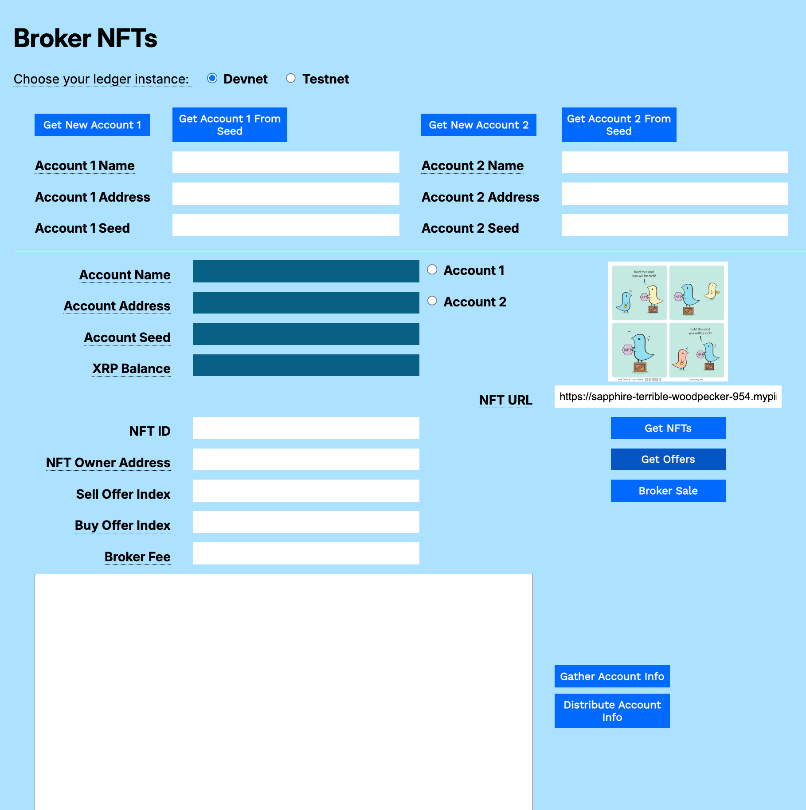
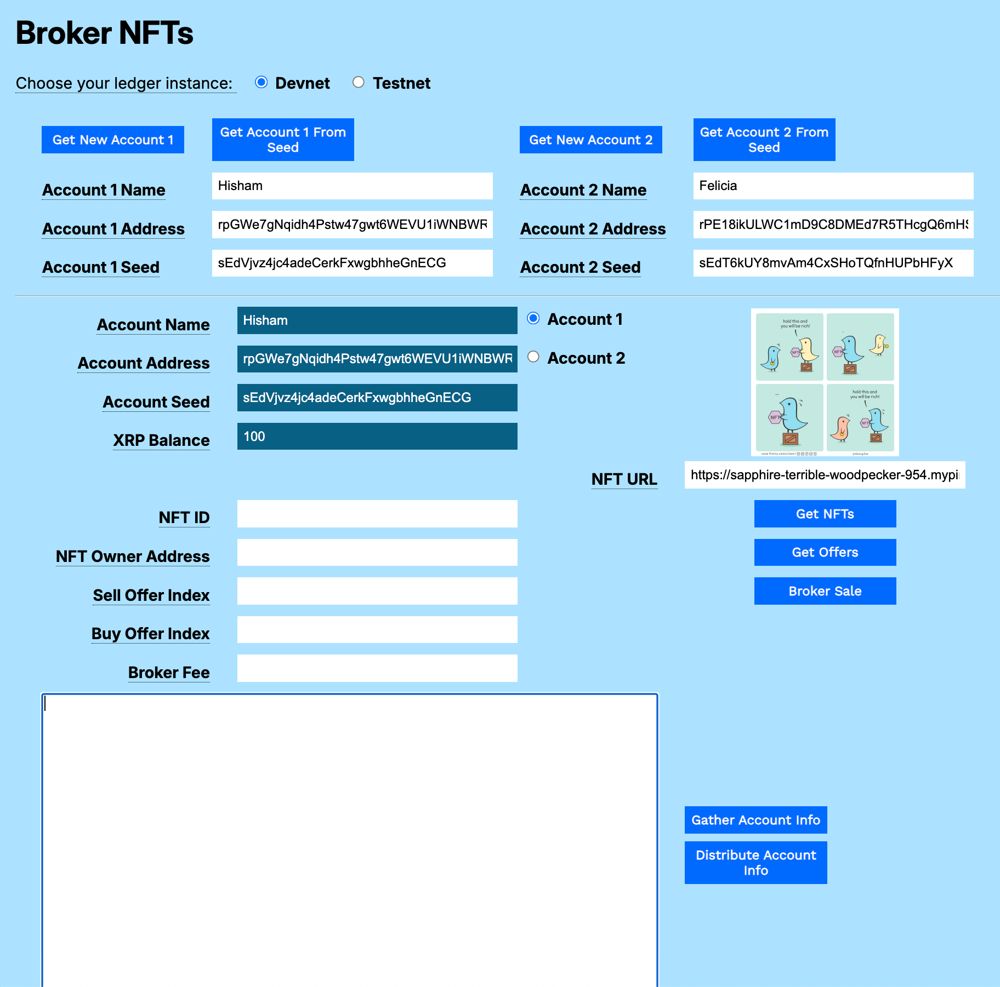
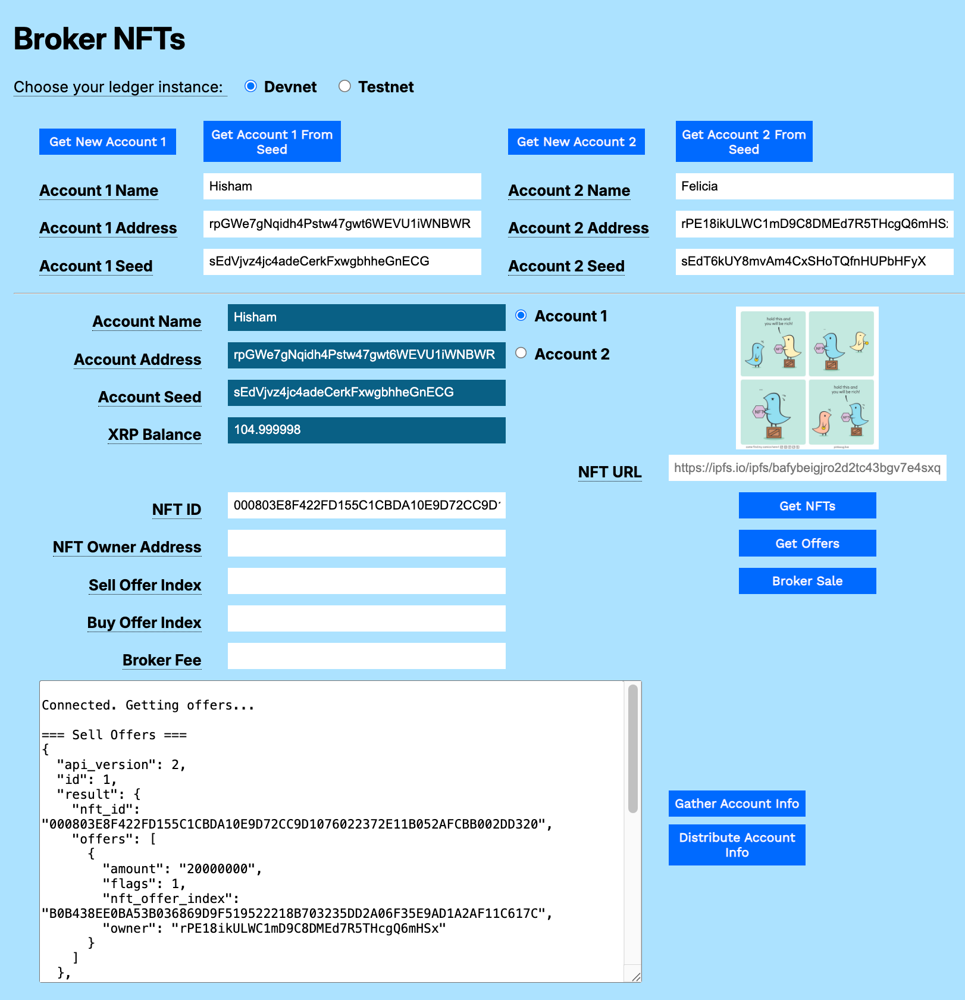

---
seo:
  description: Broker a sale between a sell offer and a buy offer.
labels:
  - Broker
  - NFT
  - XRP
---

# Broker an NFT Sale Using JavaScript

Earlier examples showed how to make buy and sell offers directly between two accounts. Another option is to use a third account as a broker for the sale. The broker acts on behalf of the NFT owner. The seller creates an offer with the broker account as its destination. The broker gathers and evaluates buy offers and chooses which one to accept, adding an agreed-upon fee for arranging the sale. When the broker account accepts a sell offer with a buy offer, the funds and ownership of the NFT are transferred simultaneously, completing the deal. This allows an account to act as a marketplace or personal agent for NFT creators and traders.

# Usage

This example shows how to:

1. Create a brokered sell offer.
2. Get a list of offers for the brokered item.
3. Broker a sale between two different accounts.

[](../../../img/mt-broker-nfts-1-empty-form.png)

You can download the [NFT Modular Tutorials](../../../../_code-samples/nft-modular-tutorials/nft-modular-tutorials.zip) archive to try each of the samples in your own browser.

## Prerequisites

To create a brokered sale, you need a broker account, a Sell Offer with the broker account as its **Destination**, and one or more Buy Offers for the same NFT.

1. Optionally use the [Account Configurator](../../../concepts/accounts/configuring-accounts.md) to create your Broker account.
2. Use a different issuer account in the [Mint NFT](./mint-and-burn-nfts.md) form to mint a new NFT to sell.
3. Use the issuer account in the [Transfer NFTs](./transfer-nfts.md) form to create a **Sell Offer** for the NFT with the Broker account as its **Destination**.
4. Use one or more other accounts to create **Buy Offers** for the NFT.

## Get Accounts

1. Open `broker-nfts.html` in a browser.
2. Choose your preferred test network (**Devnet** or **Testnet**).
3. Get test accounts.
   1. If you copied the gathered information from another tutorial (in this case, it would be best to load the Broker account and the Issuer account from the Prerequisite step):
      1. Paste the gathered information to the **Result** field.
      2. Click **Distribute Account Info**.
   2. If you have an existing account seed:
      1. Paste the account seed to the **Account 1 Seed** or **Account 2 Seed** field.
      2. Click **Get Account 1 from Seed** or **Get Account 2 from Seed**.
   3. If you do not have existing accounts:
      1. Click **Get New Account 1**.
      2. Click **Get New Account 2**.

[](../../../img/mt-broker-nfts-2-broker-form-with-accounts.png)

## Get Offers

1. Enter the **NFT ID**.
2. Click **Get Offers**.

[](../../../img/mt-broker-nfts-3-get-offers.png)

## Broker the Sale

1. Click the Account 1 or Account 2 radio button. The account information populates the uneditable fields of the form.
1. Copy the _nft_offer_index_ of the sell offer and paste it in the **Sell Offer Index** field.
1. Copy the _nft_offer_index_ of the buy offer and paste it in the **Buy Offer Index** field.
1. Enter a **Broker Fee**, in drops.
1. Click **Broker Sale**.

In this example, the sale succeeds with 25 XRP going to the issuer account (Felicia), 30 XRP taken from the buyer account (Unknown 3rd Pary), and 5 XRP minus the transaction cost going to the broker account (Hisham).

[](../../../img/mt-broker-nfts-4-broker-sale.png)

## Cancel Offer

After accepting a buy offer, a best practice for the broker is to cancel all other offers, if the broker has permissions to do so. Use the [Transfer NFTs](../../../../_code-samples/nft-modular-tutorials/transfer-nfts.html) form to get and cancel any existing Sell or Buy offers.

# Code Walkthrough

You can download the [NFT Modular Tutorials](../../../../_code-samples/nft-modular-tutorials/nft-modular-tutorials.zip) archive to try each of the samples in your own browser.

## broker-nfts.js

## brokerSale()

```javascript
// *******************************************************
// ******************* Broker Sale ***********************
// *******************************************************

async function brokerSale() {

```

Get the account wallet and connect to the XRP Ledger.

```javascript
  const wallet = xrpl.Wallet.fromSeed(accountSeedField.value);
  const net = getNet();
  const client = new xrpl.Client(net);
  let results = `\n=== Connected. Brokering the sale. ===`;
  resultField.value = results;

  try {
    await client.connect();
```

Prepare an NFTokenAcceptOffer, passing both the sell offer and the buy offer, and also the broker fee. With the additional arguments, the API interprets this as a brokered sale.

```javascript
const brokerTx = {
  TransactionType: 'NFTokenAcceptOffer',
  Account: wallet.classicAddress,
  NFTokenSellOffer: nftSellOfferIndexField.value,
  NFTokenBuyOffer: nftBuyOfferIndexField.value,
  NFTokenBrokerFee: brokerFeeField.value,
}
```

Display the transaction object in the console.

```javascript
console.log(JSON.stringify(brokerTx, null, 2))
```

Submit the transaction and report the results.

```javascript
const tx = await client.submitAndWait(brokerTx, { wallet: wallet })

results += '\n\nTransaction result:\n' + JSON.stringify(tx.result.meta.TransactionResult, null, 2)
results += '\nBalance changes:\n' + JSON.stringify(xrpl.getBalanceChanges(tx.result.meta), null, 2)
xrpBalanceField.value = await client.getXrpBalance(wallet.address)
resultField.value += results
```

Catch and report any errors.

```javascript
  } catch (error) {
    console.error("Error in broker sale:", error);
    results = `\n\n=== Error in broker sale: ${error.message} ===`;
    resultField.value += results;
  }
```

Disconnect from the XRP Ledger.

```javascript
  finally {
    if (client && client.isConnected()) {
      await client.disconnect();
    }
  }
}// End of brokerSale()
```

## broker-nfts.html

```html
<html>
<head>
    <title>Broker NFTs</title>
    <link href='https://fonts.googleapis.com/css?family=Work Sans' rel='stylesheet'>
    <link href="modular-tutorials.css" rel="stylesheet">
    <script src='https://unpkg.com/xrpl@4.1.0/build/xrpl-latest.js'></script>
    <script src="account-support.js"></script>
    <script src="transaction-support.js"></script>
    <script src="mint-nfts.js"></script>
    <script src="transfer-nfts.js"></script>
    <script src="broker-nfts.js"></script>
</head>
<body>
    <h1>Broker NFTs</h1>
    <form id="theForm">
        <span class="tooltip" tooltip-data="Choose the XRPL host server for your account.">
            Choose your ledger instance:
        </span>
        &nbsp;&nbsp;
        <input type="radio" id="dn" name="server" value="wss://s.devnet.rippletest.net:51233" checked>
        <label for="dn">Devnet</label>
        &nbsp;&nbsp;
        <input type="radio" id="tn" name="server" value="wss://s.altnet.rippletest.net:51233">
        <label for="tn">Testnet</label>
        <br /><br />
        <table>
            <tr>
                <td>
                    <button type="button" onClick="getNewAccount1()">Get New Account 1</button>
                </td>
                <td>
                    <button type="button" onClick="getAccountFromSeed1()">Get Account 1 From Seed</button>
                </td>
                <td>
                    <button type="button" onClick="getNewAccount2()">Get New Account 2</button>
                </td>
                <td>
                    <button type="button" onClick="getAccountFromSeed2()">Get Account 2 From Seed</button>
                </td>
            </tr>
            <tr>
                <td>
                    <span class="tooltip" tooltip-data="Arbitrary human-readable name for the account."><label
                            for="account1name">Account 1 Name</label>
                    </span>
                </td>
                <td>
                    <input type="text" id="account1name" size="40"></input>
                </td>
                <td>
                    <span class="tooltip" tooltip-data="Arbitrary human-readable name for the account.">
                        <label for="account2name">Account 2 Name</label>
                    </span>
                </td>
                <td>
                    <input type="text" id="account2name" size="40"></input>
                </td>
            </tr>
            <tr>
                <td>
                    <span class="tooltip" tooltip-data="Identifying address for the account.">
                        <label for="account1address">Account 1 Address</label>
                    </span>
                </td>
                <td>
                    <input type="text" id="account1address" size="40"></input>
                </td>
                <td>
                    <span class="tooltip" tooltip-data="Identifying address for the account.">
                        <label for="account2address">Account 2 Address</label>
                    </span>
                </td>
                <td>
                    <input type="text" id="account2address" size="40"></input>
                </td>
            </tr>
            <tr>
                <td>
                    <span class="tooltip" tooltip-data="Seed for deriving public and private keys for the account.">
                        <label for="account1seed">Account 1 Seed</label>
                    </span>
                </td>
                <td>
                    <input type="text" id="account1seed" size="40"></input>
                </td>
                <td>
                    <span class="tooltip" tooltip-data="Seed for deriving public and private keys for the account.">
                        <label for="account2seed">Account 2 Seed</label>
                    </span>
                </td>
                <td>
                    <input type="text" id="account2seed" size="40"></input>
                </td>
            </tr>
        </table>
        <hr />
        <table>
            <tr valign="top">
                <td align="right">
                    <span class="tooltip" tooltip-data="Name of the currently selected account.">
                        <label for="accountNameField">Account Name</label>
                    </span>
                </td>
                <td>
                    <input type="text" id="accountNameField" size="40" readonly></input>
                    <input type="radio" id="account1" name="accounts" value="account1">
                    <label for="account1">Account 1</label>
                </td>
                <td rowspan="4" align="center">
                    <p>
                        
                </td>
            </tr>
            <tr valign="top">
                <td align="right">
                    <span class="tooltip" tooltip-data="Address of the currently selected account.">
                        <label for="accountAddressField">Account Address</label>
                    </span>
                </td>
                <td>
                    <input type="text" id="accountAddressField" size="40" readonly></input>
                    <input type="radio" id="account2" name="accounts" value="account2">
                    <label for="account2">Account 2</label>
                </td>
            </tr>
            <tr valign="top">
                <td align="right">
                    <span class="tooltip" tooltip-data="Seed of the currently selected account.">
                        <label for="accountSeedField">Account Seed</label>
                    </span>
                </td>
                <td>
                    <input type="text" id="accountSeedField" size="40" readonly></input>
                    <br>
                </td>
            </tr>
            <tr>
                <td align="right">
                    <span class="tooltip" tooltip-data="XRP balance for the currently selected account.">
                        <label for="xrpBalanceField">XRP Balance</label>
                    </span>
                </td>
                <td>
                    <input type="text" id="xrpBalanceField" size="40" readonly></input>
                </td>
            </tr>
            <tr>
                 <td>
                </td>
                <td align="right">
                    <span class="tooltip" tooltip-data="URL to the stored NFT.">
                        <label for="nftURLfield">NFT URL</label>
                    </span>
                </td>
                <td>
                    <input type="text" id="nftURLfield" size="40"
                        placeholder="https://ipfs.io/ipfs/bafybeigjro2d2tc43bgv7e4sxqg7f5jga7kjizbk7nnmmyhmq35dtz6deq"></input>
                    <br />
                    <p id="error-message"></p>
                </td>
            </tr>
            <tr>
                <td align="right">
                    <span class="tooltip" tooltip-data="NFT ID code, used to identify the token after it's minted.">
                        <label for="nftIdField">NFT ID</label>
                    </span>
                </td>
                <td>
                    <input type="text" id="nftIdField" size="40"></input>
                </td>

                <td align="center" valign="top">
                    <button type="button" onClick="getNFTs()">Get NFTs</button>
                </td>
            </tr>
            <tr>
                <td align="right">
                    <span class="tooltip" tooltip-data="Account address of the Owner of an NFT offered to sell or buy.">
                        <label for="nftOwnerField">NFT Owner Address</label>
                    </span>
                </td>
                <td>
                    <input type="text" id="nftOwnerField" size="40"></input>
                </td>
                <td colspan="2" align="center" valign="top">
                   <button type="button" onClick="getOffers()" width="40">Get Offers</button>
                </td>
            </tr>
            <tr>
                <td align="right">
                    <span class="tooltip" tooltip-data="Index of the sell offer to broker.">
                        <label for="nftSellOfferIndexField">Sell Offer Index</label>
                    </span>
                </td>
                <td>
                    <input type="text" id="nftSellOfferIndexField" size="40"></input>
                    <br>
                </td>
                <td align="middle" valign="top" colspan="2">
                    <button type="button" onClick="brokerSale()">Broker Sale</button>
                </td>
            </tr>
            <tr>
                <td align="right">
                    <span class="tooltip" tooltip-data="Index of the buy offer to broker.">
                        <label for="nftBuyOfferIndexField">Buy Offer Index</label>
                    </span>
                </td>
                <td>
                    <input type="text" id="nftBuyOfferIndexField" size="40"></input>
                    <br>
                </td>
                <td align="middle" valign="top" colspan="2">

                </td>
            </tr>
            <tr>
                <td align="right">
                    <span class="tooltip" tooltip-data="Fee collected by the broker account when the brokered deal is complete.">
                        <label for="brokerFeeField">Broker Fee</label>
                    </span>
                </td>
                <td>
                    <input type="text" id="brokerFeeField" size="40"></input>
                </td>
            </tr>
            <tr valign="top">
                <td colspan="2">
                    <p align="left">
                        <textarea id="resultField" cols="75" rows="20"></textarea>
                    </p>
                </td>
                <td align="left" valign="top">
                    <button type="button" onClick="gatherAccountInfo()">Gather Account Info</button><br />
                    <button type="button" onClick="distributeAccountInfo()">Distribute Account Info</button>
                </td>
            </tr>
        </table>
    </form>
</body>
<script>

    document.addEventListener('DOMContentLoaded', () => {
        const imageURLInput = document.getElementById('nftURLfield'); // Correct ID to nftURLfield
        const displayImage = document.getElementById('nftImage');
        const loadButton = document.getElementById('showNFTbutton');
        const errorMessage = document.getElementById('error-message');

        if (imageURLInput) {
            imageURLInput.addEventListener('change', () => {
                const newURL = imageURLInput.value;
                displayImage.src = ''; // Clear previous image
                errorMessage.style.display = 'none';
                try {
                    new URL(newURL);
                } catch (_) {
                    errorMessage.textContent = 'Invalid URL. Please enter a valid URL, including "https://" or "http://".';
                    errorMessage.style.display = 'block';
                    return;
                }
                displayImage.onload = () => {
                    // Image loaded.  You might add a console log here, or update UI.
                    console.log(`Image loaded from: ${newURL}`);
                };
                displayImage.onerror = () => {
                    errorMessage.textContent = 'Error loading image from the provided URL.';
                    errorMessage.style.display = 'block';
                    displayImage.src = ''; // Clear the image on error
                };
                displayImage.src = newURL; // Load the image
            });
        }
    });

    const radioButtons = document.querySelectorAll('input[type="radio"]');
    radioButtons.forEach(radio => {
        radio.addEventListener('change', function () {
            if (this.value === 'account1') {
                populate1()
            } else if (this.value === 'account2') {
                populate2()
            }
        });
    });
</script>

</html>
```
