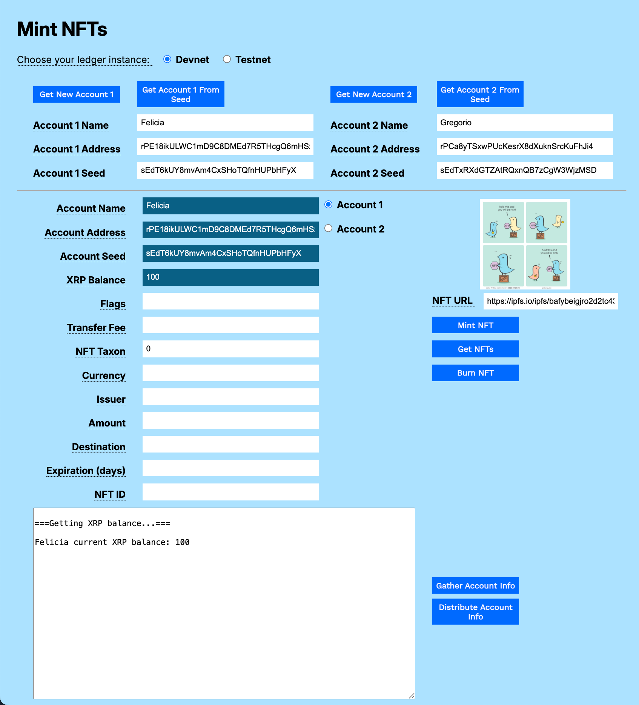
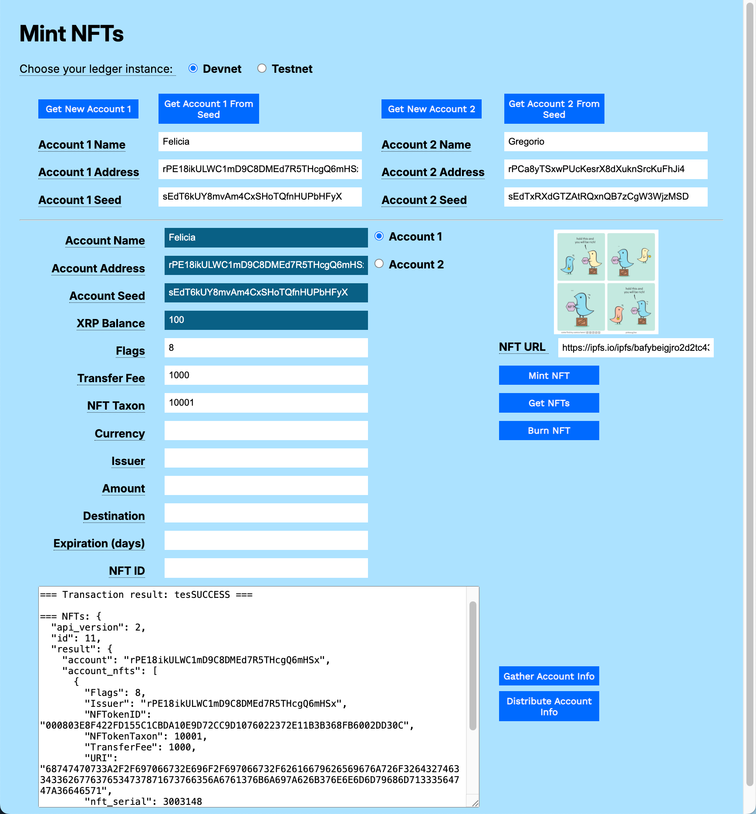
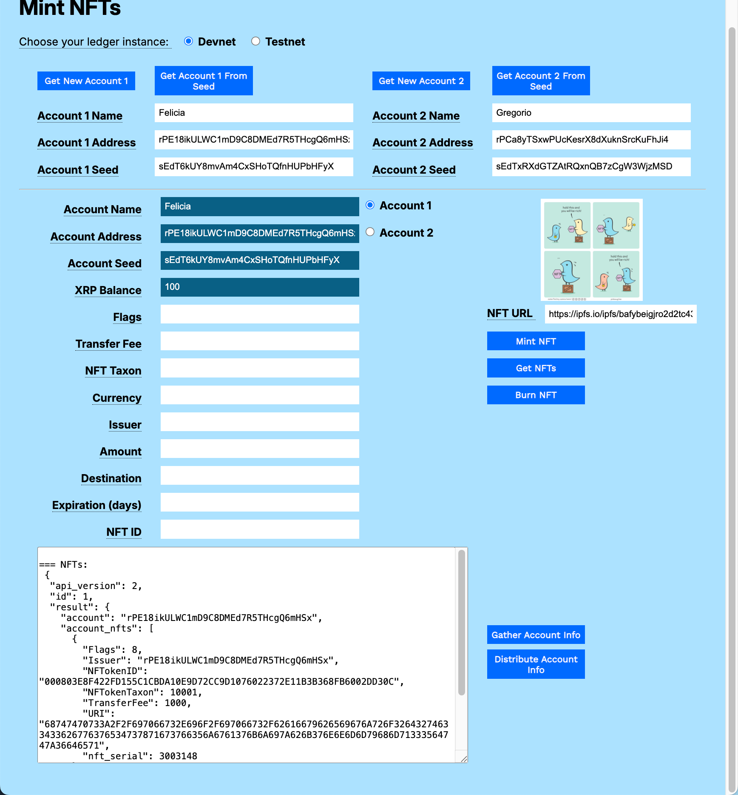
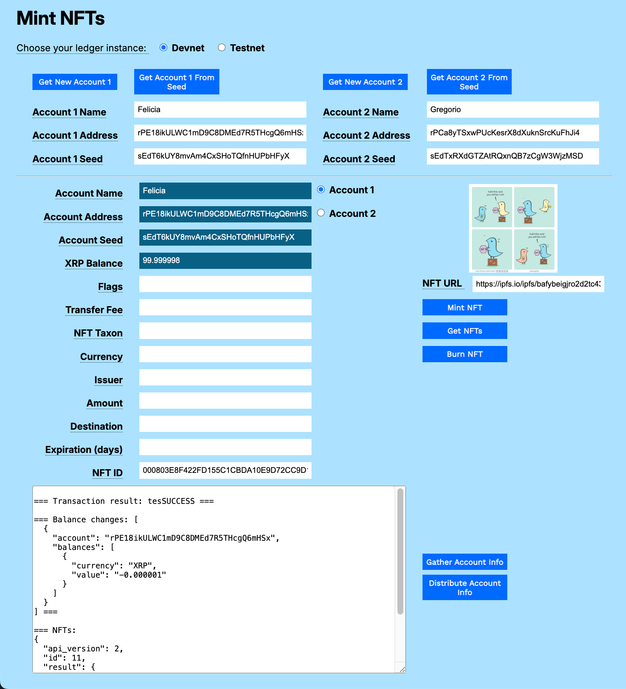

---
seo:
    description: Mint and burn NFTs.
labels:
  - Tokens
  - Non-fungible tokens, NFTs
---
# Mint and Burn NFTs Using JavaScript

This example shows how to:

1. Mint new Non-fungible Tokens (NFTs).
2. Get a list of existing NFTs.
3. Delete (Burn) an NFT.

[](../../../img/mt-mint-token-1-empty-form.png)

# Usage

You can download the [NFT Modular Tutorials](../../../../_code-samples/nft-modular-tutorials/nft-modular-tutorials.zip) archive to try the sample in your own browser.

## Get Accounts

1. Open `mint-nfts.html` in a browser.
2. Choose your preferred test network (**Devnet** or **Testnet**).
3. Get test accounts.
    1. If you copied the gathered information from another tutorial:
        1. Paste the gathered information to the **Result** field.
        2. Click **Distribute Account Info**.
    2. If you have an existing account seed:
        1. Paste the account seed to the **Account 1 Seed** or **Account 2 Seed** field.
        2. Click **Get Account 1 from Seed** or **Get Account 2 from Seed**.
    2. If you do not have existing accounts:
        1. Click **Get New Account 1**.
        2. Click **Get New Account 2**.

[](../../../img/mt-mint-token-2-accounts.png)

## Mint an NFT

To mint a non-fungible token object:

1. Set the **Flags** field. For testing purposes, we recommend setting the value to _8_. This sets the _tsTransferable_ flag, meaning that the NFT object can be transferred to another account. Otherwise, the NFT object can only be transferred back to the issuing account.
2. Enter the **NFT URL**. This is a URI that points to the data or metadata associated with the NFT object. You can use the sample URI provided if you do not have one of your own.
3. Enter the **Transfer Fee**, a percentage of the proceeds from future sales of the NFT that will be returned to the original creator. This is a value of 0-50000 inclusive, allowing transfer rates between 0.000% and 50.000% in increments of 0.001%. If you do not set the **Flags** field to allow the NFT to be transferrable, set this field to 0. If you impose a transfer fee, your NFT can only be traded for tokens for which your account has a trust line. See [Trust Lines](../../../concepts/tokens/fungible-tokens/index.md#trust-lines).
4. Enter an **NFT Taxon**. This is a required value, but if you are not using the field to create an integer-based taxon entry, you can set the value to 0.
5. Optionally, you can set an expected prices for the NFT. To set a price in XRP, enter the amount in drops in the **Amount** field. To use an issued currency, enter the **Currency**, **Issuer**, and **Amount**.
6. Optionally, you can enter a **Destination** address that will be the only account authorized to purchase the NFT.
7. Optionally, you can enter an **Expiration** value in days, after which the offer will no longer be available.
8. Click **Mint NFT**.

[](../../../img/mt-mint-token-3-mint-token.png)


## Get Tokens

Click **Get NFTs** to get a list of NFTs owned by the account.

[](../../../img/mt-mint-token-4-get-tokens.png)

## Burn a Token

The current owner of an NFT can always destroy (or _burn_) an NFT object.

To permanently destroy an NFT:

1. Enter or select the account that owns the NFT.
2. Enter the **NFT ID**.
2. Click **Burn NFT**.

[](../../../img/mt-mint-token-5-burn-token.png)

# Code Walkthrough

You can download the [NFT Modular Tutorials](../../../../_code-samples/nft-modular-tutorials/nft-modular-tutorials.zip) archive to examine the code samples.

## mint-nfts.js
<!-- SPELLING_IGNORE: ripplex3 -->

### Mint NFT

Get the account wallet and connect to the XRP Ledger.
```javascript
async function mintNFT() {
  const wallet = xrpl.Wallet.fromSeed(accountSeedField.value);
  const net = getNet();
  const client = new xrpl.Client(net);
  let results = `\n=== Connected. Minting NFT ===`;
  resultField.value = results;

  try {
    await client.connect();
```

Prepare the  transaction parameters.

```javascript
    const transactionParams = {
      TransactionType: "NFTokenMint",
      Account: wallet.classicAddress,
      URI: xrpl.convertStringToHex(nftURLfield.value),
      Flags: parseInt(flagsField.value, 10), // Parse to integer
      TransferFee: parseInt(transferFeeField.value, 10), // Parse to integer
      NFTokenTaxon: parseInt(nftTaxonField.value, 10), // Parse to integer
    };
```

Add optional fields.

```javascript
    // Add optional fields
    if (amountField.value) {
         transactionParams.Amount = configureAmount(amountField.value);
    }

    if (expirationField.value) {
       transactionParams.Expiration = configureExpiration(expirationField.value);
    }

    if (destinationField.value) {
      transactionParams.Destination = destinationField.value;
    }
```

Log the transaction parameters before submission.

```javascript
    console.log("Mint NFT Transaction Parameters:", transactionParams);
```

Submit the transaction.

```javascript

    const tx = await client.submitAndWait(transactionParams, { wallet });
```

Get the current list of NFTs owned by the account.

```javascript
    const nfts = await client.request({
      method: "account_nfts",
      account: wallet.classicAddress,
    });
```

Report the results of the transaction.

```javascript
    results = `\n\n=== Transaction result: ${tx.result.meta.TransactionResult} ===`;
    results += `\n\n=== NFTs: ${JSON.stringify(nfts, null, 2)} ===`;
    results += `\n\n=== XRP Balance: ${await client.getXrpBalance(wallet.address)} ===`; // Await here
    resultField.value = results;
```

Catch and report any errors.

```javascript
  } catch (error) {
    console.error("Error minting NFT:", error);
    results += `\n\n=== Error minting NFT: ${error.message} ===`; // Use error.message
    resultField.value = results;
```

Disconnect from the XRP Ledger.

```javascript
  } finally {
    if (client && client.isConnected()) { // Check if connected before disconnecting
      await client.disconnect();
    }
  }
} // End of mintToken()
```

### Get NFTs

Get the wallet and connect to the XRP Ledger.

```javascript
async function getNFTs() {
  const wallet = xrpl.Wallet.fromSeed(accountSeedField.value);
  const net = getNet();
  const client = new xrpl.Client(net);
  let results = '\n=== Connected. Getting NFTs. ===';
  resultField.value = results;
  try {
    await client.connect();
```

Prepare and send the `account_nfts` request.

```javascript

    const nfts = await client.request({
      method: "account_nfts",
      account: wallet.classicAddress,
    });
```

Report the results.

```javascript
    results = '\n=== NFTs:\n ' + JSON.stringify(nfts, null, 2) + ' ===';
    resultField.value = results;
```

Catch and report any errors.

```javascript
  } catch (error) {
    console.error("Error getting NFTs:", error);
    results += `\n\n=== Error getting NFTs: ${error.message} ===`;
    resultField.value = results;
```

Disconnect from the XRP Ledger.

```javascript
  } finally {
    if (client && client.isConnected()) {
      await client.disconnect();
    }
  }
} // End of getNFTs()
```

### Burn NFT

Get the account wallet and connect to the XRP Ledger.

```javascript
sync function burnNFT() {
  const wallet = xrpl.Wallet.fromSeed(accountSeedField.value);
  const net = getNet();
  const client = new xrpl.Client(net);
  let results = '\n=== Connected. Burning NFT. ===';
  resultField.value = results;
  try {
    await client.connect();
```

Prepare the `NFTokenBurn` transaction.

```javascript
    const transactionBlob = {
      TransactionType: "NFTokenBurn",
      Account: wallet.classicAddress,
      NFTokenID: nftIdField.value,
    };

    console.log("Burn NFT Transaction Parameters:", transactionBlob); // Log before submit
```

Submit the transaction and wait for the results.

```javascript
    const tx = await client.submitAndWait(transactionBlob, { wallet });
    const nfts = await client.request({ // Get nfts after burning.
      method: "account_nfts",
      account: wallet.classicAddress,
    });
```

Report the results.

```javascript
    results = `\n=== Transaction result: ${tx.result.meta.TransactionResult} ===`; 
    results += '\n\n=== Balance changes: ' +
      JSON.stringify(xrpl.getBalanceChanges(tx.result.meta), null, 2) + ' ===';
    results += '\n\n=== NFTs: \n' + JSON.stringify(nfts, null, 2) + ' ==='; 
    resultField.value = results;
    xrpBalanceField.value = (await client.getXrpBalance(wallet.address)); // Await
```

Catch and report any errors.

```javascript
  } catch (error) {
    console.error("Error burning NFT:", error);
    results = `\n\n=== Error burning NFT: ${error.message} ===`; // User friendly
    resultField.value = results;
```

Disconnect from the XRP Ledger.

```javascript
  } finally {
    if (client && client.isConnected()) {
      await client.disconnect();
    }
  }
}
```

## mint-nfts.html

```html
<html>
<head>
    <title>Mint NFTs</title>
    <link href='https://fonts.googleapis.com/css?family=Work Sans' rel='stylesheet'>
    <link href="modular-tutorials.css" rel="stylesheet">
    <script src='https://unpkg.com/xrpl@4.1.0/build/xrpl-latest.js'></script>
    <script src="account-support.js"></script>
    <script src='transaction-support.js'></script>
    <script src='mint-nfts.js'></script>
</head>
<body>
    <h1>Mint NFTs</h1>
    <form id="theForm">
        <span class="tooltip" tooltip-data="Choose the XRPL host server for your account.">
            Choose your ledger instance:
        </span>
        &nbsp;&nbsp;
        <input type="radio" id="dn" name="server" value="wss://s.devnet.rippletest.net:51233" checked>
        <label for="dn">Devnet</label>
        &nbsp;&nbsp;
        <input type="radio" id="tn" name="server" value="wss://s.altnet.rippletest.net:51233">
        <label for="tn">Testnet</label>
        <br /><br />
        <table>
            <tr>
                <td>
                    <button type="button" onClick="getNewAccount1()">Get New Account 1</button>
                </td>
                <td>
                    <button type="button" onClick="getAccountFromSeed1()">Get Account 1 From Seed</button>
                </td>
                <td>
                    <button type="button" onClick="getNewAccount2()">Get New Account 2</button>
                </td>
                <td>
                    <button type="button" onClick="getAccountFromSeed2()">Get Account 2 From Seed</button>
                </td>
            </tr>
            <tr>
                <td>
                    <span class="tooltip" tooltip-data="Arbitrary human-readable name for the account."><label
                            for="account1name">Account 1 Name</label>
                    </span>
                </td>
                <td>
                    <input type="text" id="account1name" size="40"></input>
                </td>
                <td>
                    <span class="tooltip" tooltip-data="Arbitrary human-readable name for the account.">
                        <label for="account2name">Account 2 Name</label>
                    </span>
                </td>
                <td>
                    <input type="text" id="account2name" size="40"></input>
                </td>
            </tr>
            <tr>
                <td>
                    <span class="tooltip" tooltip-data="Identifying address for the account.">
                        <label for="account1address">Account 1 Address</label>
                    </span>
                </td>
                <td>
                    <input type="text" id="account1address" size="40"></input>
                </td>
                <td>
                    <span class="tooltip" tooltip-data="Identifying address for the account.">
                        <label for="account2address">Account 2 Address</label>
                    </span>
                </td>
                <td>
                    <input type="text" id="account2address" size="40"></input>
                </td>
            </tr>
            <tr>
                <td>
                    <span class="tooltip" tooltip-data="Seed for deriving public and private keys for the account.">
                        <label for="account1seed">Account 1 Seed</label>
                    </span>
                </td>
                <td>
                    <input type="text" id="account1seed" size="40"></input>
                </td>
                <td>
                    <span class="tooltip" tooltip-data="Seed for deriving public and private keys for the account.">
                        <label for="account2seed">Account 2 Seed</label>
                    </span>
                </td>
                <td>
                    <input type="text" id="account2seed" size="40"></input>
                </td>
            </tr>
        </table>
        <hr />
        <table>
            <tr valign="top">
                <td align="right">
                    <span class="tooltip" tooltip-data="Name of the currently selected account.">
                        <label for="accountNameField">Account Name</label>
                    </span>
                </td>
                <td>
                    <input type="text" id="accountNameField" size="40" readonly></input>
                    <input type="radio" id="account1" name="accounts" value="account1">
                    <label for="account1">Account 1</label>
                </td>
                <td rowspan="4" align="center">
                    <p>
                        
                </td>
            <tr valign="top">
                <td align="right">
                    <span class="tooltip" tooltip-data="Address of the currently selected account.">
                        <label for="accountAddressField">Account Address</label>
                    </span>
                </td>
                <td>
                    <input type="text" id="accountAddressField" size="40" readonly></input>
                    <input type="radio" id="account2" name="accounts" value="account2">
                    <label for="account2">Account 2</label>
                </td>
            </tr>
            <tr valign="top">
                <td align="right">
                    <span class="tooltip" tooltip-data="Seed of the currently selected account.">
                        <label for="accountSeedField">Account Seed</label>
                    </span>
                </td>
                <td>
                    <input type="text" id="accountSeedField" size="40" readonly></input>
                    <br>
                </td>
            </tr>
            <tr>
                <td align="right">
                    <span class="tooltip" tooltip-data="XRP balance for the currently selected account.">
                        <label for="xrpBalanceField">XRP Balance</label>
                    </span>
                </td>
                <td>
                    <input type="text" id="xrpBalanceField" size="40" readonly></input>
                </td>
            </tr>
            <tr>
                <td align="right">
                    <span class="tooltip" tooltip-data="NFT configuration flags.">
                        <label for="flagsField">Flags</label>
                    </span>
                </td>
                <td>
                    <input type="text" id="flagsField" size="40"></input>
                </td>
                <td align="right">
                    <span class="tooltip" tooltip-data="URL to the stored NFT.">
                        <label for="nftURLfield">NFT URL</label>
                    </span>&nbsp;&nbsp;
                    <input type="text" id="nftURLfield" size="30"
                        value="https://ipfs.io/ipfs/bafybeigjro2d2tc43bgv7e4sxqg7f5jga7kjizbk7nnmmyhmq35dtz6deq"></input>
                </td>
            </tr>
            <tr>
                <td align="right">
                    <span class="tooltip" tooltip-data="Percentage of sale price collected by the issuer when the NFT is sold. Enter a value from 0 to 50000, where 1000=1%.">
                        <label for="transferFeeField">Transfer Fee</label>
                    </span>
                    <p id="error-message"></p>
                </td>
                <td>
                    <input type="text" id="transferFeeField" size="40"></input>
                </td>
                <td>
                    <button type="button" onClick="mintNFT()">Mint NFT</button>
                </td>
            </tr>
            <tr>
                <td align="right">
                    <span class="tooltip" tooltip-data="NFT Taxon. Integer value used to identify NFTs minted in a series or collection. This value is required. Set it to 0 if you have no use for it.">
                        <label for="nftTaxonField">NFT Taxon</label>
                    </span>
                </td>
                <td>
                    <input type="text" id="nftTaxonField" size="40" value="0"></input>
                </td>
                <td>
                    <button type="button" onClick="getNFTs()">Get NFTs</button>
                </td>
            </tr>
            <tr>
                <td align="right">
                    <span class="tooltip" tooltip-data="Currency for the offer.">
                        <label for="currencyField">Currency</label>
                    </span>
                </td>
                <td>
                    <input type="text" id="currencyField" size="40"></input>
                    <br>
                </td>
                <td>
                    <button type="button" onClick="burnNFT()">Burn NFT</button>
                </td>
            </tr>
            <tr>
                <td align="right">
                    <span class="tooltip" tooltip-data="Issuer of the currency used.">
                        <label for="issuerField">Issuer</label>
                    </span>
                </td>
                <td>
                    <input type="text" id="issuerField" size="40"></input>
                    <br>
                </td>
            </tr>
            <tr>
                <td align="right">
                    <span class="tooltip" tooltip-data="Amount of currency to send. If XRP, you can enter 1 per XRP: the amount is converted to drops for you.">
                        <label for="amountField">Amount</label>
                    </span>
                </td>
                <td>
                    <input type="text" id="amountField" size="40"></input>
                </td>
            </tr>
            <tr>
                <td align="right">
                    <span class="tooltip" tooltip-data="Destination account address where XRP is sent.">
                        <label for="destinationField">Destination</label>
                    </span>
                </td>
                <td>
                    <input type="text" id="destinationField" size="40"></input>
                    <br>
                </td>
            </tr>
            <tr>
                <td align="right">
                    <span class="tooltip" tooltip-data="Number of days the offer is valid.">
                        <label for="expirationField">Expiration (days)</label>
                    </span>
                </td>
                <td>
                    <input type="text" id="expirationField" size="40"></input>
                </td>
            </tr>
            <tr>
                <td align="right">
                    <span class="tooltip" tooltip-data="NFT ID, used to transfer or burn the NFT after it is created.">
                        <label for="nftIdField">NFT ID</label>
                    </span>
                </td>
                <td>
                    <input type="text" id="nftIdField" size="40"></input>
                </td>
            </tr>
            <tr>
                <td colspan="2">
                    <p align="left">
                        <textarea id="resultField" cols="75" rows="20"></textarea>
                    </p>
                </td>
                <td align="left" valign="top">
                    <button type="button" onClick="gatherAccountInfo()">Gather Account Info</button><br />
                    <button type="button" onClick="distributeAccountInfo()">Distribute Account Info</button>
                </td>
            </tr>
        </table>
    </form>
</body>
<script>
    document.addEventListener('DOMContentLoaded', () => {
        const imageURLInput = document.getElementById('nftURLfield'); // Correct ID to nftURLfield
        const displayImage = document.getElementById('nftImage');
        const errorMessage = document.getElementById('error-message');

        if (imageURLInput) {
            imageURLInput.addEventListener('change', () => {
                const newURL = imageURLInput.value;
                displayImage.src = ''; // Clear previous image
                errorMessage.style.display = 'none';
                try {
                    new URL(newURL);
                } catch (_) {
                    errorMessage.textContent = 'Invalid URL. Please enter a valid URL, including "https://" or "http://".';
                    errorMessage.style.display = 'block';
                    return;
                }
                displayImage.onload = () => {
                    // Image loaded.  You might add a console log here, or update UI.
                    console.log(`Image loaded from: ${newURL}`);
                };
                displayImage.onerror = () => {
                    errorMessage.textContent = 'Error loading image from the provided URL.';
                    errorMessage.style.display = 'block';
                    displayImage.src = ''; // Clear the image on error
                };
                displayImage.src = newURL; // Load the image
            });
        }
    });

    const radioButtons = document.querySelectorAll('input[type="radio"]');
    radioButtons.forEach(radio => {
        radio.addEventListener('change', function () {
            if (this.value === 'account1') {
                populate1()
            } else if (this.value === 'account2') {
                populate2()
            }
        });
    });
</script>
</html>
```
