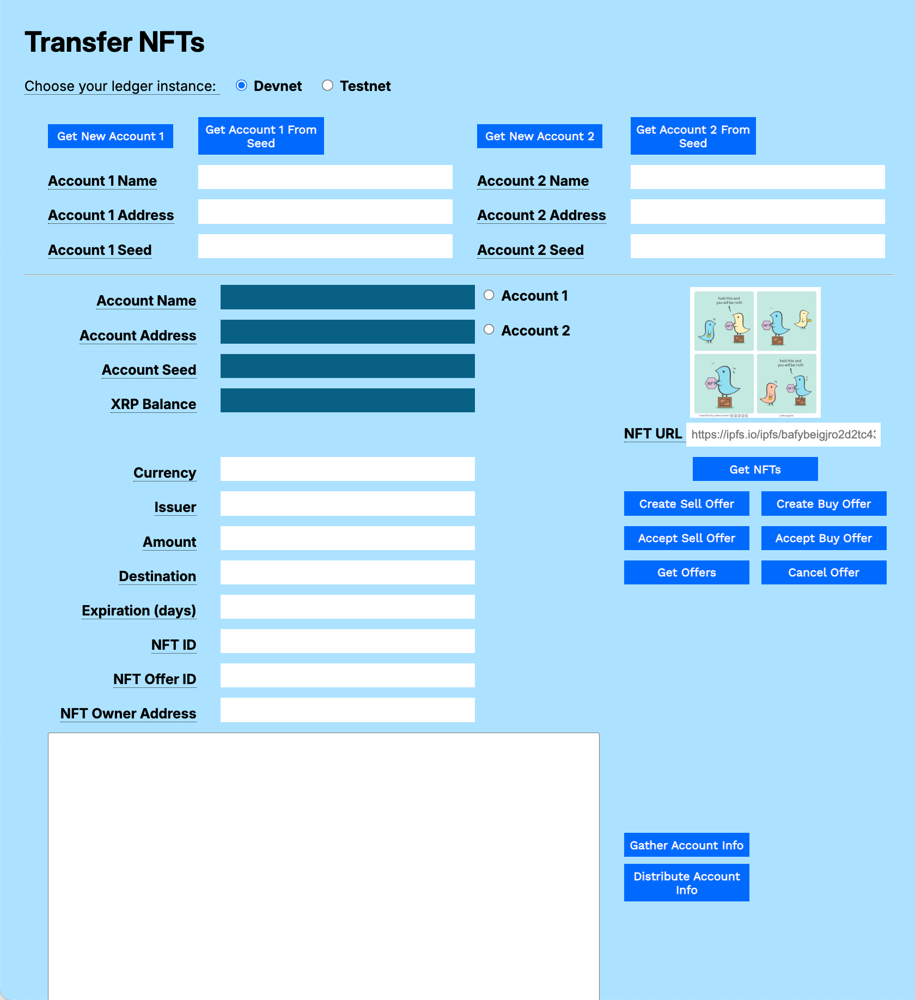
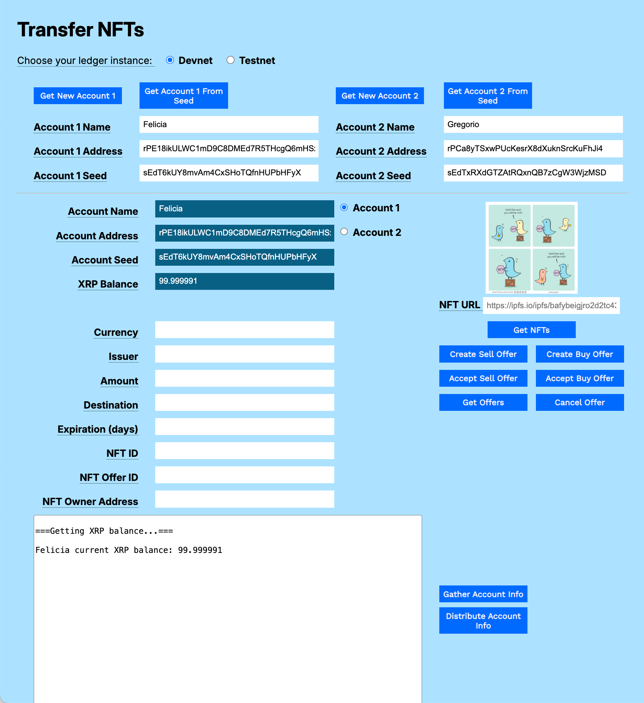
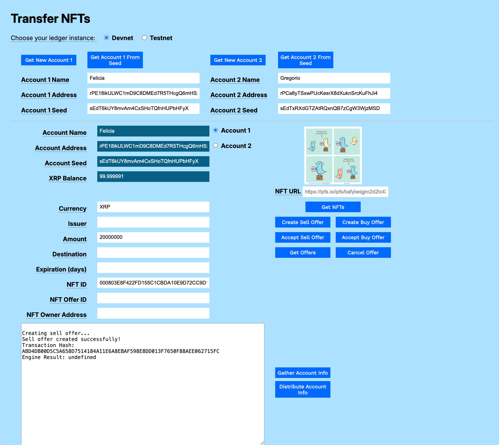
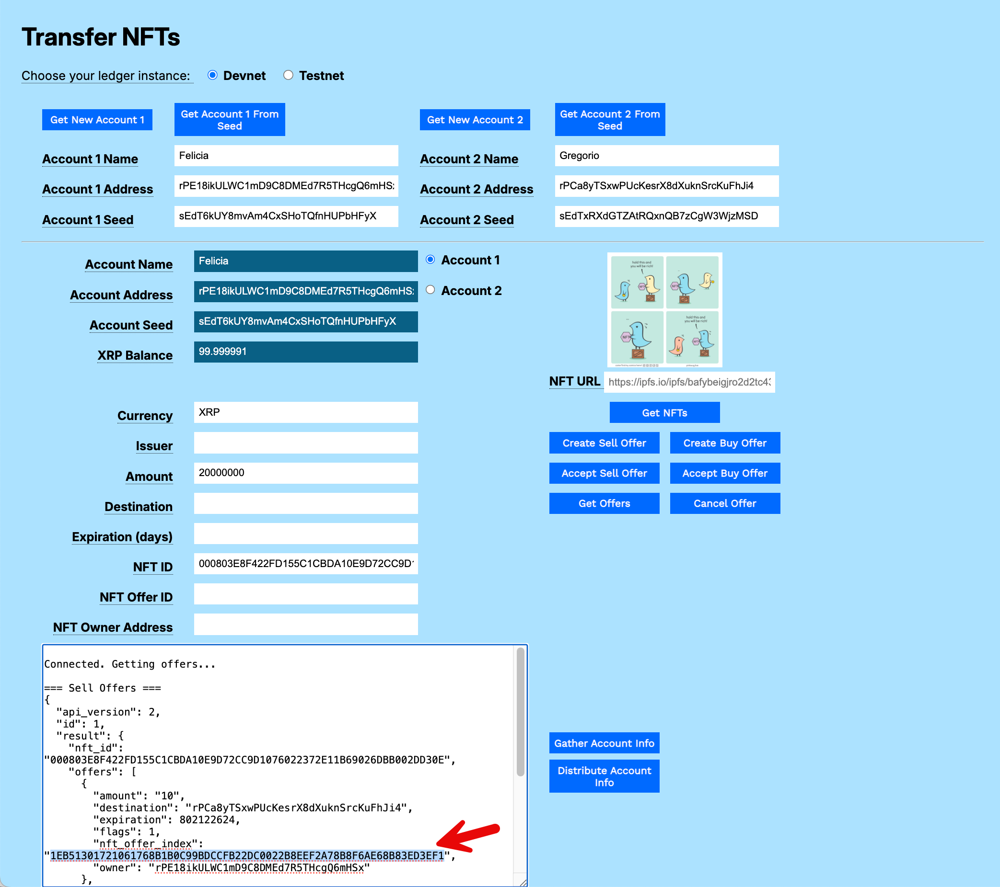
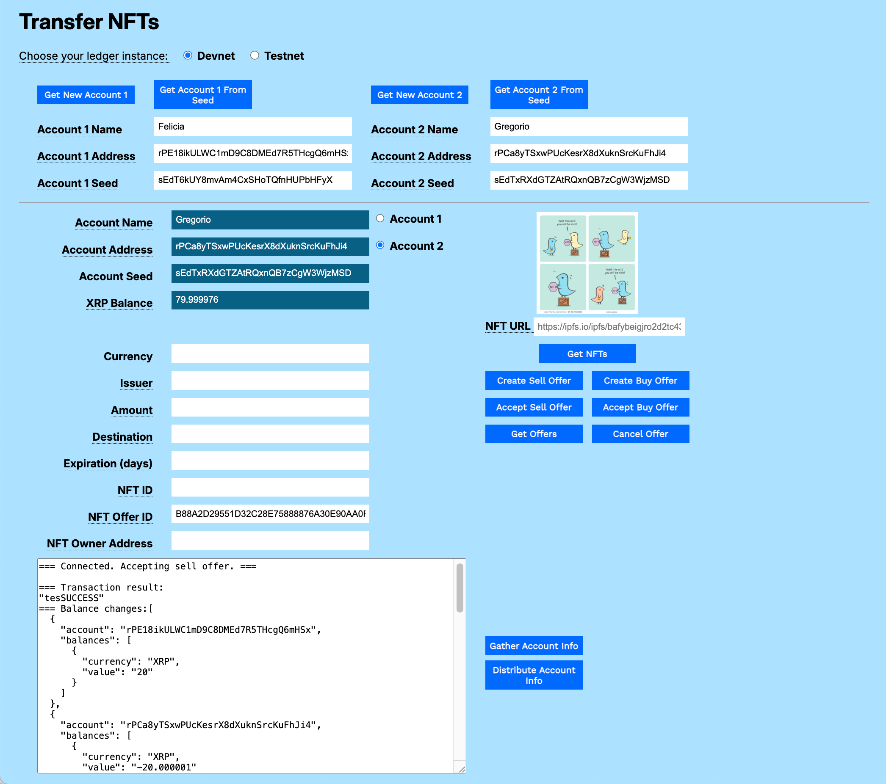
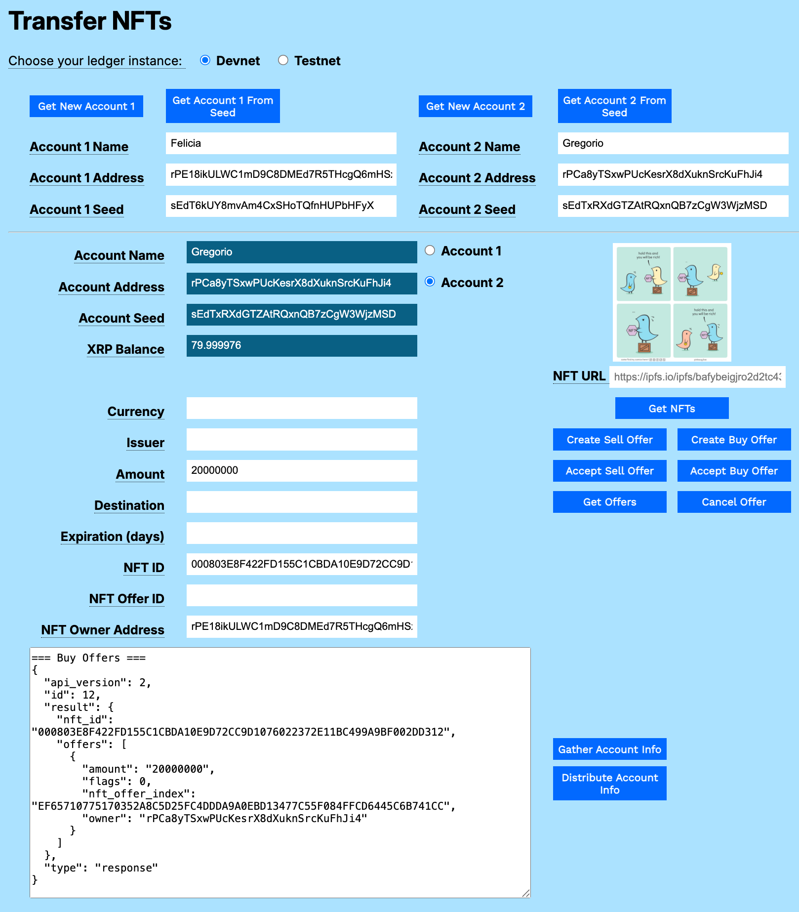
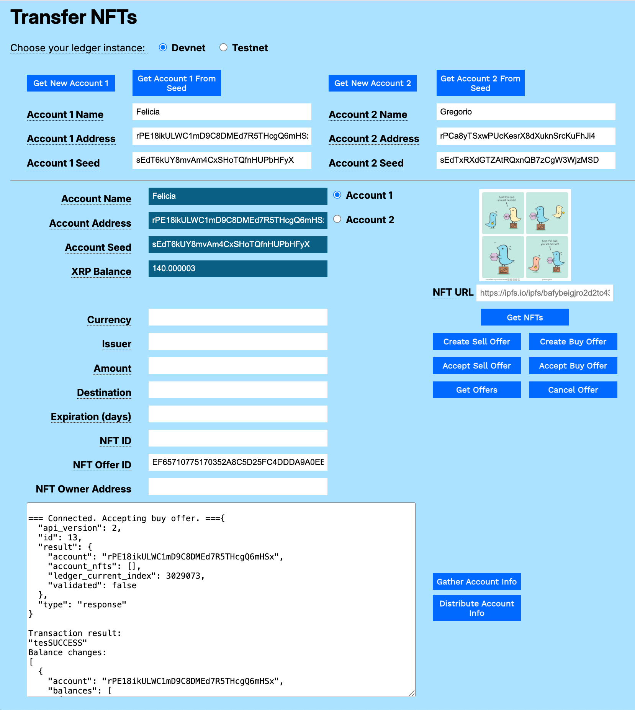
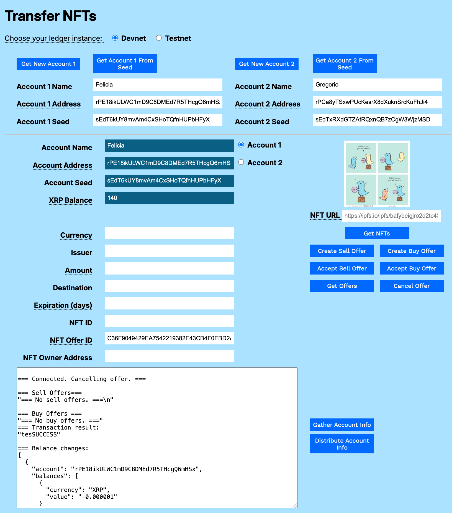

---
seo:
    description: Use a JavaScript test harness to send XRP, trade currencies, and mint and trade NFTs.
labels:
  - Tokens
  - Non-fungible Tokens, NFTs
---
# Transfer NFTs Using JavaScript

This example shows how to:

1. Create NFT Sell Offers.
2. Create NFT Buy Offers.
3. Accept NFT Sell Offers.
4. Accept NFT Buy Offers.
5. Get a list of offers for a particular NFT.
6. Cancel an offer.

[](../../../img/mt-transfer-nft-1-empty-form.png)

You can download the [NFT Modular Tutorials](../../../../_code-samples/nft-modular-tutorials/nft-modular-tutorials.zip) archive to try each of the samples in your own browser.

# Usage

## Get Accounts

1. Open `transfer-nfts.html` in a browser.
2. Choose your preferred test network (**Devnet** or **Testnet**).
3. Get test accounts.
    1. If you copied the gathered information from another tutorial:
        1. Paste the gathered information to the **Result** field.
        2. Click **Distribute Account Info**.
    2. If you have an existing account seed:
        1. Paste the account seed to the **Account 1 Seed** or **Account 2 Seed** field.
        2. Click **Get Account 1 from Seed** or **Get Account 2 from Seed**.
    2. If you do not have existing accounts:
        1. Click **Get New Account 1**.
        2. Click **Get New Account 2**.

[](../../../img/mt-transfer-nft-2-accounts-loaded.png)

## Create a Sell Offer

To create an NFT sell offer:

1. Enter the **Amount** of the sell offer.
   1. If using _XRP_, enter the **Amount** in drops (millionths of an XRP; for example, 20000000).
   2. If using issued currency, enter the **Currency** code, **Issuer** account address, and the **Amount**.
2. Optionally, include a **Destination** account address. If present, only that account will have permission to accept the sell offer.
3. Optionally, enter a number of days until **Expiration** of the offer.
4. Enter the **NFT ID** of the NFT you want to sell.
5. Click **Create Sell Offer**.

[](../../../img/mt-transfer-nfts-3-create-sell-offer.png)

## Get Offers

To list the buy and sell offers associated with an NFT:
1. Enter the **NFT ID**.
2. Click **Get Offers**.

The key piece of information is the NFT Offer ID (labeled as `nft_offer_index`), which you use to accept a sell or buy offer. 

[](../../../img/mt-transfer-nfts-4-get-offers.png)

## Accept Sell Offer

Once a sell offer is available, another account can opt to accept the offer and buy the NFT.

To accept an available sell offer:

1. Enter the **NFT Offer Index** (labeled as `nft_offer_index` in the token offer results. This is different from the `NFTokenID`.)
2. Click **Accept Sell Offer**.

[](../../../img/mt-transfer-nfts-5-accept-sell-offer.png)

## Create a Buy Offer

You can offer to buy an NFT from another account.

To create an offer to buy an NFT:

1. Change to an account other than the NFT owner.
2. Enter the **Amount** of your offer.
   1. If paying XRP, enter the **Amount** of XRP in drops (1000000 equals 1 XRP).
   2. If paying an issued currency, enter the **Currency**, **Issuer**, and **Amount**.
3. Optionally, enter the number of days until **Expiration**.
4. Enter the **NFT ID**.
5. Enter the owner’s account address in the **NFT Owner Address** field.
6. Click **Create Buy Offer**.

[](../../../img/mt-transfer-nfts-6-create-buy-offer.png)

## Accept a Buy Offer

To accept an offer to buy an NFT:

1. Change to the NFT owner account.
2. Use **Get Offers**, above, if needed, to find the `nft_offer_index`.
3. Enter the `nft_offer_index` in the **NFT Offer ID** field.
4. Click **Accept Buy Offer**.

[](../../../img/mt-transfer-nfts-7-accept-buy-offer.png)

## Cancel Offer

To cancel a buy or sell offer that you have created:

1. Enter the **NFT Offer Index**.
2. Click **Cancel Offer**.

[](../../../img/mt-transfer-nfts-8-cancel-offer.png)

# Code Walkthrough

You can download the [NFT Modular Examples](../../../../_code-samples/nft-modular-tutorials/nft-modular-tutorials.zip) archive to try each of the samples in your own browser.

## Create Sell Offer

```javascript
// *******************************************************
// ****************** Create Sell Offer ******************
// *******************************************************
      
async function createSellOffer() {
```

Get the account wallet and connect to the XRP Ledger.

```javascript
  const wallet = xrpl.Wallet.fromSeed(accountSeedField.value);
  let results = '\nCreating sell offer...';
  resultField.value = results;

  try {
    const client = new xrpl.Client(getNet());
    await client.connect();
    try {
```

If the destination field is populated, capture the value.

```javascript
      const destination = destinationField.value || undefined;
```

If the **Expiration** field is populated, configure the expiration date for the sell offer.

```javascript
      const expiration = expirationField.value ? configureExpiration() : undefined;
```

Begin constructing the transaction JSON object.

```javascript
      const transactionJson = {
        TransactionType: "NFTokenCreateOffer",
        Account: wallet.classicAddress,
        NFTokenID: nftIdField.value,
        Flags: 1,
      };
```

Configure the amount. To give the NFT away, set the **Amount** to 0. `configureAmount()` determines whether the currency is XRP or an issued currency, and returns the properly formattted object to add to the JSON transaction object.

```javascript
      const amount = configureAmount();
      if (amount) { // Only add Amount if it's defined
        transactionJson.Amount = amount;
      } else {
        console.warn("Amount is undefined. Sell offer might be invalid.");
        resultField.value = results;
      }
```

If you have an expiration date or specified destination, add them to the JSON transaction object.

```javascript
      if (expiration) {
        transactionJson.Expiration = expiration;
      }
      if (destination) {
        transactionJson.Destination = destination;
      }
```

Submit the transaction, wait for and report the results.

```javascript
      const tx = await client.submitAndWait(transactionJson, { wallet });
      results += `\nSell offer created successfully!\nTransaction Hash: ${tx.result.hash}\nEngine Result: ${tx.result.engine_result}`;
      resultField.value = results;
```

Disconnect from the XRP Ledger.

```javascript
    } finally {
      client.disconnect();
    }
```

Catch and report any errors.

```javascript
  } catch (error) {
    console.error("Error creating sell offer:", error);
    results = `\nError: ${error.message || error}`;
    resultField.value = results;
  }
}// End of createSellOffer()
```

## Create Buy Offer

```javascript
// *******************************************************
// ***************** Create Buy Offer ********************
// *******************************************************

async function createBuyOffer() {
```

Get the account wallet and connect to the ledger.

```javascript
  const wallet = xrpl.Wallet.fromSeed(accountSeedField.value);
  let net = getNet();
  const client = new xrpl.Client(net);
  await client.connect();
  let results = '\n=== Connected. Creating buy offer. ===';
  resultField.value = results;
```

Configure the amount and expiration date, if present.

```javascript
  try {
    // Use the external configureAmount() function
    let amount = configureAmount();
    // Use the external configureExpiration() function
    let expiration = configureExpiration(); // This will return a number or an empty string from the original logic
```

Start constructing the transactionJson object.

```javascript
    let transactionJson = {
      "TransactionType": "NFTokenCreateOffer",
      "Account": wallet.classicAddress,
      "Owner": nftOwnerField.value,
      "NFTokenID": nftIdField.value,
      "Flags": 0, // Ensure no tfSellNFToken flag for a buy offer
    };
```

Add the configured amount to the transaction.

```javascript
    if (amount !== undefined && amount !== '') {
        transactionJson.Amount = amount;
    } else {
        results += "\nError: Amount field is required for a buy offer.";
        resultField.value = results;
        client.disconnect();
        return;
    }
```

Add the **Destination** value, if it is set.

```javascript
    if (destinationField.value !== '') {
      transactionJson.Destination = destinationField.value;
    }
```

Add the Expiration date if it's not an empty string.

```javascript
    if (expiration > 0) {
      transactionJson.Expiration = expiration;
    }
```

Submit the transaction and wait for the results. List the sell offers and buy offers currently available.

```javascript
    const tx = await client.submitAndWait(transactionJson, { wallet: wallet });

    results += "\n\n=== Sell Offers ===\n";
    let nftSellOffers;
    try {
      nftSellOffers = await client.request({
        method: "nft_sell_offers",
        nft_id: nftIdField.value
      });
    } catch (err) {
      nftSellOffers = "=== No sell offers. ===";
    }
    results += JSON.stringify(nftSellOffers, null, 2);
    results += "\n\n=== Buy Offers ===\n";
    let nftBuyOffers;
    try {
      nftBuyOffers = await client.request({
        method: "nft_buy_offers",
        nft_id: nftIdField.value
      });
      results += JSON.stringify(nftBuyOffers, null, 2);
    } catch (err) {
      results += "=== No buy offers. ===";
    }
```

Report the results of the transaction.

```javascript
    // Check transaction results -------------------------------------------------
    results += "\n\n=== Transaction result:\n" +
      JSON.stringify(tx.result.meta.TransactionResult, null, 2);
    results += "\n\n=== Balance changes:\n" +
      JSON.stringify(xrpl.getBalanceChanges(tx.result.meta), null, 2);
    resultField.value = results;
```

Catch and report any errors.
```javascript
  } catch (error) {
    console.error('Error creating buy offer:', error);
    results += "\n\n=== Error: " + error;
    resultField.value = results;
```

Disconnect from the XRP Ledger.

```javascript
  } finally {
    client.disconnect();
  }
}// End of createBuyOffer()
```

## Cancel Offer

```javascript      
// *******************************************************
// ******************** Cancel Offer *********************
// *******************************************************

async function cancelOffer() {    
```

Get the account wallet and connect to the ledger.

```javascript      
    const wallet = xrpl.Wallet.fromSeed(accountSeedField.value)
  let net = getNet()
  const client = new xrpl.Client(net)
  await client.connect()
  let results = "\n=== Connected. Cancelling offer. ==="
  resultField.value = results
```

Store the token offer ID in the `NFTokenOffers` array parameter.

```javascript
  const tokenOfferIDs = [nftOfferIdField.value]
```

Construct the NFTokenCancelOffer JSON transaction.

```javascript
  const transactionJson = {
    "TransactionType": "NFTokenCancelOffer",
    "Account": wallet.classicAddress,
    "NFTokenOffers": tokenOfferIDs
  }
```

Submit the transaction and wait for the results.

```javascript
  const tx = await client.submitAndWait(transactionJson, { wallet })
```

List the remaining sell offers and buy offers.

```javascript
  results = "\n\n=== Sell Offers===\n"
  let nftSellOffers
  try {
    nftSellOffers = await client.request({
      method: "nft_sell_offers",
      nft_id: nftIdField.value
    })
  } catch (err) {
    nftSellOffers = '=== No sell offers. ===\n'
  }
  results += JSON.stringify(nftSellOffers, null, 2)
  results += "\n\n=== Buy Offers ===\n"
  let nftBuyOffers
  try {
    nftBuyOffers = await client.request({
      method: "nft_buy_offers",
      nft_id: nftIdField.value
    })
  } catch (err) {
    nftBuyOffers = '=== No buy offers. ==='
  } 
  results += JSON.stringify(nftBuyOffers, null, 2)
  resultField.value += results
```

Report the transaction results and XRP balance changes.

```javascript
  results = "\n=== Transaction result:\n" +
    JSON.stringify(tx.result.meta.TransactionResult, null, 2)
  results += "\n\n=== Balance changes:\n" +
    JSON.stringify(xrpl.getBalanceChanges(tx.result.meta), null, 2)
  resultField.value += results
```

Disconnect from the XRP Ledger.

```javascript
  client.disconnect() // End of cancelOffer()
}
```

## Get Offers

```javascript      
// *******************************************************
// ******************** Get Offers ***********************
// *******************************************************


async function getOffers() {
```

Get the account wallet and connect to the ledger.

```javascript      
const wallet = xrpl.Wallet.fromSeed(accountSeedField.value)
  let net = getNet()
  const client = new xrpl.Client(net)
  await client.connect()
 
  let results = '\nConnected. Getting offers...'
  resultField.value = results 

  // --- Sell Offers ---
  results += '\n\n=== Sell Offers ===\n' 
```

Prepare and an `nft_sell_offers` request for the selected NFT ID. Catch any errors and report the results.

```javascript
  let nftSellOffers
  try {
    nftSellOffers = await client.request({
      method: "nft_sell_offers",
      nft_id: nftIdField.value
    })
  } catch (err) {
    nftSellOffers = 'No sell offers found for this NFT ID.'
  }
  results += JSON.stringify(nftSellOffers, null, 2)
  resultField.value = results 
```

Prepare and an `nft_buy_offers` request for the selected NFT ID. Catch any errors and report the results.

```javascript
  // --- Buy Offers ---
  results = '\n\n=== Buy Offers ===\n'
  let nftBuyOffers
  try {
    nftBuyOffers = await client.request({
      method: "nft_buy_offers",
      nft_id: nftIdField.value
    })
  } catch (err) {
    // Log the actual error for debugging
    nftBuyOffers = 'No buy offers found for this NFT ID.' // More descriptive
  }
  results += JSON.stringify(nftBuyOffers, null, 2) // Append the JSON string
  resultField.value += results // Update the display with buy offers
```

Disconnect from the XRP Ledger.

```javascript
  client.disconnect()
}// End of getOffers()
```

## Accept Sell Offer

```javascript      
// *******************************************************
// ****************** Accept Sell Offer ******************
// *******************************************************


async function acceptSellOffer() {
```

Get the account wallet and connect to the ledger.

```javascript      
  const wallet = xrpl.Wallet.fromSeed(accountSeedField.value)
  let net = getNet()
  const client = new xrpl.Client(net)
  try {
    await client.connect()
    let results = '\n=== Connected. Accepting sell offer. ===\n\n'
    resultField.value = results
```

Prepare the transaction JSON object.

```javascript
    const transactionJson = {
      "TransactionType": "NFTokenAcceptOffer",
      "Account": wallet.classicAddress,
      "NFTokenSellOffer": nftOfferIdField.value,
  }
```

Submit the transaction and wait for the results.

```javascript
   const tx = await client.submitAndWait(transactionJson, { wallet: wallet })
```

Get the current NFTs held by the account after the transaction.

```javascript
    const nfts = await client.request({
      method: "account_nfts",
      account: wallet.classicAddress
    })
```

Get the new XRP balance after the transaction.

```javascript
    xrpBalanceField.value = (await client.getXrpBalance(wallet.address))
```

Report the results.

```javascript
    results += '=== Transaction result:\n'
    results += JSON.stringify(tx.result.meta.TransactionResult, null, 2)
    results += '\n=== Balance changes:'
    results += JSON.stringify(xrpl.getBalanceChanges(tx.result.meta), null, 2)
    results += JSON.stringify(nfts, null, 2)
    resultField.value += results
```

Catch and report any errors.

```javascript
  } catch (error) {
    console.error('Error accepting sell offer:', error)
    resultField.value = `Error: ${error.message || error}`
```
Disconnect from the XRP Ledger.

```javascript
  } finally {
    client.disconnect()
  }
}// End of acceptSellOffer()

### Accept Buy Offer

```javascript
// *******************************************************
// ******************* Accept Buy Offer ******************
// *******************************************************

async function acceptBuyOffer() {
``` 

Get the account wallet and connect to the XRP Ledger.

```javascript
async function acceptBuyOffer() {
  const wallet = xrpl.Wallet.fromSeed(accountSeedField.value);
  let net = getNet();
  const client = new xrpl.Client(net);
  let results = '\n=== Connected. Accepting buy offer. ==='; // Declare results locally

  try {
    await client.connect();
    resultField.value = results;
```

Create the transactionJson object, passing the account address and the buy offer ID.

```javascript
    const transactionJson = {
      "TransactionType": "NFTokenAcceptOffer",
      "Account": wallet.classicAddress,
      "NFTokenBuyOffer": nftOfferIdField.value
    };
```

Submit the transaction and wait for the results.

```javascript
    const tx = await client.submitAndWait(transactionJson, { wallet: wallet });
```

Report the current list of account NFTs after the transaction.

```javascript
    const nfts = await client.request({
      method: "account_nfts",
      account: wallet.classicAddress
    });

    results += JSON.stringify(nfts, null, 2);
    resultField.value = results;
```

Report the result of the transaction and update the XRP Balance field.

```javascript
    results += "\n\nTransaction result:\n" +
      JSON.stringify(tx.result.meta.TransactionResult, null, 2);
    results += "\nBalance changes:\n" +
      JSON.stringify(xrpl.getBalanceChanges(tx.result.meta), null, 2);
    xrpBalanceField.value = (await client.getXrpBalance(wallet.address));
    resultField.value = results;
```

Catch and report any errors.

```javascript
  } catch (error) {
    console.error('Error in acceptBuyOffer:', error); // Log the full error
    results = `\n=== Error accepting buy offer: ${error.message || 'Unknown error'} ===`; 
    resultField.value = results;
```

Disconnect from the XRP Ledger.

```javascript
  } finally {
    if (client && client.isConnected()) {
      client.disconnect();
    }
  }
} // End of acceptBuyOffer()
```

## 4.transfer-nfts.html

```html
<html>
<head>
    <title>Transfer NFTs</title>
    <link href='https://fonts.googleapis.com/css?family=Work Sans' rel='stylesheet'>
    <link href="modular-tutorials.css" rel="stylesheet">
    <script src='https://unpkg.com/xrpl@4.1.0/build/xrpl-latest.js'></script>
    <script src="account-support.js"></script>
    <script src="transaction-support.js"></script>
    <!-- <script src='send-xrp.js'></script> -->
    <script src="transfer-nfts.js"></script>
    <script src="mint-nfts.js"></script>
</head>
<body>
    <h1>Transfer NFTs</h1>
    <form id="theForm">
        <span class="tooltip" tooltip-data="Choose the XRPL host server for your account.">
            Choose your ledger instance:
        </span>
        &nbsp;&nbsp;
        <input type="radio" id="dn" name="server" value="wss://s.devnet.rippletest.net:51233" checked>
        <label for="dn">Devnet</label>
        &nbsp;&nbsp;
        <input type="radio" id="tn" name="server" value="wss://s.altnet.rippletest.net:51233">
        <label for="tn">Testnet</label>
        <br /><br />
        <table>
            <tr>
                <td>
                    <button type="button" onClick="getNewAccount1()">Get New Account 1</button>
                </td>
                <td>
                    <button type="button" onClick="getAccountFromSeed1()">Get Account 1 From Seed</button>
                </td>
                <td>
                    <button type="button" onClick="getNewAccount2()">Get New Account 2</button>
                </td>
                <td>
                    <button type="button" onClick="getAccountFromSeed2()">Get Account 2 From Seed</button>
                </td>
            </tr>
            <tr>
                <td>
                    <span class="tooltip" tooltip-data="Arbitrary human-readable name for the account."><label
                            for="account1name">Account 1 Name</label>
                    </span>
                </td>
                <td>
                    <input type="text" id="account1name" size="40"></input>
                </td>
                <td>
                    <span class="tooltip" tooltip-data="Arbitrary human-readable name for the account.">
                        <label for="account2name">Account 2 Name</label>
                    </span>
                </td>
                <td>
                    <input type="text" id="account2name" size="40"></input>
                </td>
            </tr>
            <tr>
                <td>
                    <span class="tooltip" tooltip-data="Identifying address for the account.">
                        <label for="account1address">Account 1 Address</label>
                    </span>
                </td>
                <td>
                    <input type="text" id="account1address" size="40"></input>
                </td>
                <td>
                    <span class="tooltip" tooltip-data="Identifying address for the account.">
                        <label for="account2address">Account 2 Address</label>
                    </span>
                </td>
                <td>
                    <input type="text" id="account2address" size="40"></input>
                </td>
            </tr>
            <tr>
                <td>
                    <span class="tooltip" tooltip-data="Seed for deriving public and private keys for the account.">
                        <label for="account1seed">Account 1 Seed</label>
                    </span>
                </td>
                <td>
                    <input type="text" id="account1seed" size="40"></input>
                </td>
                <td>
                    <span class="tooltip" tooltip-data="Seed for deriving public and private keys for the account.">
                        <label for="account2seed">Account 2 Seed</label>
                    </span>
                </td>
                <td>
                    <input type="text" id="account2seed" size="40"></input>
                </td>
            </tr>
        </table>
        <hr />
        <table>
            <tr valign="top">
                <td align="right">
                    <span class="tooltip" tooltip-data="Name of the currently selected account.">
                        <label for="accountNameField">Account Name</label>
                    </span>
                </td>
                <td>
                    <input type="text" id="accountNameField" size="40" readonly></input>
                    <input type="radio" id="account1" name="accounts" value="account1">
                    <label for="account1">Account 1</label>
                </td>
                <td rowspan="4" align="center">
                    <p>
                        
                </td>
            </tr>
            <tr valign="top">
                <td align="right">
                    <span class="tooltip" tooltip-data="Address of the currently selected account.">
                        <label for="accountAddressField">Account Address</label>
                    </span>
                </td>
                <td>
                    <input type="text" id="accountAddressField" size="40" readonly></input>
                    <input type="radio" id="account2" name="accounts" value="account2">
                    <label for="account2">Account 2</label>
                </td>
            </tr>
            <tr valign="top">
                <td align="right">
                    <span class="tooltip" tooltip-data="Seed of the currently selected account.">
                        <label for="accountSeedField">Account Seed</label>
                    </span>
                </td>
                <td>
                    <input type="text" id="accountSeedField" size="40" readonly></input>
                    <br>
                </td>
            </tr>
            <tr>
                <td align="right">
                    <span class="tooltip" tooltip-data="XRP balance for the currently selected account.">
                        <label for="xrpBalanceField">XRP Balance</label>
                    </span>
                </td>
                <td>
                    <input type="text" id="xrpBalanceField" size="40" readonly></input>
                </td>
            </tr>
            <tr>
                 <td>
                </td>
                <td>
                </td>
                <td>
                    <span class="tooltip" tooltip-data="URL to the stored NFT.">
                        <label for="nftURLfield">NFT URL</label>
                    </span>
                    <input type="text" id="nftURLfield" size="30"
                        placeholder="https://ipfs.io/ipfs/bafybeigjro2d2tc43bgv7e4sxqg7f5jga7kjizbk7nnmmyhmq35dtz6deq"></input>
                    <br />
                    <p id="error-message"></p>
                </td>
            </tr>
            <tr>
                <td align="right" >
                    <span class="tooltip" tooltip-data="Currency for the offer.">
                        <label for="currencyField">Currency</label>
                    </span>
                </td>
                 <td>
                    <input type="text" id="currencyField" size="40"></input>
                    <br>
                </td>
                <td align="center" valign="top">
                    <button type="button" onClick="getNFTs()">Get NFTs</button>
                </td>
            </tr>
            <tr>
                <td align="right">
                    <span class="tooltip" tooltip-data="Issuer of the currency used.">
                        <label for="issuerField">Issuer</label>
                    </span>
                </td>
                <td>
                    <input type="text" id="issuerField" size="40"></input>
                    <br>
                </td>
                <td>
                    <button type="button" onClick="createSellOffer()">Create Sell Offer</button>&nbsp;&nbsp;

                    <button type="button" onClick="createBuyOffer()">Create Buy Offer</button>
                </td>
            </tr>
            <tr>
                <td align="right">
                    <span class="tooltip" tooltip-data="Amount of XRP to send.">
                        <label for="amountField">Amount</label>
                    </span>
                </td>
                <td>
                    <input type="text" id="amountField" size="40"></input>
                    <br>
                </td>
                <td align="left" valign="top">
                    <button type="button" onClick="acceptSellOffer()">Accept Sell Offer</button>&nbsp;&nbsp;

                    <button type="button" onClick="acceptBuyOffer()">Accept Buy Offer</button>
                </td>
            </tr>
            <tr>
                <td align="right">
                    <span class="tooltip" tooltip-data="Destination account address where XRP is sent.">
                        <label for="destinationField">Destination</label>
                    </span>
                </td>
                <td>
                    <input type="text" id="destinationField" size="40"></input>
                    <br>
                </td>
                <td align="left" valign="top">
                    <button type="button" onClick="getOffers()" width="40">Get Offers</button>&nbsp;&nbsp;
                    <button type="button" onClick="cancelOffer()">Cancel Offer</button>
                </td>

            </tr>
            <tr>
                <td align="right">
                    <span class="tooltip" tooltip-data="Number of days the offer is valid.">
                        <label for="expirationField">Expiration (days)</label>
                    </span>
                </td>
                <td>
                    <input type="text" id="expirationField" size="40"></input>
                </td>
            </tr>
            <tr>
                <td align="right">
                    <span class="tooltip" tooltip-data="NFT ID code, used to identify the token after it's minted.">
                        <label for="nftIdField">NFT ID</label>
                    </span>
                </td>
                <td>
                    <input type="text" id="nftIdField" size="40"></input>
                </td>
            </tr>
            <tr>
                <td align="right">
                    <span class="tooltip" tooltip-data="NFT Offer ID code, used to identify an offer to sell or buy an NFT.">
                        <label for="nftOfferIdField">NFT Offer ID</label>
                    </span>
                </td>
                <td>
                    <input type="text" id="nftOfferIdField" size="40"></input>
                </td>
            </tr>
            <tr>
                <td align="right">
                    <span class="tooltip" tooltip-data="Account address of the Owner of an NFT offered to sell or buy.">
                        <label for="nftOwnerField">NFT Owner Address</label>
                    </span>
                </td>
                <td>
                    <input type="text" id="nftOwnerField" size="40"></input>
                </td>
            </tr>
            <tr valign="top">
                <td colspan="2">
                    <p align="left">
                        <textarea id="resultField" cols="75" rows="20"></textarea>
                    </p>
                </td>
                <td align="left" valign="top">
                    <button type="button" onClick="gatherAccountInfo()">Gather Account Info</button><br />
                    <button type="button" onClick="distributeAccountInfo()">Distribute Account Info</button>
                </td>
            </tr>
        </table>
    </form>
</body>
<script>

    document.addEventListener('DOMContentLoaded', () => {
        const imageURLInput = document.getElementById('nftURLfield'); // Correct ID to nftURLfield
        const displayImage = document.getElementById('nftImage');
        const loadButton = document.getElementById('showNFTbutton');
        const errorMessage = document.getElementById('error-message');

        if (imageURLInput) {
            imageURLInput.addEventListener('change', () => {
                const newURL = imageURLInput.value;
                displayImage.src = ''; // Clear previous image
                errorMessage.style.display = 'none';
                try {
                    new URL(newURL);
                } catch (_) {
                    errorMessage.textContent = 'Invalid URL. Please enter a valid URL, including "https://" or "http://".';
                    errorMessage.style.display = 'block';
                    return;
                }
                displayImage.onload = () => {
                    // Image loaded.  You might add a console log here, or update UI.
                    console.log(`Image loaded from: ${newURL}`);
                };
                displayImage.onerror = () => {
                    errorMessage.textContent = 'Error loading image from the provided URL.';
                    errorMessage.style.display = 'block';
                    displayImage.src = ''; // Clear the image on error
                };
                displayImage.src = newURL; // Load the image
            });
        }
    });

    const radioButtons = document.querySelectorAll('input[type="radio"]');
    radioButtons.forEach(radio => {
        radio.addEventListener('change', function () {
            if (this.value === 'account1') {
                populate1()
            } else if (this.value === 'account2') {
                populate2()
            }
        });
    });
</script>
</html>
```
