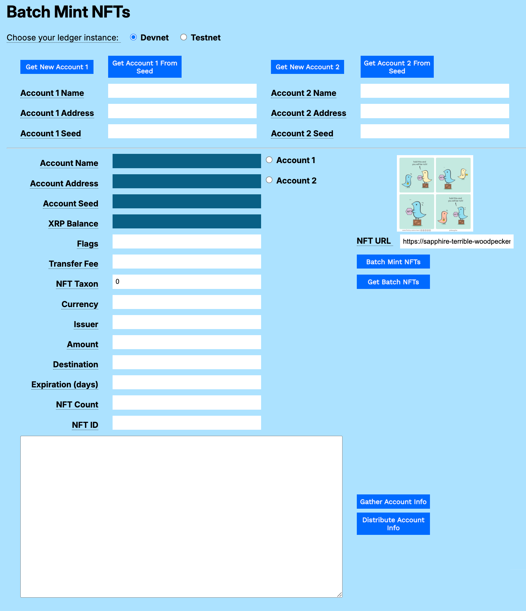
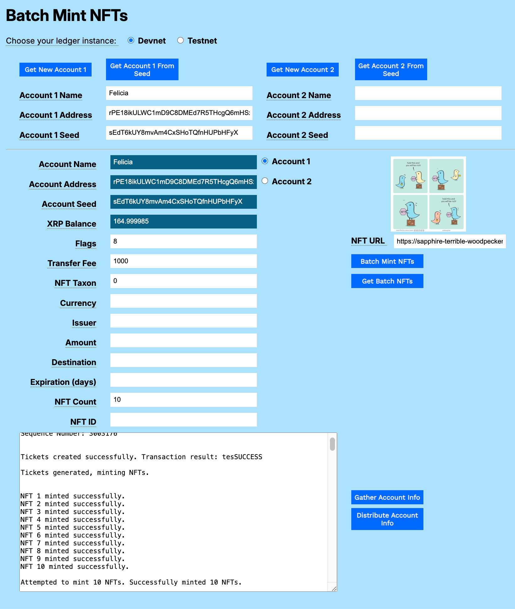
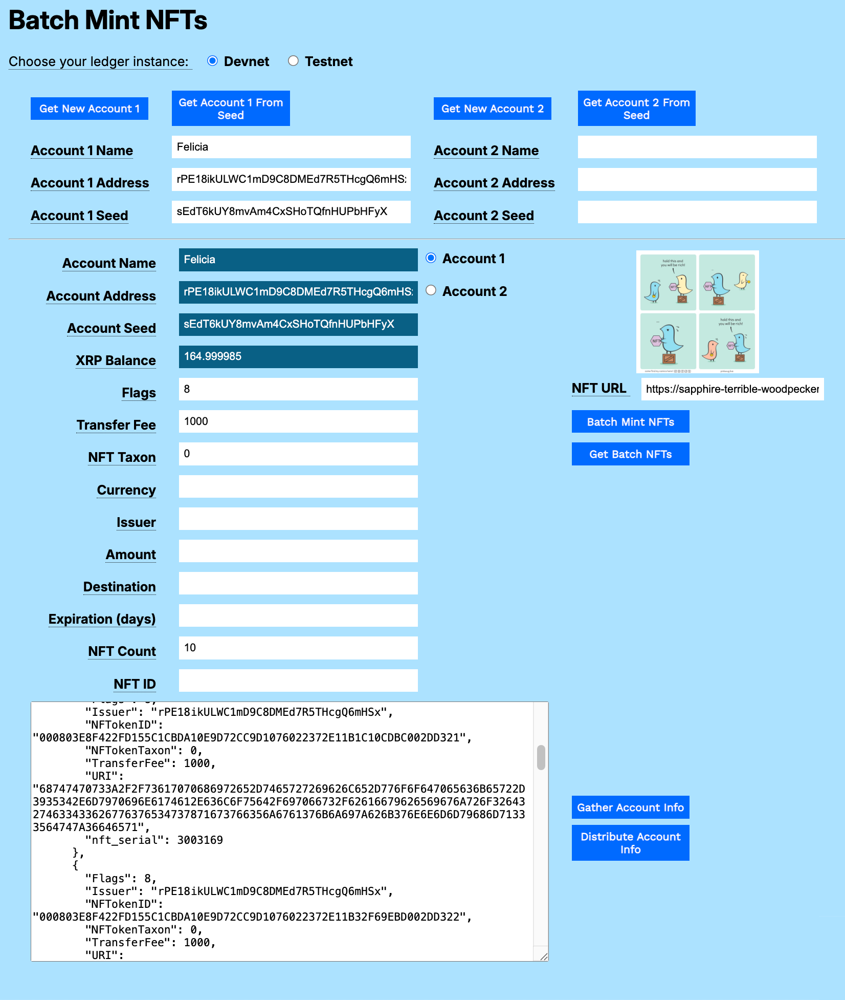

---
seo:
    description: Broker a sale between a sell offer and a buy offer.
labels:
  - Accounts
  - NFTs
  - Batch
  - XRP
---
# Batch Mint NFTs Using JavaScript

You can create an application that mints multiple NFTs at one time. You can use a `for` loop to send one transaction after another.

A best practice is to use `Tickets` to reserve the transaction sequence numbers. If you create an application that creates NFTs without using tickets, if any transaction fails for any reason, the application stops with an error. If you use tickets, the application continues to send transactions, and you can look into the reason for any individual failures afterward.

[](../../../img/mt-batch-mint-1-empty-form.png)

## Usage

You can download the [NFT Modular Samples](../../../../_code-samples/nft-modular-tutorials/nft-modular-tutorials.zip)) archive to try the sample in your own browser.

## Get an Account

1. Open `batch-minting.html` in a browser.
2. Get a test account.
    1. If you want to use an existing account seed:
        1. Paste the account seed in the **Seed** field.
        2. Click **Get Account from Seed**.
    2. If you do not want to use an existing account seed, click **Get New Account 1**.

## Batch Mint NFTs

This example lets you mint multiple NFTs for a single unique item. The NFT might represent "prints" of an original artwork, tickets to an event, or another limited set of unique items. 

To batch mint NFTs:

1. Click the Account 1 or Account 2 radio button. The account information populates the uneditable fields of the form.
2. Set the **Flags** field. For testing purposes, we recommend setting the value to _8_. This sets the _tsTransferable_ flag, meaning that the NFT object can be transferred to another account. Otherwise, the NFT object can only be transferred back to the issuing account. See [NFTokenMint](../../../../docs/references/protocol/transactions/types/nftokenmint.md) for information about all of the available flags for minting NFTs.
3. Enter the **NFT URL**. This is a URI that points to the data or metadata associated with the NFT object. You can use the sample URI provided if you do not have one of your own.
4. Set the **NFT Taxon**. If you don't have a use for this field, set it to _0_. 
5. Enter an **NFT Count** of up to 200 NFTs to create in one batch.
6. Enter the **Transfer Fee**, a percentage of the proceeds that the original creator receives from future sales of the NFT. This is a value of 0-50000 inclusive, allowing transfer fees between 0.000% and 50.000% in increments of 0.001%. If you do not set the **Flags** field to allow the NFT to be transferrable, set this field to 0.
7. Click **Batch Mint NFTs**.

[](../../../img/mt-batch-mint-2-batch-mint.png)

## Get Batch NFTs

Click **Get Batch NFTs** to get the current list of NFTs for the selected account.

The difference between this function and the `getTokens()` function used earlier is that it allows for larger lists of tokens, and sends multiple requests if the tokens exceed the number of objects allowed in a single request.

[](../../../img/mt-batch-mint-3-get-batch-mint.png)

# Code Walkthrough

You can download the [NFT Modular Tutorials](../../../../_code-samples/nft-modular-tutorials/nft-modular-tutorials.zip) archive to try each of the samples in your own browser.

## batchMintNFTs()

```javascript
// *******************************************************
// ***************** Batch Mint NFTs *********************
// *******************************************************

async function batchMintNFTs() {
```

Connect to the XRP Ledger and get the account wallet.

```javascript
  let client;
  try {
    let net = getNet();
    client = new xrpl.Client(net); // Assign client
    results = 'Connecting to ' + getNet() + '....';
    resultField.value = results;
    await client.connect();
    results += '\nConnected, finding wallet.';
    resultField.value = results;

    let wallet;
    try {
      wallet = xrpl.Wallet.fromSeed(accountSeedField.value);
    } catch (error) {
      results += '\nError: Invalid account seed. Please check your seed.';
      resultField.value = results;
      return; // Stop execution if wallet cannot be derived
    }
    resultField.value = results;
```

Get the Sequence number from the most recent transaction  with an account information request.

```javascript
    let account_info;
    try {
      account_info = await client.request({
        "command": "account_info",
        "account": wallet.address
      });
    } catch (error) {
      results += `\nError retrieving account info for ${wallet.address}: ${error.message}`;
      resultField.value = results;
      return;
    }

    let my_sequence = account_info.result.account_data.Sequence;
    results += "\n\nSequence Number: " + my_sequence + "\n\n";
    resultField.value = results;
```

Create ticket numbers for the batch.

Without tickets, if one transaction fails, all others in the batch fail. With tickets, there can be failures, but the rest will continue, and you can investigate any problems afterward.

Start by parsing the **NFT Count**.

```javascript
    const nftCount = parseInt(nftCountField.value);
    if (isNaN(nftCount) || nftCount <= 0) {
      results += '\nError: Please enter a valid number of NFTs to mint.';
      resultField.value = results;
      return;
    }
```

Create the transaction JSON object.

```javascript
    let ticketTransaction;
    try {
      ticketTransaction = await client.autofill({
        "TransactionType": "TicketCreate",
        "Account": wallet.address,
        "TicketCount": nftCount,
        "Sequence": my_sequence
      });
    } catch (error) {
      results += `\nError autofilling ticket creation transaction: ${error.message}`;
      resultField.value = results;
      return;
    }
```

Sign the ticket transaction.

```javascript

    //---------------------------------------------------- Sign the transaction.
    const signedTransaction = wallet.sign(ticketTransaction);
```

Submit the transaction and wait for the result.

```javascript
  let tx;
    try {
      tx = await client.submitAndWait(signedTransaction.tx_blob);
    } catch (error) {
      results += `\nError submitting ticket creation transaction: ${error.message}`;
      resultField.value = results;
      return;
    }
```

Verify the transaction succeeded and report the result.

```javascript
    if (tx.result.meta.TransactionResult !== 'tesSUCCESS') {
      results += `\nError creating tickets. Transaction failed with result: ${tx.result.meta.TransactionResult}`;
      resultField.value = results;
      return;
    }
    results += `\nTickets created successfully. Transaction result: ${tx.result.meta.TransactionResult}\n\n`;
    resultField.value = results;
```

Get the generated tickets.

```javascript
    let response;
    try {
      response = await client.request({
        "command": "account_objects",
        "account": wallet.address,
        "type": "ticket"
      });
    } catch (error) {
      results += `\nError retrieving account tickets: ${error.message}`;
      resultField.value = results;
      return;
    }
```

Populate an array variable with the tickets and report the results.

```javascript
    let tickets = [];
    if (response.result.account_objects && response.result.account_objects.length > 0) {
      for (let i = 0; i < nftCount; i++) {
        if (response.result.account_objects[i]) {
          tickets[i] = response.result.account_objects[i].TicketSequence;
        } else {
          results += `\nWarning: Fewer tickets found than requested. Expected ${nftCount}, found ${response.result.account_objects.length}.`;
          resultField.value = results;
          break; // Exit loop if tickets run out
        }
      }
    } else {
      results += '\nError: No tickets found for the account.';
      resultField.value = results;
      return;
    }
    results += "Tickets generated, minting NFTs.\n\n";
    resultField.value = results;
```

Mint the NFTs by looping through the available tickets and creating NFTs one at a time.

```javascript
    let mintedNFTsCount = 0;
    for (let i = 0; i < tickets.length; i++) {
      const transactionParams = {
        "TransactionType": "NFTokenMint",
        "Account": wallet.classicAddress,
        "URI": xrpl.convertStringToHex(nftURLfield.value),
        "Flags": parseInt(flagsField.value),
        "TransferFee": parseInt(transferFeeField.value),
        "Sequence": 0, // Sequence is 0 when using TicketSequence
        "TicketSequence": tickets[i],
        "LastLedgerSequence": null, // Optional, can be used for time limits
        "NFTokenTaxon": nftTaxonField.value,
      };
```

Add optional fields, as needed.

```javascript
         // Add optional fields
      if (amountField.value) {
          transactionParams.Amount = configureAmount(amountField.value);
      }

      if (expirationField.value) {
        transactionParams.Expiration = configureExpiration(expirationField.value);
      }

      if (destinationField.value) {
        transactionParams.Destination = destinationField.value;
      }
```

Submit the transaction and wait for the result.


```javascript
      try {
        const mintTx = await client.submitAndWait(transactionParams, {
          wallet: wallet
        });
        results += `\nNFT ${i+1} minted successfully.`;
        mintedNFTsCount++;
        console.log(mintTx.result.nfts)
        resultField.value = results;
      } catch (error) {
        console.log(error);
      }
      // Add a small delay to avoid hitting rate limits if many NFTs are being minted
      await new Promise(resolve => setTimeout(resolve, 500));
    }
```


Report the results.

```javascript
    results += `\n\nAttempted to mint ${nftCount} NFTs. Successfully minted ${mintedNFTsCount} NFTs.`;
```


Display the minted NFTs.

```javascript
    results += "\n\nFetching minted NFTs...\n";
    let nfts;
    try {
      nfts = await client.request({
        method: "account_nfts",
        account: wallet.classicAddress,
        limit: 400
      });
      results += JSON.stringify(nfts, null, 2);
```

Continue to retrieve NFTs 400 at a time until all NFTs are fetched. 

```javascript
      while (nfts.result.marker) {
        nfts = await client.request({
          method: "account_nfts",
          account: wallet.classicAddress,
          limit: 400,
          marker: nfts.result.marker
        });
        results += '\n' + JSON.stringify(nfts, null, 2);
      }
    } catch (error) {
      results += `\nError fetching account NFTs: ${error.message}`;
    }
```

Update the **XRP Balance** field.

```javascript
    try {
      xrpBalanceField.value = (await client.getXrpBalance(wallet.address));
    } catch (error) {
      results += `\nError fetching XRP balance: ${error.message}`;
    }

    resultField.value = results;
```

Catch and report any errors.

```javascript
  } catch (error) {
    results += `\nAn unexpected error occurred during batch minting: ${error.message}`;
    resultField.value = results;
```

Disconnect from the XRP Ledger.

```javascript
  } finally {
    if (client && client.isConnected()) {
      client.disconnect();
      results += '\nDisconnected from XRP Ledger.';
      resultField.value = results;
    }
  }
} // End of batchMint()
```

## getBatchNFTs

Retrieve the NFTs for an account in batches of 400.

Get the account wallet and connect to the XRP Ledger.

```javascript
async function getBatchNFTs() {
  let client; // Declare client here for finally block access
  try {
    const wallet = xrpl.Wallet.fromSeed(accountSeedField.value);
    let net = getNet();
    client = new xrpl.Client(net); // Assign client
    results = 'Connecting to ' + net + '...';
    resultField.value = results;
    await client.connect();
    results += '\nConnected. Getting NFTs...';
    resultField.value = results;
```

Retrieve the first 400 NFTs and report the results.

```javascript
    results += "\n\nNFTs:\n";
    let nfts;
    try {
      nfts = await client.request({
        method: "account_nfts",
        account: wallet.classicAddress,
        limit: 400
      });
      results += JSON.stringify(nfts, null, 2);
```

While there are more NFTs, continue to retrieve them in batches of 400.

```javascript
      while (nfts.result.marker) {
        nfts = await client.request({
          method: "account_nfts",
          account: wallet.classicAddress,
          limit: 400,
          marker: nfts.result.marker
        });
        results += '\n' + JSON.stringify(nfts, null, 2);
      }
```

Catch and report any fetch errors.

```javascript
    } catch (error) {
      results += `\nError fetching account NFTs: ${error.message}`;
    }
    resultField.value = results;
```

Catch and report any general errors.

```javascript
  } catch (error) {
    results += `\nAn unexpected error occurred while getting batch NFTs: ${error.message}`;
    resultField.value = results;
```

Disconnect from the XRP Ledger.

```javascript
  } finally {
    if (client && client.isConnected()) {
      client.disconnect();
      results += '\nDisconnected from XRP Ledger.';
      resultField.value = results;
    }
  }
} //End of getBatchNFTs()
```

## batch-minting.html

```html
<html>
<head>
    <title>Batch Mint NFTs</title>
    <link href='https://fonts.googleapis.com/css?family=Work Sans' rel='stylesheet'>
    <link href="modular-tutorials.css" rel="stylesheet">
    <script src='https://unpkg.com/xrpl@4.1.0/build/xrpl-latest.js'></script>
    <script src="account-support.js"></script>
    <script src='transaction-support.js'></script>
    <script src='mint-nfts.js'></script>
    <script src="batch-minting.js"></script>
</head>
<body>
    <h1>Batch Mint NFTs</h1>
    <form id="theForm">
        <span class="tooltip" tooltip-data="Choose the XRPL host server for your account.">
            Choose your ledger instance:
        </span>
        &nbsp;&nbsp;
        <input type="radio" id="dn" name="server" value="wss://s.devnet.rippletest.net:51233" checked>
        <label for="dn">Devnet</label>
        &nbsp;&nbsp;
        <input type="radio" id="tn" name="server" value="wss://s.altnet.rippletest.net:51233">
        <label for="tn">Testnet</label>
        <br /><br />
        <table>
            <tr>
                <td>
                    <button type="button" onClick="getNewAccount1()">Get New Account 1</button>
                </td>
                <td>
                    <button type="button" onClick="getAccountFromSeed1()">Get Account 1 From Seed</button>
                </td>
                <td>
                    <button type="button" onClick="getNewAccount2()">Get New Account 2</button>
                </td>
                <td>
                    <button type="button" onClick="getAccountFromSeed2()">Get Account 2 From Seed</button>
                </td>
            </tr>
            <tr>
                <td>
                    <span class="tooltip" tooltip-data="Arbitrary human-readable name for the account."><label
                            for="account1name">Account 1 Name</label>
                    </span>
                </td>
                <td>
                    <input type="text" id="account1name" size="40"></input>
                </td>
                <td>
                    <span class="tooltip" tooltip-data="Arbitrary human-readable name for the account.">
                        <label for="account2name">Account 2 Name</label>
                    </span>
                </td>
                <td>
                    <input type="text" id="account2name" size="40"></input>
                </td>
            </tr>
            <tr>
                <td>
                    <span class="tooltip" tooltip-data="Identifying address for the account.">
                        <label for="account1address">Account 1 Address</label>
                    </span>
                </td>
                <td>
                    <input type="text" id="account1address" size="40"></input>
                </td>
                <td>
                    <span class="tooltip" tooltip-data="Identifying address for the account.">
                        <label for="account2address">Account 2 Address</label>
                    </span>
                </td>
                <td>
                    <input type="text" id="account2address" size="40"></input>
                </td>
            </tr>
            <tr>
                <td>
                    <span class="tooltip" tooltip-data="Seed for deriving public and private keys for the account.">
                        <label for="account1seed">Account 1 Seed</label>
                    </span>
                </td>
                <td>
                    <input type="text" id="account1seed" size="40"></input>
                </td>
                <td>
                    <span class="tooltip" tooltip-data="Seed for deriving public and private keys for the account.">
                        <label for="account2seed">Account 2 Seed</label>
                    </span>
                </td>
                <td>
                    <input type="text" id="account2seed" size="40"></input>
                </td>
            </tr>
        </table>
        <hr />
        <table>
            <tr valign="top">
                <td align="right">
                    <span class="tooltip" tooltip-data="Name of the currently selected account.">
                        <label for="accountNameField">Account Name</label>
                    </span>
                </td>
                <td>
                    <input type="text" id="accountNameField" size="40" readonly></input>
                    <input type="radio" id="account1" name="accounts" value="account1">
                    <label for="account1">Account 1</label>
                </td>
                <td rowspan="4" align="center">
                    <p>
                        
                </td>
            <tr valign="top">
                <td align="right">
                    <span class="tooltip" tooltip-data="Address of the currently selected account.">
                        <label for="accountAddressField">Account Address</label>
                    </span>
                </td>
                <td>
                    <input type="text" id="accountAddressField" size="40" readonly></input>
                    <input type="radio" id="account2" name="accounts" value="account2">
                    <label for="account2">Account 2</label>
                </td>
            </tr>
            <tr valign="top">
                <td align="right">
                    <span class="tooltip" tooltip-data="Seed of the currently selected account.">
                        <label for="accountSeedField">Account Seed</label>
                    </span>
                </td>
                <td>
                    <input type="text" id="accountSeedField" size="40" readonly></input>
                    <br>
                </td>
            </tr>
            <tr>
                <td align="right">
                    <span class="tooltip" tooltip-data="XRP balance for the currently selected account.">
                        <label for="xrpBalanceField">XRP Balance</label>
                    </span>
                </td>
                <td>
                    <input type="text" id="xrpBalanceField" size="40" readonly></input>
                </td>
            </tr>
            <tr>
                <td align="right">
                    <span class="tooltip" tooltip-data="NFT configuration flags.">
                        <label for="flagsField">Flags</label>
                    </span>
                </td>
                <td>
                    <input type="text" id="flagsField" size="40"></input>
                </td>
                <td align="right">
                    <span class="tooltip" tooltip-data="URL to the stored NFT.">
                        <label for="nftURLfield">NFT URL</label>
                    </span>&nbsp;&nbsp;
                    <input type="text" id="nftURLfield" size="30"
                        value="https://ipfs.io/ipfs/bafybeigjro2d2tc43bgv7e4sxqg7f5jga7kjizbk7nnmmyhmq35dtz6deq"></input>
                </td>
            </tr>
            <tr>
                <td align="right">
                    <span class="tooltip" tooltip-data="Percentage of sale price collected by the issuer when the NFT is sold. Enter a value from 0 to 50000, where 1000=1%.">
                        <label for="transferFeeField">Transfer Fee</label>
                    </span>
                    <p id="error-message"></p>
                </td>
                <td>
                    <input type="text" id="transferFeeField" size="40"></input>
                </td>
                <td>
                    <button type="button" onClick="batchMintNFTs()">Batch Mint NFTs</button>
                </td>
            </tr>
            <tr>
                <td align="right">
                    <span class="tooltip" tooltip-data="NFT Taxon. Integer value used to identify NFTs minted in a series or collection. This value is required. Set it to 0 if you have no use for it.">
                        <label for="nftTaxonField">NFT Taxon</label>
                    </span>
                </td>
                <td>
                    <input type="text" id="nftTaxonField" size="40" value="0"></input>
                </td>
                <td>
                    <button type="button" onClick="getBatchNFTs()">Get Batch NFTs</button>
                </td>
            </tr>
            <tr>
                <td align="right">
                    <span class="tooltip" tooltip-data="Currency for the offer.">
                        <label for="currencyField">Currency</label>
                    </span>
                </td>
                <td>
                    <input type="text" id="currencyField" size="40"></input>
                    <br>
                </td>
            </tr>
            <tr>
                <td align="right">
                    <span class="tooltip" tooltip-data="Issuer of the currency used.">
                        <label for="issuerField">Issuer</label>
                    </span>
                </td>
                <td>
                    <input type="text" id="issuerField" size="40"></input>
                    <br>
                </td>
            </tr>
            <tr>
                <td align="right">
                    <span class="tooltip" tooltip-data="Amount of XRP to send.">
                        <label for="amountField">Amount</label>
                    </span>
                </td>
                <td>
                    <input type="text" id="amountField" size="40"></input>
                </td>
            </tr>
            <tr>
                <td align="right">
                    <span class="tooltip" tooltip-data="Destination account address where XRP is sent.">
                        <label for="destinationField">Destination</label>
                    </span>
                </td>
                <td>
                    <input type="text" id="destinationField" size="40"></input>
                    <br>
                </td>
            </tr>
            <tr>
                <td align="right">
                    <span class="tooltip" tooltip-data="Number of days the offer is valid.">
                        <label for="expirationField">Expiration (days)</label>
                    </span>
                </td>
                <td>
                    <input type="text" id="expirationField" size="40"></input>
                </td>
            </tr>
            <tr>
                <td align="right">
                    <span class="tooltip" tooltip-data="Number of NFTs to produce in a batch.">
                        <label for="nftCountField">NFT Count</label>
                    </span>
                </td>
                <td>
                    <input type="text" id="nftCountField" size="40"></input>
                </td>
            </tr>
            <tr>
                <td align="right">
                    <span class="tooltip" tooltip-data="NFT ID, used to transfer or burn the NFT after it is created.">
                        <label for="nftIdField">NFT ID</label>
                    </span>
                </td>
                <td>
                    <input type="text" id="nftIdField" size="40"></input>
                </td>
            </tr>            <tr>
                <td colspan="2">
                    <p align="left">
                        <textarea id="resultField" cols="75" rows="20"></textarea>
                    </p>
                </td>
                <td align="left" valign="top">
                    <button type="button" onClick="gatherAccountInfo()">Gather Account Info</button><br />
                    <button type="button" onClick="distributeAccountInfo()">Distribute Account Info</button>
                </td>
            </tr>
        </table>
    </form>
</body>
<script>
    document.addEventListener('DOMContentLoaded', () => {
        const imageURLInput = document.getElementById('nftURLfield'); // Correct ID to nftURLfield
        const displayImage = document.getElementById('nftImage');
        const errorMessage = document.getElementById('error-message');

        if (imageURLInput) {
            imageURLInput.addEventListener('change', () => {
                const newURL = imageURLInput.value;
                displayImage.src = ''; // Clear previous image
                errorMessage.style.display = 'none';
                try {
                    new URL(newURL);
                } catch (_) {
                    errorMessage.textContent = 'Invalid URL. Please enter a valid URL, including "https://" or "http://".';
                    errorMessage.style.display = 'block';
                    return;
                }
                displayImage.onload = () => {
                    // Image loaded.  You might add a console log here, or update UI.
                    console.log(`Image loaded from: ${newURL}`);
                };
                displayImage.onerror = () => {
                    errorMessage.textContent = 'Error loading image from the provided URL.';
                    errorMessage.style.display = 'block';
                    displayImage.src = ''; // Clear the image on error
                };
                displayImage.src = newURL; // Load the image
            });
        }
    });

    const radioButtons = document.querySelectorAll('input[type="radio"]');
    radioButtons.forEach(radio => {
        radio.addEventListener('change', function () {
            if (this.value === 'account1') {
                populate1()
            } else if (this.value === 'account2') {
                populate2()
            }
        });
    });
</script>
</html>
```
