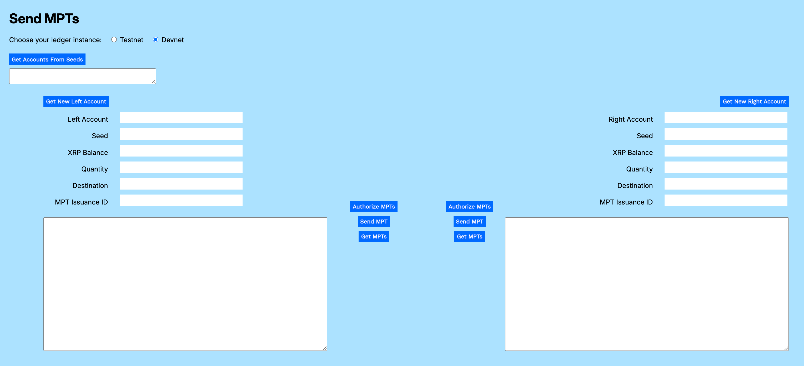

---
seo:
    description: Issue an asset-backed token such as a US Treasury bill using multi-purpose tokens.
labels:
  - Tokens
  - MPT
---
# Sending an MPT

_As an XRPL holder, I want to send multi-purpose tokens to another account in order to complete an offline transaction._

To send an MPT to another account, the receiving account must first authorize the receipt of the MPT, based on its MPToken Issuance ID. This is to prevent malicious users from spamming accounts with unwanted tokens that could negatively impact storage and XRP reserves.

## Send MPT Utility

The Send MPT utility embedded on the page below lets you create an account to receive an MPT, authorize it to receive a specific MPT issuance, then send an MPT from an issuer or holder account. (You can issue an MPT using the [MPT Generator](./creating-an-asset-backed-multi-purpose-token.md) utility.)

You can download a [standalone version of the MPT Sender](../../../_code-samples/mpt-sender/mpt-sender.zip) as sample code, or use the embedded form that follows.

    <link href='https://fonts.googleapis.com/css?family=Work Sans' rel='stylesheet'>
     

<form>
    <link href='https://fonts.googleapis.com/css?family=Work Sans' rel='stylesheet'>
     
    <!-- Required meta tags -->
    <meta charset="utf-8">
    <meta name="viewport" content="width=device-width, initial-scale=1, shrink-to-fit=no">
    

      

        

        <h4>MPT Sender</h4>
        

      

        

            

              <b>1. Choose your preferred network.</b>
            

            

              <input type="radio" id="tn" name="server"
                  value="wss://s.altnet.rippletest.net:51233">
              <label for="tn">Testnet</label>
               
              <input type="radio" id="dn" name="server"
                  value="wss://s.devnet.rippletest.net:51233" checked>
              <label for="dn">Devnet</label>
            

        

        

            

              <b>2. Get the holder (or issuer) account from its seed. 
            

          

          

            

              <label for="holderSeedField">Holder Seed</label>
            

          

          

            

              <input type="text" id="holderSeedField" size="40"></input>
                
            

          

          

            

              <label for="holderAccountField">Holder Account</label>
            

          

          

            

              <input type="text" id="holderAccountField" size="40"></input>
            

          

           
          

          

            

              <button type="button" id="getHolderAccountFromSeedButton" class="btn btn-primary">Get Holder Account From Seed</button>
                
            

          

          

            

              <b>3. Get a new receiver account or retrieve one from its seed.</b>
                  

            

              <label for="receiverSeedField">Receiver Seed</label>
            

          

          

            

              <input type="text" id="receiverSeedField" size="40"></input>
                
            

          

          

            

              <label for="receiverAccountField">Receiver Account</label>
            

          

          

            

              <input type="text" id="receiverAccountField" size="40"></input>
            

          

          

            

              <button type="button" id="getReceiverAccountButton" class="btn btn-primary">Get New Receiver Account</button>
              

              

              <button type="button" id="getReceiverFromSeedButton" class="btn btn-primary">Get Receiver Account From Seed</button>
                
              

            

          

        

        

          

            <b>4. Enter the <i>MPT Issuance ID</i>.</b>
          

        

        

            

                <label for="mptIssuanceIDField">MPT Issuance ID</label>
            

        

        

            

              <input type="text" id="mptIssuanceIDField" size="40"></input>
                
            

        

        

          

            <b>5. Click <i>Authorize MPT</i> to authorize the MPT for the receiver.</b>
          

        

        

            <button type="button" id="authorizeMPTButton" class="btn btn-primary">Authorize MPT</button>
        

         
        

        

          

            <b>5. Enter the <i>Quantity</i> of MPTs to send.</b>
          

        

        

            

                <label for="quantity">Quantity</label>
            

        

        

            

                <input type="text" id="quantityField" size="40"></input>
            

        

    

        

         
          
<b>6. Click Send MPTs</b> 
             <button type="button" id="sendMPTButton" class="btn btn-primary">Send MPTs</button>
          

          

    

    

        

          
<b>Results</b>

          <textarea class="form-control" id="resultsArea" rows="18" cols="40"></textarea>
        

    

    

        

             
            
<b>7. Click Get MPTs</b> 
            <button type = "button" id="getMPTsButton" class="btn btn-primary">Get MPTs</button>
          

      

    

  

</form>

